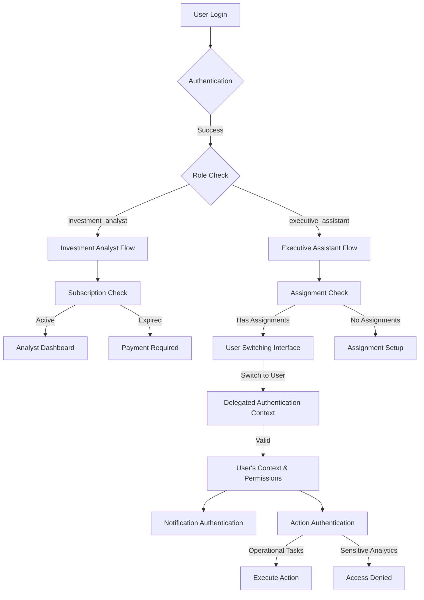

# AGORA Development Guide 03: Authentication & Role-Based Access Implementation (User Story Aligned)

> **⚠️ PREREQUISITE:** Complete **AGORA_DEV_02_DATABASE_SETUP** before starting this document.

## 📋 Overview

This document guides you through implementing comprehensive user story-aligned authentication for AGORA using **Cursor AI IDE**. You'll set up Microsoft Single Sign-On (SSO), role-based authentication for Investment Analysts and Executive Assistants, subscription-based access control, and Executive Assistant delegation authentication as required by the user stories.

## 🎯 What You'll Accomplish

- ✅ Configure Microsoft Azure App Registration for Office add-ins
- ✅ Implement role-based authentication (`investment_analyst` vs `executive_assistant`)
- ✅ Create Executive Assistant delegation authentication system
- ✅ Set up subscription-aware authentication flows
- ✅ Implement user switching capabilities for Executive Assistants
- ✅ Create permission matrix enforcement for user story restrictions
- ✅ Set up notification authentication for multi-user EA management
- ✅ Implement session security with role-based context

## 🎭 User Story Role-Based Authentication Architecture



### **User Story Requirements Mapped to Authentication:**

1. **Investment Analyst Authentication**:
   - Role: `'investment_analyst'`
   - Own subscription management
   - Own calendar and event access
   - Cannot access other users' data

2. **Executive Assistant Authentication**:
   - Role: `'executive_assistant'`
   - Multi-user delegation context
   - Operational task permissions for assisted users
   - Restricted from sensitive analytics/private notes
   - Notification permissions for all assisted users

3. **Subscription-Based Access Control**:
   - Authentication integrates with subscription status
   - Immediate access removal when subscriptions expire
   - Payment-required authentication redirects

---

## 🚀 Step 1: Microsoft Azure App Registration (User Story Enhanced)

### **1.1 Create Azure App Registration for Role-Based Office Add-ins**

1. **Go to [Azure Portal](https://portal.azure.com)**
2. **Navigate to Azure Active Directory > App registrations**
3. **Click "New registration"**

**Configuration:**
- **Name:** `AGORA - Role-Based Access`
- **Supported account types:** `Accounts in any organizational directory and personal Microsoft accounts`
- **Redirect URI:** 
  - Type: `Web`
  - URI: `https://your-project.supabase.co/auth/v1/callback`

### **1.2 Configure App Registration for User Story Roles**

**Cursor AI Prompt:**
```
Create a comprehensive Azure App Registration configuration for AGORA that supports user story requirements:

1. API Permissions for role-based access:
   - Microsoft Graph: User.Read (user profile and role determination)
   - Microsoft Graph: Calendars.ReadWrite (Investment Analyst calendar access)
   - Microsoft Graph: Calendars.Read.Shared (Executive Assistant delegated access)
   - Microsoft Graph: Mail.Send (notification permissions for EAs)
   - Microsoft Graph: offline_access (refresh tokens for session management)

2. Authentication configuration for Office add-ins:
   - Redirect URIs for both local development and production
   - Support for role-based authentication flows
   - Executive Assistant delegation callback handling
   - Subscription-aware authentication redirects

3. Role-based scope definitions:
   - Investment Analyst scopes: personal calendar, own subscriptions
   - Executive Assistant scopes: delegated calendar access, multi-user notifications
   - Subscription management scopes: payment integration, access control

4. Security configurations:
   - Role-based token validation
   - Delegation permission verification
   - Subscription status integration

Include step-by-step instructions for configuring role-based permissions.
```

### **1.3 Environment Variables for Role-Based Authentication**

**Cursor AI Prompt:**
```
Update the backend/.env file with role-based Microsoft authentication configuration:

# Microsoft Authentication for Role-Based Access
MICROSOFT_CLIENT_ID=your-application-client-id
MICROSOFT_CLIENT_SECRET=your-client-secret
MICROSOFT_TENANT_ID=common
MICROSOFT_REDIRECT_URI=https://your-project.supabase.co/auth/v1/callback

# Role-Based Authentication Settings
MICROSOFT_ANALYST_SCOPES=User.Read,Calendars.ReadWrite,offline_access
MICROSOFT_EA_SCOPES=User.Read,Calendars.Read.Shared,Mail.Send,offline_access

# Executive Assistant Delegation
EA_DELEGATION_SECRET=your-ea-delegation-secret
EA_SESSION_TIMEOUT=15  # 15 minutes for user switching

# Subscription Integration
SUBSCRIPTION_AUTH_REQUIRED=true
PAYMENT_REDIRECT_URL=https://your-domain.com/payment

Include detailed comments explaining role-based authentication flow and Executive Assistant delegation requirements.
```

---

## 🔐 Step 2: Role-Based Supabase Authentication Setup

### **2.1 Configure Supabase Auth for User Story Roles**

**Cursor AI Prompt:**
```
Configure Supabase authentication to support AGORA user story requirements:

1. Set up Microsoft SSO provider in Supabase:
   - Configure Microsoft provider with role-based scopes
   - Set up custom claims for Investment Analyst vs Executive Assistant roles
   - Configure session management for role switching

2. User registration flow customization:
   - Automatic role assignment based on email domain or manual selection
   - Executive Assistant assignment permission setup
   - Subscription status integration during registration

3. Authentication policies configuration:
   - Role-based redirect after authentication
   - Executive Assistant delegation permission validation
   - Subscription-required authentication gates

4. Session management for role contexts:
   - Investment Analyst: single-user session context
   - Executive Assistant: multi-user session context with user switching
   - Subscription status session integration

Include configuration for both local development and production environments.
```

### **2.2 Database Integration for Role-Based Authentication**

**Cursor AI Prompt:**
```
Integrate Supabase authentication with the user story-aligned database schema:

1. User profile creation with role assignment:
   - Automatic profile creation with role validation
   - Executive Assistant assignment relationship setup
   - Subscription status synchronization

2. Role-based access policy integration:
   - Investment Analyst: access only to own data
   - Executive Assistant: access to assigned users' data
   - Subscription-based content access enforcement

3. Authentication triggers and functions:
   - Role validation on login
   - Executive Assistant permission verification
   - Subscription status authentication checks
   - Session context updates for user switching

4. Security policy enforcement:
   - Prevent access to sensitive analytics for Executive Assistants
   - Enforce subscription requirements for content access
   - Audit logging for all authentication events

Create PostgreSQL triggers and functions that enforce user story authentication requirements.
```

---

## 👥 Step 3: Executive Assistant Delegation Authentication

### **3.1 User Switching Authentication System**

**Cursor AI Prompt:**
```
Create Executive Assistant user switching authentication system in backend/src/auth/delegation/:

1. ea-delegation.service.ts - Core delegation logic:
   - authenticateEAForUser(eaId, targetUserId): Validate EA can access user
   - switchUserContext(eaId, fromUserId, toUserId): Handle user switching
   - validateEAPermissions(eaId, userId, action): Check specific action permissions
   - createDelegatedSession(eaId, userId): Create session context for delegated access
   - auditEAAction(eaId, userId, action): Log all EA actions for security

2. user-context.service.ts - Context management:
   - setActiveUserContext(eaId, userId): Set current user context for EA
   - getActiveUserContext(eaId): Get current user context
   - validateContextSwitch(eaId, newUserId): Validate context switch permission
   - refreshDelegatedPermissions(eaId, userId): Refresh permissions cache
   - clearUserContext(eaId): Clear context on logout

3. permission-matrix.service.ts - User story permission enforcement:
   - canManageSubscriptions(eaId, userId): Check subscription management permission
   - canManageRSVP(eaId, userId): Check RSVP management permission
   - canViewCalendar(eaId, userId): Check calendar access permission
   - cannotAccessAnalytics(eaId, userId): Enforce analytics restriction
   - cannotAccessPrivateNotes(eaId, userId): Enforce private notes restriction

4. ea-notification.service.ts - Multi-user notification authentication:
   - authenticateNotificationAccess(eaId, userId): Validate notification permissions
   - getNotificationContexts(eaId): Get all users EA can receive notifications for
   - validateNotificationAction(eaId, notificationId): Check notification action permission

Include comprehensive security validation and audit logging for all delegation operations.
```

### **3.2 Role-Based Authentication Middleware**

**Cursor AI Prompt:**
```
Create role-based authentication middleware in backend/src/middleware/auth/:

1. role-auth.middleware.ts - Core role authentication:
   - requireRole(role): Middleware to require specific role
   - requireInvestmentAnalyst(): Middleware for analyst-only access
   - requireExecutiveAssistant(): Middleware for EA-only access
   - requireAnyRole(): Middleware for authenticated users of any role

2. ea-delegation.middleware.ts - Executive Assistant delegation:
   - requireEADelegation(userId): Middleware to validate EA can access specific user
   - setUserContext(userId): Middleware to set delegated user context
   - validateEAAction(action): Middleware to validate EA can perform action
   - restrictSensitiveAccess(): Middleware to block analytics/private notes

3. subscription-auth.middleware.ts - Subscription-based access:
   - requireActiveSubscription(subsector): Middleware to require subscription
   - validateSubscriptionAccess(): Middleware to check subscription status
   - redirectToPayment(): Middleware to redirect expired subscriptions

4. session-context.middleware.ts - Session context management:
   - extractUserContext(): Extract current user context from session
   - validateSessionContext(): Validate session context is valid
   - refreshContextPermissions(): Refresh permissions in session
   - auditContextAccess(): Log all context access for security

Include error handling, security logging, and user story compliance validation.
```

---

## 🛡️ Step 4: Permission Matrix Implementation

### **4.1 User Story Permission Definitions**

**Cursor AI Prompt:**
```
Create comprehensive permission matrix in backend/src/auth/permissions/:

1. permission-definitions.ts - User story permission constants:
   - INVESTMENT_ANALYST_PERMISSIONS: Complete list of analyst permissions
   - EXECUTIVE_ASSISTANT_PERMISSIONS: Complete list of EA permissions
   - RESTRICTED_EA_ACTIONS: List of actions EAs cannot perform
   - SUBSCRIPTION_REQUIRED_ACTIONS: Actions requiring active subscriptions

2. role-permissions.service.ts - Permission checking logic:
   - checkUserPermission(userId, action): Check if user can perform action
   - checkEAPermission(eaId, userId, action): Check if EA can perform action for user
   - validateSubscriptionRequired(userId, action): Check subscription requirement
   - validateSensitiveAccess(userId, action): Enforce sensitive data restrictions

3. permission-matrix.ts - Complete user story permission matrix:
   ```typescript
   export const USER_STORY_PERMISSIONS = {
     investment_analyst: {
       can: [
         'manage_own_subscriptions',
         'view_own_calendar',
         'rsvp_own_events',
         'view_own_analytics',
         'manage_own_notes',
         
         'order_companies',
         'view_subscribed_events'
       ],
       cannot: [
         'access_other_users_data',
         'manage_other_users',
         'view_ea_analytics'
       ]
     },
     executive_assistant: {
       can: [
         'switch_between_users',
         'manage_delegated_subscriptions',
         'view_delegated_calendars',
         'rsvp_delegated_events',
         'receive_delegated_notifications',
         
         'manage_delegated_company_order'
       ],
       cannot: [
         'access_sensitive_analytics',
         'access_private_notes',
         'view_financial_details',
         'manage_ea_assignments'
       ],
       requires_assignment: [
         'all_delegated_actions'
       ]
     }
   };
   ```

4. subscription-permissions.service.ts - Subscription-based access control:
   - validateEventAccess(userId, eventId): Check subscription for event access
   - checkSubsectorAccess(userId, subsector): Validate subsector subscription
   - enforcePaymentRequired(userId, action): Enforce payment requirements
   - auditSubscriptionAccess(userId, resource): Log subscription-based access

Include comprehensive validation logic that enforces all user story restrictions.
```

---

## 🔧 Step 5: Authentication API Endpoints (User Story Aligned)

### **5.1 Role-Based Authentication APIs**

**Cursor AI Prompt:**
```
Create role-based authentication API endpoints in backend/src/api/auth/:

1. role-auth-routes.ts - Role-specific authentication:
   - POST /auth/analyst/login - Investment Analyst login with subscription check
   - POST /auth/ea/login - Executive Assistant login with assignment validation
   - POST /auth/role/switch - Role-based context switching (EA only)
   - GET /auth/role/permissions - Get current user role permissions
   - POST /auth/role/validate - Validate role-specific action permission

2. ea-delegation-routes.ts - Executive Assistant delegation:
   - GET /auth/ea/assignments - Get users assigned to EA
   - POST /auth/ea/switch-user/:userId - Switch to user context
   - GET /auth/ea/current-context - Get current delegated user context
   - POST /auth/ea/validate-action - Validate EA can perform action for user
   - GET /auth/ea/notification-contexts - Get all notification contexts for EA

3. subscription-auth-routes.ts - Subscription-aware authentication:
   - GET /auth/subscription/status - Get current subscription status
   - POST /auth/subscription/validate/:subsector - Validate subsector access
   - GET /auth/subscription/required/:eventId - Check if subscription required for event
   - POST /auth/subscription/payment-redirect - Redirect to payment for expired subscription

4. session-management-routes.ts - Advanced session management:
   - GET /auth/session/context - Get current session context (user, role, permissions)
   - POST /auth/session/refresh-permissions - Refresh session permissions
   - GET /auth/session/audit - Get session audit log
   - DELETE /auth/session/clear-context - Clear delegated context (EA only)

Include comprehensive error handling, validation, and audit logging for all role-based operations.
```

### **5.2 User Story Compliance APIs**

**Cursor AI Prompt:**
```
Create user story compliance API endpoints in backend/src/api/compliance/:

1. permission-validation-routes.ts - Real-time permission validation:
   - POST /compliance/validate-access - Validate user story compliance for any action
   - GET /compliance/user-permissions/:userId - Get complete user permission matrix
   - POST /compliance/ea-action-check - Validate EA action compliance
   - GET /compliance/subscription-requirements - Get subscription requirements for actions

2. audit-routes.ts - User story compliance auditing:
   - GET /compliance/audit/role-access - Audit role-based access patterns
   - GET /compliance/audit/ea-actions - Audit Executive Assistant actions
   - GET /compliance/audit/subscription-access - Audit subscription-based access
   - POST /compliance/report/violation - Report user story compliance violation

3. security-enforcement-routes.ts - Security policy enforcement:
   - POST /security/block-sensitive-access - Block sensitive data access for EAs
   - GET /security/access-violations - Get access policy violations
   - POST /security/validate-delegation - Validate delegation security
   - GET /security/permission-matrix - Get security-enforced permission matrix

Include real-time validation against user story requirements and comprehensive audit trails.
```

---

## 🧪 Step 6: Authentication Testing (User Story Scenarios)

### **6.1 Role-Based Authentication Testing**

**Cursor AI Prompt:**
```
Create comprehensive role-based authentication testing in backend/tests/auth/:

1. role-auth.test.ts - Core role authentication testing:
   - Test Investment Analyst authentication flow
   - Test Executive Assistant authentication flow
   - Test role-based permission enforcement
   - Test subscription-based access control
   - Test EA delegation authentication

2. ea-delegation.test.ts - Executive Assistant delegation testing:
   - Test user switching functionality
   - Test multi-user context management
   - Test delegated action permissions
   - Test sensitive data access restrictions
   - Test notification permission authentication

3. permission-matrix.test.ts - User story permission testing:
   - Test all Investment Analyst permissions
   - Test all Executive Assistant permissions
   - Test restricted action enforcement
   - Test subscription requirement validation
   - Test cross-role access prevention

4. subscription-auth.test.ts - Subscription-based authentication testing:
   - Test subscription status authentication
   - Test payment required redirects
   - Test subscription expiration handling
   - Test subsector access validation
   - Test event access permissions

Include test cases for all user story acceptance criteria and edge cases.
```

### **6.2 User Story Compliance Testing**

**Cursor AI Prompt:**
```
Create user story compliance testing suite in backend/tests/compliance/:

1. user-story-compliance.test.ts - Complete user story validation:
   - Test "Executive Assistant Full Operational Access" user story
   - Test subscription and payment requirements
   - Test event visibility restrictions
   - Test role-based feature access
   - Test multi-user management capabilities

2. security-compliance.test.ts - Security requirement testing:
   - Test sensitive analytics access prevention for EAs
   - Test private notes access restrictions
   - Test audit logging for all actions
   - Test session security for role switching
   - Test delegation permission validation

3. integration-compliance.test.ts - End-to-end compliance testing:
   - Test complete Investment Analyst workflow
   - Test complete Executive Assistant workflow
   - Test user switching scenarios
   - Test subscription integration scenarios
   - Test Office add-in authentication integration

Include automated testing that validates all user story acceptance criteria.
```

---

## 🔒 Step 7: Security Implementation (User Story Enhanced)

### **7.1 Role-Based Security Policies**

**Cursor AI Prompt:**
```
Implement enhanced security policies in backend/src/security/:

1. role-security.service.ts - Role-based security enforcement:
   - enforceAnalystSecurity(userId, action): Security checks for analysts
   - enforceEASecurity(eaId, userId, action): Security checks for EA delegation
   - validateCrossRoleAccess(fromUser, toUser): Prevent unauthorized cross-role access
   - auditSecurityEvent(userId, event, context): Comprehensive security auditing

2. delegation-security.service.ts - Executive Assistant delegation security:
   - validateEAAssignment(eaId, userId): Validate EA is assigned to user
   - checkDelegationPermission(eaId, userId, action): Check specific delegation permission
   - preventSensitiveAccess(eaId, resource): Block access to sensitive data
   - monitorEAActivity(eaId): Monitor EA activity for security violations

3. subscription-security.service.ts - Subscription-based security:
   - enforceSubscriptionAccess(userId, resource): Enforce subscription requirements
   - validatePaymentSecurity(userId, subscriptionId): Validate payment security
   - auditSubscriptionAccess(userId, event): Audit subscription-based access
   - preventUnauthorizedAccess(userId, subsector): Block unauthorized subsector access

4. session-security.service.ts - Enhanced session security:
   - validateSessionContext(sessionId): Validate session context integrity
   - enforceRoleBasedTimeout(role): Role-specific session timeouts
   - detectSuspiciousActivity(userId, actions): Detect unusual access patterns
   - secureUserSwitching(eaId, fromUser, toUser): Secure EA user switching

Include advanced security monitoring and real-time threat detection for role-based access.
```

---

## ✅ Step 8: User Story Validation Checklist

### **Role-Based Authentication ✅**
- [ ] Investment Analyst role (`'investment_analyst'`) authentication working
- [ ] Executive Assistant role (`'executive_assistant'`) authentication working
- [ ] Role-based permission matrix enforced correctly
- [ ] Subscription-based access control integrated with authentication

### **Executive Assistant Delegation ✅**
- [ ] EA can switch between assigned users successfully
- [ ] EA can perform operational tasks (RSVP, subscribe) for users
- [ ] EA receives notifications for all assisted users
- [ ] EA cannot access sensitive analytics or private notes
- [ ] EA assignment validation working correctly

### **Subscription Integration ✅**
- [ ] Authentication integrates with subscription status
- [ ] Payment required redirects working for expired subscriptions
- [ ] Subscription-based event access enforced in authentication
- [ ] Real-time subscription status updates in authentication context

### **Security & Compliance ✅**
- [ ] All user story restrictions enforced in authentication
- [ ] Audit logging for all role-based actions
- [ ] Session security for user switching
- [ ] Cross-role access prevention working
- [ ] Office add-in authentication integration complete

### **API Integration ✅**
- [ ] Role-based authentication APIs working
- [ ] EA delegation APIs functional
- [ ] Subscription-aware authentication endpoints active
- [ ] Real-time permission validation working

---

## 📋 Next Steps

Once you've completed ALL items in the checklist above:

1. **Test role-based authentication:**
   ```bash
   npm run test:auth-roles
   npm run test:ea-delegation
   npm run test:subscription-auth
   ```

2. **Validate user story compliance:**
   ```bash
   npm run test:user-stories
   npm run test:compliance
   ```

3. **Commit your work:**
   ```bash
   git add .
   git commit -m "Complete user story-aligned authentication: role-based auth, EA delegation, subscription integration"
   ```

4. **Proceed to AGORA_DEV_04_BACKEND_APIS.md** - This will build upon your role-based authentication to implement user story-specific API endpoints

---

**Document Status:** ✅ Ready for Implementation (User Story Aligned)  
**Next Document:** AGORA_DEV_04_BACKEND_APIS.md  
**Estimated Time:** 8-10 hours  
**Difficulty:** Advanced  
**Prerequisites:** Completed AGORA_DEV_02_DATABASE_SETUP

**Key User Story Features Implemented:**
- ✅ **Role-based authentication** (Investment Analyst & Executive Assistant)
- ✅ **Executive Assistant multi-user delegation** with user switching
- ✅ **Subscription-based access control** integrated with authentication
- ✅ **Permission matrix enforcement** for user story restrictions
- ✅ **Notification authentication** for EA multi-user management
- ✅ **Security compliance** with sensitive data access restrictions
- ✅ **Office add-in authentication** optimized for role-based access