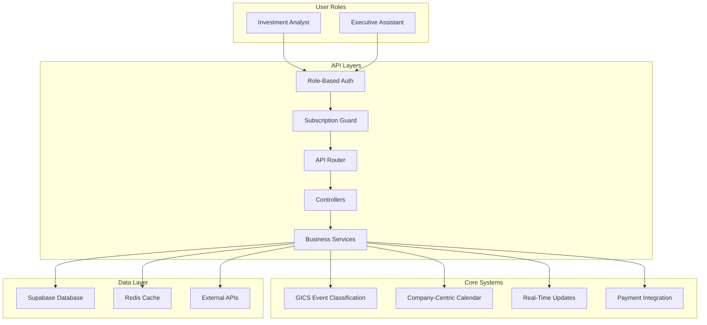

# AGORA Development Guide 04: Backend APIs & Business Logic - User Story Aligned

> **⚠️ PREREQUISITE:** Complete **AGORA_DEV_03_AUTHENTICATION** before starting this document.

## 📋 Overview

This document guides you through implementing the complete backend API system for AGORA using **Cursor AI IDE**, specifically designed to support all user stories and requirements for investment professionals. You'll create subscription-based APIs, role-based access control, GICS company event classification, and Executive Assistant multi-user management.

## 🎯 What You'll Accomplish - User Story Aligned

- ✅ Create subscription-based API access control system
- ✅ Implement GICS company event classification APIs
- ✅ Build role-based authentication and authorization
- ✅ Create Executive Assistant multi-user management APIs
- ✅ Implement company-centric calendar and event APIs
- ✅ Build real-time RSVP and attendee management
- ✅ Create notification systems
- ✅ Set up payment integration for subscription management

## 🏗️ User Story-Driven API Architecture



---

## 🚀 Step 1: User Story-Driven API Foundation

### **1.1 Create Role-Based API Server Foundation**

**Cursor AI Prompt:**
```
Create the core API server structure in backend/src/ with AGORA user story requirements:

1. app.ts - Main Express application with role-based setup:
   - Express server configuration with role-based middleware
   - Subscription-aware CORS and security headers
   - Request logging with user context (Investment Analyst vs Executive Assistant)
   - API versioning structure (/api/v1/) with role-based endpoints
   - Health check endpoint with subscription system status

2. server.ts - Server startup with user story features:
   - Environment configuration for subscription and payment systems
   - Supabase connection with Row Level Security for roles
   - Real-time WebSocket setup for RSVP and attendee updates
   - Payment webhook endpoints for subscription management
   - Development vs production configurations including payment gateways

3. config/index.ts - User story specific configuration:
   - Role-based environment variables (analyst vs EA permissions)
   - Subscription tier and access level configuration
   - Payment gateway configuration (Stripe/corporate billing)
   - GICS sector and subsector configuration
   - Real-time notification and WebSocket settings

4. middleware/user-story.ts - User story specific middleware:
   - roleBasedAuth: Validate user role (investment_analyst | executive_assistant)
   - subscriptionGuard: Ensure user has active subscription for company access
   - userContextMiddleware: Handle EA user switching and context validation
   - auditTrail: Log all actions for compliance and EA oversight

Include comprehensive TypeScript types for user roles, subscription levels, and GICS classification.
```

### **1.2 Set Up User Story-Specific Routing Architecture**

**Cursor AI Prompt:**
```
Create routing architecture specifically for AGORA user stories in backend/src/routes/:

1. index.ts - Role-based router setup:
   - Separate route mounting for Investment Analysts vs Executive Assistants
   - Subscription-aware route protection
   - User context switching routes for EAs
   - Real-time WebSocket endpoint registration
   - Payment webhook route integration

2. User Story Route Modules:
   - auth.ts - Role-based authentication with subscription integration
   - users.ts - User management with EA assisted user relationships
   - companies.ts - GICS company data with subscription filtering
   - events.ts - Event management with company attendance classification
   - subscriptions.ts - Subsector subscription and payment management
   - calendar.ts - Company-centric calendar with user preferences
   - rsvp.ts - Real-time RSVP management with color status
   
   - executive-assistant.ts - Multi-user management for EAs
   - attendees.ts - Real-time attendee list management

3. Subscription-Protected Routes:
   - Route guards that validate subscription access before company data
   - Dynamic route generation based on user's active subscriptions
   - Payment flow integration for subscription upgrades
   - Trial period and grace period handling

4. Executive Assistant Specific Routes:
   - User context switching with security validation
   - Bulk operation endpoints for multi-user management
   - Aggregated notification and dashboard data
   - Audit trail and activity logging endpoints

Each route module must include subscription validation, role checking, and user story specific business logic.
```

### **1.3 Create User Story Middleware System**

**Cursor AI Prompt:**
```
Create comprehensive middleware system for AGORA user story requirements in backend/src/middleware/:

1. subscription-guard.ts - Subscription-based access control:
   - validateSubscriptionAccess(companyId, userId) - Check active subscription for company
   - enforceSubscriptionTiers(requiredTier) - Validate subscription level access
   - handleExpiredSubscriptions(userId) - Graceful subscription expiry handling
   - subscriptionTrialAccess(userId, resource) - Trial period access management
   - paymentPendingAccess(userId) - Handle pending payment scenarios

2. role-based-auth.ts - User role validation and permissions:
   - validateUserRole(allowedRoles) - Ensure user has required role
   - executiveAssistantContext(userId) - Validate EA can access user context
   - auditExecutiveAssistantActions(action, targetUserId) - Log EA actions
   - preventUnauthorizedUserSwitching(eaUserId, targetUserId) - Security validation
   - roleBasedFeatureAccess(feature, userRole) - Feature flag enforcement

3. gics-company-filter.ts - Company-based event filtering:
   - filterEventsByUserSubscriptions(userId, events) - Show only subscribed company events
   - classifyEventsByCompanyAttendance(event) - Identify all attending GICS companies
   - validateCompanyAccess(userId, companyId) - Subscription-based company access
   - applyGICSSubsectorFiltering(userId, companies) - Subsector-based filtering
   - handleMultiCompanyEvents(event, userSubscriptions) - Multi-company event access

4. real-time-middleware.ts - WebSocket and real-time features:
   - authenticateWebSocketConnection(token, userId) - Secure WebSocket auth
   - validateRSVPUpdates(userId, eventId, status) - Real-time RSVP validation
   - broadcastAttendeeUpdates(eventId, attendeeChange) - Live attendee list updates
   
   - manageUserPresence(userId, status) - Online/offline status management

5. payment-integration.ts - Subscription payment handling:
   - validatePaymentWebhooks(signature, payload) - Secure payment notifications
   - processSubscriptionPayment(userId, subscriptionData) - Payment processing
   - handlePaymentFailures(userId, subscriptionId, error) - Payment failure recovery
   - updateSubscriptionStatus(subscriptionId, status) - Real-time status updates
   - enforcePaymentBasedAccess(userId, resource) - Payment-based access control

Include comprehensive logging, error handling, and audit trails for all middleware.
```

---

## 📊 Step 2: Role-Based User Management APIs

### **2.1 Investment Analyst and Executive Assistant APIs**

**Cursor AI Prompt:**
```
Create role-specific user management APIs in backend/src/controllers/users.ts:

1. Role-Based Profile Management:
   - GET /api/v1/users/profile - Get user profile with role-specific data
   - PUT /api/v1/users/profile - Update profile with role validation
   - GET /api/v1/users/role - Get current user role and permissions
   - PUT /api/v1/users/role - Update user role (admin only)
   - GET /api/v1/users/subscription-status - Current subscription status

2. Executive Assistant User Management:
   - GET /api/v1/users/assisted-users - List users EA can manage
   - POST /api/v1/users/assisted-users/:userId - Add user to EA management
   - DELETE /api/v1/users/assisted-users/:userId - Remove user from EA management
   - PUT /api/v1/users/context/:userId - Switch to user context for EA
   - GET /api/v1/users/context - Get current EA user context

3. User Preferences with Role Context:
   - GET /api/v1/users/preferences - Role-specific user preferences
   - PUT /api/v1/users/preferences - Update preferences with validation
   - GET /api/v1/users/calendar-preferences - Calendar organization preferences
   - PUT /api/v1/users/calendar-preferences - Update calendar settings
   - GET /api/v1/users/notification-preferences - Notification settings

4. User Activity and Audit:
   - GET /api/v1/users/activity - User activity log
   - GET /api/v1/users/audit-trail - EA action audit trail
   - POST /api/v1/users/audit-action - Log specific user action
   - GET /api/v1/users/session-history - User session and login history
   - GET /api/v1/users/security-events - Security-related events

5. Multi-User Dashboard (EA Only):
   - GET /api/v1/users/dashboard/overview - Multi-user overview for EA
   - GET /api/v1/users/dashboard/notifications - Aggregated notifications
   - GET /api/v1/users/dashboard/pending-actions - Actions requiring attention
   - GET /api/v1/users/dashboard/calendar-summary - Calendar summary across users
   - GET /api/v1/users/dashboard/subscription-status - Subscription status across users

Include role-based access control and subscription validation for all endpoints.
```

---

## 🏢 Step 3: GICS Company and Subscription Management APIs

### **3.1 Subscription-Filtered Company APIs**

**Cursor AI Prompt:**
```
Create subscription-aware company management APIs in backend/src/controllers/companies.ts:

1. Subscription-Based Company Discovery:
   - GET /api/v1/companies/subscribed - Companies user has active subscriptions for
   - GET /api/v1/companies/available - Companies available for subscription
   - GET /api/v1/companies/sectors/subscribed - User's subscribed GICS sectors
   - GET /api/v1/companies/sectors/available - Available sectors for subscription
   - POST /api/v1/companies/sectors/:sectorId/subscribe - Subscribe to GICS sector

2. GICS Classification and Company Data:
   - GET /api/v1/companies/:ticker/gics - Complete GICS classification data
   - GET /api/v1/companies/gics/sectors - All GICS sectors with subscription info
   - GET /api/v1/companies/gics/subsectors - Available subsectors for subscription
   - GET /api/v1/companies/:ticker/sector-peers - Companies in same GICS sector
   - GET /api/v1/companies/gics/hierarchy - Complete GICS hierarchy structure

3. Company Event Attendance Classification:
   - GET /api/v1/companies/:ticker/events/hosting - Events company is hosting
   - GET /api/v1/companies/:ticker/events/attending - Events company is attending
   - GET /api/v1/companies/:ticker/events/all - All events (hosting + attending)
   - GET /api/v1/companies/events/:eventId/attending-companies - All GICS companies attending event
   - GET /api/v1/companies/events/multi-company - Events with multiple company attendance

4. User Company Preferences:
   - GET /api/v1/companies/row-order - User's custom company row order
   - PUT /api/v1/companies/row-order - Update company row order preference
   - POST /api/v1/companies/row-order/reset - Reset to default ordering
   - GET /api/v1/companies/favorites - User's favorite/prioritized companies
   - PUT /api/v1/companies/favorites - Update favorite companies list

5. Subscription Access Control:
   - GET /api/v1/companies/:ticker/access-status - User's access level for company
   - POST /api/v1/companies/:ticker/request-access - Request subscription for company access
   - GET /api/v1/companies/subscription-required - Companies requiring subscription
   - GET /api/v1/companies/trial-access - Companies available for trial access
   - POST /api/v1/companies/upgrade-subscription - Upgrade subscription for more companies

Include real-time subscription validation and access control for all company data.
```

### **3.2 Subscription Management and Payment APIs**

**Cursor AI Prompt:**
```
Create comprehensive subscription and payment APIs in backend/src/controllers/subscriptions.ts:

1. GICS Subsector Subscription Management:
   - GET /api/v1/subscriptions/gics/sectors - Available GICS sectors for subscription
   - POST /api/v1/subscriptions/gics/sectors/:sectorId - Subscribe to GICS sector
   - DELETE /api/v1/subscriptions/gics/sectors/:sectorId - Cancel sector subscription
   - GET /api/v1/subscriptions/active - User's active subscriptions with expiry
   - GET /api/v1/subscriptions/expired - Expired subscriptions available for renewal

2. Payment Integration and Processing:
   - POST /api/v1/subscriptions/payment/initiate - Initiate subscription payment
   - POST /api/v1/subscriptions/payment/confirm - Confirm payment completion
   - POST /api/v1/subscriptions/payment/methods - Manage payment methods
   - GET /api/v1/subscriptions/billing/history - Billing and payment history
   - POST /api/v1/subscriptions/billing/invoice - Generate invoice for subscription

3. Subscription Tiers and Access Levels:
   - GET /api/v1/subscriptions/tiers - Available subscription tiers and features
   - POST /api/v1/subscriptions/upgrade - Upgrade subscription tier
   - POST /api/v1/subscriptions/downgrade - Downgrade subscription tier
   - GET /api/v1/subscriptions/features - Features available for current subscription
   - GET /api/v1/subscriptions/usage - Current usage against subscription limits

4. Trial and Promotional Access:
   - POST /api/v1/subscriptions/trial/start - Start trial subscription
   - GET /api/v1/subscriptions/trial/status - Trial subscription status
   - POST /api/v1/subscriptions/trial/convert - Convert trial to paid subscription
   - GET /api/v1/subscriptions/promotions - Available promotional offers
   - POST /api/v1/subscriptions/promotions/:promoId/apply - Apply promotional code

5. Real-Time Subscription Status:
   - GET /api/v1/subscriptions/status/real-time - Real-time subscription status
   - WebSocket /ws/subscriptions/status - Live subscription status updates
   - POST /api/v1/subscriptions/status/refresh - Refresh subscription status
   - GET /api/v1/subscriptions/access/validate - Validate current access permissions
   - POST /api/v1/subscriptions/emergency-access - Emergency access requests

Include webhook endpoints for payment processor integration and real-time status updates.
```

---

## 📅 Step 4: Company-Centric Event Management APIs

### **4.1 GICS Company Event Classification APIs**

**Cursor AI Prompt:**
```
Create event management APIs with GICS company attendance classification in backend/src/controllers/events.ts:

1. Company-Centric Event Discovery:
   - GET /api/v1/events/by-company/:ticker - Events for specific company (hosting + attending)
   - GET /api/v1/events/calendar/company-rows - Calendar data organized by company rows
   - GET /api/v1/events/multi-company - Events attended by multiple GICS companies
   - GET /api/v1/events/subscribed-companies - Events from user's subscribed companies only
   - GET /api/v1/events/company-attendance/:eventId - All companies attending specific event

2. Event Classification and Attendance (User Story: Events appear under every attending company):
   - GET /api/v1/events/:eventId/gics-companies - GICS companies attending event
   - PUT /api/v1/events/:eventId/companies/attending - Update company attendance list
   - GET /api/v1/events/classification/hosting-vs-attending - Events by hosting vs attending status
   - GET /api/v1/events/multi-company-indicators - Visual indicators for multi-company events

3. User-Specific Event Views (User Story: "My Events" vs "All Events"):
   - GET /api/v1/events/my-events - Events user has accepted (RSVP: attending)
   - GET /api/v1/events/all-events - All events from subscribed companies
   - GET /api/v1/events/pending-rsvp - Events requiring RSVP response
   - GET /api/v1/events/declined - Events user has declined
   

4. Event Search and Filtering:
   - GET /api/v1/events/search - Search events with subscription filtering
   - GET /api/v1/events/filter/by-companies - Filter events by specific companies
   - GET /api/v1/events/filter/by-sectors - Filter events by GICS sectors
   - GET /api/v1/events/filter/by-date-range - Filter events by date range
   - GET /api/v1/events/filter/by-rsvp-status - Filter events by user's RSVP status

Include subscription validation and real-time updates for all event classification data.
```

### **4.2 Real-Time RSVP and Attendee Management APIs**

**Cursor AI Prompt:**
```
Create real-time RSVP and attendee management APIs in backend/src/controllers/rsvp.ts:

1. Color-Coded RSVP Management (User Story: Green/Yellow/Grey color coding):
   - POST /api/v1/rsvp/:eventId/attending - RSVP as attending (green status)
   - POST /api/v1/rsvp/:eventId/not-attending - RSVP as not attending (yellow status)
   - POST /api/v1/rsvp/:eventId/pending - Set RSVP as pending (grey status)
   - GET /api/v1/rsvp/:eventId/status - Get user's current RSVP status with color
   - GET /api/v1/rsvp/user/all-statuses - All user's RSVP statuses with color coding

2. Real-Time RSVP Updates:
   - WebSocket /ws/rsvp/:eventId - Real-time RSVP status updates
   - POST /api/v1/rsvp/:eventId/update - Update RSVP with real-time broadcast
   - GET /api/v1/rsvp/:eventId/live-count - Live attendee count updates
   - POST /api/v1/rsvp/bulk-update - Bulk RSVP updates (for Executive Assistants)
   - GET /api/v1/rsvp/pending-actions - Events requiring RSVP action

3. Attendee List Management (User Story: See who is attending):
   - GET /api/v1/attendees/:eventId - Real-time attendee list
   - GET /api/v1/attendees/:eventId/confirmed - Confirmed attendees only
   - GET /api/v1/attendees/:eventId/by-company - Attendees grouped by company
   - POST /api/v1/attendees/:eventId/visibility - Control attendee list visibility

4. Executive Assistant RSVP Management:
   - POST /api/v1/rsvp/ea/:userId/:eventId/attending - EA RSVP on behalf of user
   - GET /api/v1/rsvp/ea/managed-users - RSVP status across all managed users
   - POST /api/v1/rsvp/ea/bulk-operation - Bulk RSVP for multiple users/events
   - GET /api/v1/rsvp/ea/pending-decisions - Events requiring EA attention
   - POST /api/v1/rsvp/ea/audit-action - Log EA RSVP actions with context

Include WebSocket integration for real-time updates and comprehensive audit trails.
```

---

## 🔔 Step 5: Notification APIs

### **5.1 Notification and Real-Time Communication APIs**

**Cursor AI Prompt:**
```
Create comprehensive notification system APIs in backend/src/controllers/notifications.ts:

1. Role-Based Notification Management:
   - GET /api/v1/notifications - Get user notifications with role context
   - GET /api/v1/notifications/ea/aggregated - EA aggregated notifications across users
   - POST /api/v1/notifications/mark-read - Mark notifications as read
   - DELETE /api/v1/notifications/:notificationId - Delete notification
   - GET /api/v1/notifications/unread-count - Real-time unread notification count

2. Event-Related Notifications:
   - POST /api/v1/notifications/rsvp-reminder - RSVP reminder notifications
   - POST /api/v1/notifications/event-change - Event change/cancellation notifications
   - POST /api/v1/notifications/attendee-update - Attendee list change notifications
   
   - POST /api/v1/notifications/event-reminder - Event time reminder notifications

3. Subscription and Payment Notifications:
   - POST /api/v1/notifications/subscription-expiry - Subscription expiry warnings
   - POST /api/v1/notifications/payment-reminder - Payment due reminders
   - POST /api/v1/notifications/subscription-renewal - Renewal confirmations
   - POST /api/v1/notifications/new-companies - New companies available notifications

4. Real-Time WebSocket Notifications:
   - WebSocket /ws/notifications/:userId - Real-time notification stream
   - WebSocket /ws/notifications/ea/:eaUserId - EA aggregated notification stream
   - POST /api/v1/notifications/push/register - Register for push notifications
   - POST /api/v1/notifications/push/unregister - Unregister push notifications

5. Notification Preferences and Channels:
   - GET /api/v1/notifications/preferences - User notification preferences
   - PUT /api/v1/notifications/preferences - Update notification preferences
   - POST /api/v1/notifications/channels/email - Email notification settings
   - POST /api/v1/notifications/channels/push - Push notification settings

Include notification delivery tracking and failure retry mechanisms.
```

---

## 🔧 Step 6: Calendar and Company Row Management APIs

### **6.1 Company-Centric Calendar APIs**

**Cursor AI Prompt:**
```
Create company-centric calendar APIs in backend/src/controllers/calendar.ts:

1. Company Row Calendar Data (User Story: Drag-and-drop company rows):
   - GET /api/v1/calendar/company-rows - Calendar data organized by company ticker rows
   - GET /api/v1/calendar/company-rows/user-order - User's custom company row order
   - PUT /api/v1/calendar/company-rows/reorder - Update company row order
   - GET /api/v1/calendar/company-rows/subscribed - Calendar showing only subscribed companies
   - POST /api/v1/calendar/company-rows/reset-order - Reset to default company order

2. Calendar View Management:
   - GET /api/v1/calendar/views/my-events - Calendar view showing only accepted events
   - GET /api/v1/calendar/views/all-events - Calendar view showing all subscribed events
   - GET /api/v1/calendar/views/company-specific/:ticker - Single company calendar view (blow-up)
   - GET /api/v1/calendar/views/date-range - Calendar data for specific date range
   - GET /api/v1/calendar/views/mobile-optimized - Mobile-optimized calendar data

3. Calendar Integration and Export:
   - GET /api/v1/calendar/export/ics - Export calendar in ICS format
   - POST /api/v1/calendar/sync/outlook - Sync with Outlook calendar
   - GET /api/v1/calendar/conflicts - Detect calendar conflicts
   - POST /api/v1/calendar/add-event/:eventId - Add event to personal calendar

4. Calendar Preferences and Settings:
   - GET /api/v1/calendar/preferences - User calendar preferences
   - PUT /api/v1/calendar/preferences - Update calendar preferences
   - GET /api/v1/calendar/working-hours - User working hours configuration
   - PUT /api/v1/calendar/working-hours - Update working hours

5. Real-Time Calendar Updates:
   - WebSocket /ws/calendar/:userId - Real-time calendar updates
   - POST /api/v1/calendar/refresh - Refresh calendar data
   - GET /api/v1/calendar/last-updated - Calendar last update timestamp
   - POST /api/v1/calendar/sync-status - Calendar synchronization status

6. Executive Assistant Calendar Management:
   - GET /api/v1/calendar/ea/multi-user - Calendar overview for all managed users
   - POST /api/v1/calendar/ea/bulk-operations - Bulk calendar operations
   - GET /api/v1/calendar/ea/conflicts-across-users - Conflicts across managed users
   - POST /api/v1/calendar/ea/coordinate-meetings - Coordinate meetings between users

Include optimizations for mobile scrolling and Office add-in constraints.
```

---

## 🔧 Step 7: Business Logic Services for User Stories

### **7.1 Event Classification and Company Attendance Services**

**Cursor AI Prompt:**
```
Create business logic services for event classification in backend/src/services/event-classification/:

1. gics-company-attendance.service.ts - GICS company event classification:
   - classifyEventsByCompanyAttendance(event) - Identify all GICS companies attending
   - resolveMultiCompanyEvents(event, companies) - Handle events with multiple company attendance
   - updateEventCompanyClassification(eventId, attendanceData) - Update classification

2. subscription-based-filtering.service.ts - Filter events by user subscriptions:
   - filterEventsByUserSubscriptions(userId, events) - Show only subscribed company events
   - validateEventAccess(userId, eventId) - Subscription-based event access validation
   - getAccessibleEvents(userId, dateRange) - Events user can access based on subscriptions
   - handleSubscriptionExpiry(userId, events) - Graceful handling of expired subscriptions

3. event-company-mapping.service.ts - Map events to companies:
   - mapEventToAllAttendingCompanies(eventId) - Map event to all attending GICS companies
   - resolveEventHostingVsAttending(eventId) - Distinguish hosting vs attending companies
   - generateCompanyEventMatrix(companies, events) - Create company-event relationship matrix
   - optimizeEventDisplay(userId, events) - Optimize event display based on user preferences

4. calendar-organization.service.ts - Company-centric calendar organization:
   - organizeEventsByCompanyRows(userId, events) - Organize events into company rows
   - handleCompanyRowDragDrop(userId, newOrder) - Process company row reordering
   - syncCalendarPreferences(userId, preferences) - Sync calendar preferences across devices

5. multi-company-event.service.ts - Handle events with multiple companies:
   - identifyMultiCompanyEvents(events) - Identify events with multiple GICS company attendance
   - distributeMultiCompanyEvent(eventId, companies) - Distribute event across company rows
   - optimizeMultiCompanyDisplay(userId, event) - Optimize display for multi-company events

Include algorithms for event classification and performance optimization.
```

### **7.2 Real-Time and Collaboration Services**

**Cursor AI Prompt:**
```
Create real-time collaboration services in backend/src/services/collaboration/:

1. real-time-rsvp.service.ts - Real-time RSVP management:
   - processRealTimeRSVP(userId, eventId, status) - Process RSVP with real-time updates
   - broadcastRSVPUpdate(eventId, rsvpChange) - Broadcast RSVP changes to all users
   - handleRSVPConflicts(userId, conflictingRSVPs) - Resolve RSVP scheduling conflicts

2. attendee-management.service.ts - Real-time attendee list management:
   - updateAttendeeListRealTime(eventId, attendeeChange) - Real-time attendee updates
   - manageAttendeePrivacy(eventId, privacySettings) - Handle attendee privacy controls


   

4. executive-assistant.service.ts - Multi-user management for EAs:
   - validateEAUserAccess(eaUserId, targetUserId) - Validate EA can manage target user
   - aggregateUserData(eaUserId, dataType) - Aggregate data across managed users
   - processBulkOperations(eaUserId, operation, targets) - Process bulk operations
   - generateEADashboard(eaUserId) - Generate EA dashboard data
   - auditEAActions(eaUserId, action, context) - Comprehensive EA action auditing

5. notification-engine.service.ts - Real-time notification processing:
   - processRealTimeNotification(userId, notification) - Process real-time notifications
   - routeNotificationByPreferences(userId, notification) - Route based on user preferences
   - aggregateNotificationsForEA(eaUserId) - Aggregate notifications for EAs

6. websocket-management.service.ts - WebSocket connection management:
   - manageWebSocketConnections(userId, connectionData) - Manage user connections
   - broadcastToUserConnections(userId, message) - Broadcast to all user connections
   - handleWebSocketAuthentication(connection, token) - Authenticate WebSocket connections

Include comprehensive error handling, retry mechanisms, and performance monitoring.
```

---

## 🤖 Step 8: MCP Server Integration Layer

### **8.1 MCP Server Setup and Tool Registry**

**Cursor AI MCP Server Prompt:**
```
Create MCP server integration in backend/src/mcp/:

1. mcp-server.ts - Main MCP server:
   - MCP protocol implementation using @modelcontextprotocol/sdk
   - Tool registry with all AGORA-specific tools
   - Authentication bridge to existing Supabase auth
   - Rate limiting for MCP tool usage
   - Comprehensive audit logging for compliance

2. tools/event-tools.ts - Event management MCP tools:
   - search_events: Natural language event search with subscription filtering
   - event_details: Get comprehensive event information
   - rsvp_event: Process RSVP requests (maintaining color coding)
   - who_is_attending: Get attendee lists (respecting privacy settings)
   - my_agenda: Personalized agenda with "My Events" vs "All Events" distinction

3. tools/subscription-tools.ts - Subscription management MCP tools:
   - manage_subscription: Handle GICS sector subscriptions
   - subscription_status: Get current subscription information
   - subscription_recommendations: AI-powered subscription suggestions
   - payment_required: Handle subscription upgrade flows

4. tools/ea-tools.ts - Executive Assistant MCP tools:
   - switch_user_context: Secure user context switching for EAs
   - bulk_rsvp: Handle multiple RSVP operations
   - multi_user_calendar: Aggregated calendar view
   - ea_audit_log: Access EA action history
   - bulk_subscription: Manage subscriptions across multiple users

5. auth/mcp-auth.ts - MCP authentication bridge:
   - mapSupabaseAuthToMCP: Convert existing auth to MCP context
   - validateMCPPermissions: Enforce role-based and subscription-based access
   - auditMCPAccess: Log all MCP tool usage for compliance
   - rateLimitMCPUser: Prevent abuse of conversational interface

Each tool must maintain the same security, subscription validation, and business logic as the existing REST APIs.
```

### **8.2 Tool Implementation with Business Logic Integration**

**Cursor AI MCP Tool Implementation Prompt:**
```
Implement MCP tools that integrate with existing business logic in backend/src/mcp/tools/:

1. search_events.ts - Natural language event search:
   - Parse natural language queries for sectors, companies, dates
   - Use existing subscription filtering logic from subscription-guard.ts
   - Call existing GET /api/v1/events/search endpoint
   - Format results for natural language response
   - Maintain GICS company event classification
   - Include subscription upgrade suggestions for inaccessible events

2. rsvp_event.ts - RSVP processing via conversation:
   - Validate user access to event (existing subscription logic)
   - Process RSVP using existing POST /api/v1/rsvp/:eventId/* endpoints
   - Maintain real-time WebSocket broadcasting
   - Support EA delegation through on_behalf_of parameter
   - Return updated event status with color coding (green/yellow/grey)

3. event_details.ts - Comprehensive event information:
   - Use existing GET /api/v1/events/:eventId endpoint
   - Include GICS company attendance classification
   - Show multi-company event indicators
   - Respect attendee privacy settings
   - Include weather information if available
   - Format for conversational response

4. my_agenda.ts - Personalized schedule management:
   - Use existing calendar APIs with user preferences
   - Support "My Events" vs "All Events" distinction
   - Include company-specific calendar blow-up capability
   - Show subscription status for each event
   - Format for natural language presentation

5. who_is_attending.ts - Attendee information:
   - Use existing GET /api/v1/attendees/:eventId endpoint
   - Respect privacy and role-based access controls
   - Format attendee information for conversation
   - Include company affiliations where appropriate
   - Support EA queries about managed users' events

Each tool must log all actions to mcp_interaction_logs table and respect existing rate limiting.
```

### **8.3 MCP API Endpoints**

```typescript
// New MCP-specific endpoints in backend/src/routes/mcp.ts
POST /api/v1/mcp/chat - Main conversational interface
POST /api/v1/mcp/tools/:toolName - Direct tool execution
GET /api/v1/mcp/available-tools - List available tools for user
GET /api/v1/mcp/conversation-history - Get conversation context
POST /api/v1/mcp/reset-context - Reset conversation context
GET /api/v1/mcp/audit-log - MCP interaction audit trail
```

---

## ✅ User Story Completion Checklist (Enhanced with MCP)

Before proceeding to **AGORA_DEV_05_FRONTEND_FOUNDATION_REVISED**, verify all USER STORY backend support including MCP integration:

### **Core User Story Backend Support ✅**
- [ ] Subscription-based API access control implemented
- [ ] GICS company event classification APIs created (events appear under ALL attending companies)
- [ ] Company-centric calendar data APIs functional
- [ ] Real-time RSVP with color status support (green/yellow/grey)
- [ ] Multi-company event attendance classification working
- [ ] User role-based APIs (Investment Analyst vs Executive Assistant)

### **Executive Assistant Features ✅**
- [ ] Multi-user management APIs implemented
- [ ] User context switching with security validation
- [ ] Bulk operation APIs for EA role
- [ ] Aggregated notification APIs working
- [ ] EA audit trail and action logging functional

### **Event and Company Features ✅**
- [ ] "My Events" vs "All Events" API distinction
- [ ] Company row ordering preference APIs
- [ ] Company-specific event blow-up APIs
- [ ] Real-time attendee list management APIs


### **Subscription and Payment ✅**
- [ ] GICS subsector subscription APIs
- [ ] Payment integration for subscription access
- [ ] Subscription-based event filtering
- [ ] Trial and promotional access APIs

### **Real-Time Features ✅**
- [ ] WebSocket integration for live updates
- [ ] Real-time RSVP status broadcasting
- [ ] Live attendee list updates

- [ ] Subscription status real-time updates

### **Business Logic Services ✅**
- [ ] Event classification by company attendance
- [ ] Subscription validation and access control
- [ ] Role-based permission enforcement
- [ ] Multi-user data aggregation for EAs

### **MCP Integration Features ✅**
- [ ] MCP server setup with @modelcontextprotocol/sdk
- [ ] Authentication bridge from Supabase to MCP context
- [ ] Core MCP tools implemented (search_events, rsvp_event, my_agenda)
- [ ] Executive Assistant MCP tools (bulk operations, user switching)
- [ ] MCP audit logging to mcp_interaction_logs table
- [ ] Rate limiting for MCP tool usage
- [ ] Natural language query parsing and response formatting
- [ ] Subscription validation maintained in MCP tools
- [ ] Real-time features preserved through MCP interface

---

## 📋 Next Steps

Once ALL user story backend requirements are implemented:

1. **Test API endpoints against user stories:**
   ```bash
   npm run test:user-stories
   npm run test:subscription-access
   npm run test:role-based-auth
   ```

2. **Validate real-time features:**
   ```bash
   npm run test:websockets
   npm run test:real-time-updates
   ```

3. **Test payment integration:**
   ```bash
   npm run test:payment-flow
   npm run test:subscription-access
   ```

4. **Commit user story backend:**
   ```bash
   git add .
   git commit -m "Complete backend APIs: All user stories implemented with subscription, role-based access, and real-time features"
   ```

5. **Proceed to AGORA_DEV_05_FRONTEND_FOUNDATION_REVISED.md** - Frontend implementation aligned with backend

---

**Document Status:** ✅ User Story Aligned and Ready for Implementation  
**Next Document:** AGORA_DEV_05_FRONTEND_FOUNDATION_REVISED.md  
**Estimated Time:** 12-15 hours (increased due to user story complexity)  
**Difficulty:** Advanced (subscription system, real-time features, role-based access)  
**Prerequisites:** Completed AGORA_DEV_03_AUTHENTICATION with role support