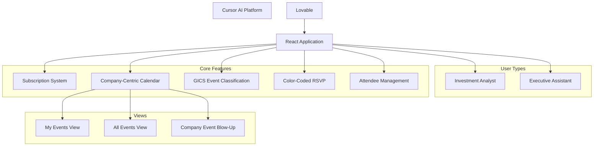

# AGORA Development Guide 05: Frontend Foundation with User Stories Integration

> **⚠️ PREREQUISITE:** Complete **AGORA_DEV_04_BACKEND_APIS** before starting this document.

## 📋 Overview

This document guides you through creating the React frontend foundation for AGORA using **Cursor AI**, specifically designed to implement all user stories and requirements for investment professionals. You'll build a subscription-based, company-centric calendar system with Executive Assistant support and GICS company attendance classification.

## 🎯 What You'll Accomplish

- ✅ Set up React application with Cursor AI tailored to user stories
- ✅ Implement subscription-based event visibility system
- ✅ Create company-centric calendar with drag-and-drop rows
- ✅ Build GICS company attendance classification
- ✅ Implement color-coded RSVP status system (Green/Yellow/Grey)
- ✅ Create Executive Assistant multi-user management
- ✅ Build "My Events" vs "All Events" views
- ✅ Implement attendee visibility
- ✅ Create Office add-in optimized layouts

## 🏗️ Frontend Architecture Based on User Stories



---

## 📱 UI Design Specifications

### **Complete Interface Description for AI Agent Implementation**

Based on user stories and design requirements, here's the comprehensive UI layout specification:

#### **Main Calendar View Layout**

**Header Navigation:**
- Multi-week tab navigation (Week 1, Week 2, Week 3, Week 4) with current week highlighted. Ability to navigate to months 
- View toggle options: Month/Week view selector
- **Event Filter Buttons:** "All Events" and "My Events" toggle
  - **"All Events":** Shows all events from subscribed companies (regardless of RSVP status)
  - **"My Events":** Shows only events that have been RSVPed to (Attending, Not Attending, or Pending response)
- Global search bar in top-right corner
- **Travel Information Widget:** Current date display with comprehensive travel decision data:
  - Temperature and weather conditions with icon
  - Weather forecast for the week
  - Time zone indicator (e.g., "EST GMT-5")
  - Any other weather-related travel alerts or conditions

**Primary Calendar Grid:**
- **Left sidebar:** Vertically draggable company ticker symbols (INTC, KO, KEY, GM, Raytheon, TSLA, GOOGL, TEL) in parentheses
  - User can drag and drop to reorder companies by priority
  - Order persists across sessions
- **Top header:** Horizontal day columns (MON 21, TUE 22, WED 23, THU 24, FRI 25, SAT 26, SUN 27)
- **Grid cells:** Company events displayed as colored rectangular blocks within each day/company intersection

**Event Display - Attendance Status Color Coding:**
- **Green blocks:** Events user is attending (RSVP: Yes)
- **Yellow blocks:** Events user is not attending (RSVP: No)  
- **Grey blocks:** Events pending user's response (RSVP: Pending)
- **Event details:** Each block shows event title and time (e.g., "Earnings Release 09:00 AM", "Financial Update 12:30 PM")
- **Multi-company events:** Visual indicators (e.g., small icon) when event appears under multiple companies
- **Interactive:** Clicking on any event block opens the Event Details Panel on the right sidebar

**Calendar Navigation & Views:**
- **Both tabbed weeks AND scrollable calendar** functionality
- **Mobile-friendly:** Smooth horizontal and vertical scrolling
- **Month view option:** Switch between week and month calendar layouts
- **Company blow-up:** Click on any company ticker to expand into detailed company-specific standard calendar view

**Right Sidebar - Event Details Panel (Appears on Event Click):**
- **Triggered by:** Clicking on any event block in the calendar grid
- **Event Title & Theme:** Highlighted header with event name
- **Date & Time:** "8:30 - 9:00 AM" with time zone
- **Location Details:** 
  - Physical events: Full address including room number, conference hall details
  - Virtual events: Meeting link and dial-in information
- **Event Description:** Brief compelling summary of what the event covers
- **Speakers, Hosts, or Special Guests:** 
  - Names, titles, and brief bios or highlights
  - Target audience description
- **Agenda or Key Sessions:** 
  - Overview of topics/activities planned
  - Main sessions, panels, or breakout rooms
- **RSVP Status & Actions:** 
  - Current attendance status (Attending/Not Attending/Pending)
  - RSVP buttons to change status
- **Attendee List:** Names and roles of other confirmed attendees
- **Access & Entry Fee:** Registration requirements and costs
- **Registration Details:** Call-to-action button for sign-up
- **Contact or Support Info:** Yellow highlighted contact section
- **Tags:** Green pill-shaped tags for categorization (e.g., "#SpringBreakfast")
- **Close button:** To close the panel and return to full calendar view

**Bottom Calendar Navigation:**
- **Month view widget:** "February 2025" with left/right arrows for navigation
- **Monthly mini-grid:** Traditional calendar grid with current day highlighted
- **Quick date jumping:** Click any date to navigate to that week/day

#### **Company-Specific Calendar Blow-Up View**

When a user clicks on a company ticker (e.g., "AAPL"), the interface transitions to a traditional standard calendar view focused on that company:

**Layout Structure:**
```
┌─────────────────────────────────────────────────────────────────┐
│ [← Back to All Companies] APPLE INC. (AAPL) Calendar            │
├─────────────────────────────────────────────────────────────────┤
│ July 2025    [← →]                     [All Events ▼]           │
├─────────────────────────────────────────────────────────────────┤
│  Sun │  Mon │  Tue │  Wed │  Thu │  Fri │  Sat                  │
├──────┼──────┼──────┼──────┼──────┼──────┼──────                 ┤
│   6  │   7  │   8  │   9  │  10  │  11  │  12                   │
│      │      │      │      │      │      │                       │
├──────┼──────┼──────┼──────┼──────┼──────┼──────                 ┤
│  13  │  14  │  15  │  16  │  17  │  18  │  19                   │
│      │      │ [🟢  │      │ [🟡  │      │                      │
│      │      │ Host │      │ Attend│     │                       │
│      │      │ Q3   │      │ Tech  │     │                       │
│      │      │ Call]│      │ Conf] │     │                       │
├──────┼──────┼──────┼──────┼──────┼──────┼──────                 ┤
│  20  │  21  │  22  │  23  │  24  │  25  │  26                   │
│      │ [ 🟢 │      │ [⚫  │ [🔶  │     │                      │
│      │ Host │      │ Multi│ Attend│     │                      │
│      │ AGM  │      │ Corp │ Summit│     │                      │
│      │ ]    │      │ Conf]│ ]     │     │                      │
└──────┴──────┴──────┴──────┴──────┴──────┴──────                ┘
```

**Event Identification System:**
- **Hosted Events:** 
  - Label: "Host" badge/indicator on event block
  - Company is the primary organizer
  - Full event control and management
- **Attending Events:**
  - Label: "Attend" badge/indicator on event block
  - Company is participating but not hosting
  - Limited control, RSVP only
- **Multi-Company Events:**
  - Special icon: 🔶 or multi-company indicator
  - Label: "Multi Corp" badge
  - Shows when multiple GICS companies are involved
  - Displays all participating companies in event details

**Company Blow-Up Features:**
- **Standard Calendar Layout:** Traditional month view like Google Calendar or Outlook
- **Header:** Company name and ticker prominently displayed with company branding
- **Breadcrumb Navigation:** "← Back to All Companies" button
- **Event Classification Visual Indicators:**
  - Clear badges/labels distinguishing hosting vs attending
  - Special indicators for multi-company events
  - RSVP color coding maintained (green/yellow/grey)
- **Enhanced Event Details:** Click events for expanded information panel
- **Company Context:** All events show relationship to the selected company
- **View Options:** Month view only available
- **Filtering Options:** Filter by event type, date range, RSVP status, hosting status

---

#### **Key Features & Behaviors:**

**Event Filtering Logic:**
- **"All Events" mode:** Shows all events from subscribed companies on calendar, regardless of RSVP status
- **"My Events" mode:** Shows only events where user has provided an RSVP response (Attending/Not Attending/Pending)
- Color coding applies in both modes based on attendance status
- Filter selection persists across sessions

**Subscription-Based Visibility:**
- Only events from subscribed companies appear in calendar (in both "All Events" and "My Events" modes)
- Events classified by GICS company attendance (not just hosting)
- If multiple GICS companies attend same event, it appears under each company's row

**Interaction Patterns:**
- **Default state:** Calendar shows event blocks, right sidebar is hidden or shows summary
- **Event click:** Right sidebar slides in or expands with detailed event information
- **Company click:** Expands to company-specific calendar view
- **Outside click:** Closes event details panel and returns to main calendar view

**Mobile & Accessibility:**
- Responsive design that works on mobile devices
- Touch-friendly scrolling and navigation
- Event details panel adapts to mobile layout (possibly full-screen overlay)
- Accessible color contrast and screen reader support

**Executive Assistant Features:**
- User context switching dropdown for EAs managing multiple users
- All operational functions available (RSVP, subscribe, view attendees)
- "My Events" shows events for the currently selected user context
- No access to sensitive analytics or private notes

**Real-time Updates:**
- Attendee lists update in real-time as users RSVP
- Event details sync across all user sessions
- Event blocks update color immediately when RSVP status changes
- Notification badges for new events or changes

---

## 🚀 Step 1: Cursor AI Project Setup for AGORA User Stories

### **1.1 Create AGORA-Specific Cursor AI Project**

**Cursor AI Project Initialization Prompt:**
```
Create a React TypeScript application for "AGORA" - a subscription-based Microsoft Outlook add-in for investment professionals with these SPECIFIC requirements:

Core User Stories Implementation:
- Company-centric calendar where events appear under ticker symbols of GICS companies attending (not just hosting)
- Subscription-based event visibility - users only see events from companies they've subscribed to
- Color-coded RSVP status: Green (attending), Yellow (not attending), Grey (pending)
- Drag-and-drop company rows for custom calendar organization
- Executive Assistant role with multi-user management capabilities
- "My Events" (accepted events) vs "All Events" (all subscribed company events) views
- Company-specific event "blow-up" - detailed calendar view for single company
- Real-time attendee lists for each event
- **Mobile-friendly calendar scrolling with fixed headers:**
  - **Vertical scrolling:** Day headers (MON 21, TUE 22, etc.) remain fixed at top while company rows scroll
  - **Horizontal scrolling:** Company ticker column remains fixed on left while day columns scroll
  - **Touch gestures:** Smooth momentum scrolling with bounce effects on scroll boundaries
  - **Performance:** Virtualized rendering for large date ranges to maintain 60fps scrolling
  - **UX behavior:** 
    - Snap-to-grid alignment when scrolling stops (events align to grid)
    - Visual scroll indicators showing current position in calendar
    - Pinch-to-zoom disabled to prevent accidental interface scaling
    - Pull-to-refresh gesture for updating calendar data

**Visual Theme:**
- Bloomberg-style dark mode  
- Dense, high-contrast design with clean sans-serif fonts  
- Data-focused, minimal distractions

Technical Requirements:
- React 18+ with TypeScript
- Tailwind CSS with custom color system for RSVP status
- React Router with role-based routing (Analyst vs Executive Assistant)
- React Query for subscription-filtered data fetching
- Zustand for complex state management (user switching, calendar preferences)
- React Beautiful DnD for company row reordering
- React Calendar with custom company-row layout
- Responsive design optimized for Office add-in constraints (320px-450px)
- Real-time updates for attendee lists and RSVP changes

Set up the project structure with placeholder components for all user story features.
```

### **1.2 Configure User Story-Specific Dependencies**

**Cursor AI Dependencies Configuration Prompt:**
```
Configure the AGORA project with dependencies specifically for user story implementation:

Required Dependencies:
1. Core Framework:
   - @supabase/supabase-js for subscription and event data
   - @tanstack/react-query for subscription-filtered data fetching
   - zustand for user switching and calendar state management
   - react-router-dom with role-based routing

2. Calendar and Interaction:
   - react-beautiful-dnd for company row drag-and-drop
   - @dnd-kit/core as fallback for complex drag interactions
   - react-calendar for company-specific blow-up views
   - date-fns for event time handling and calendar logic

3. User Story Specific:
   - react-hook-form for subscription and RSVP forms
   - @hookform/resolvers for form validation
   - lucide-react for status icons (green/yellow/grey indicators)
   
   - @tanstack/react-virtual for performance with large company lists

4. Office Integration:
   - @microsoft/office-js-helpers for Office add-in optimization
   - office-ui-fabric-react for Office theme integration

5. Development:
   - @types/react-beautiful-dnd for TypeScript support
   - tailwindcss with custom color configuration for RSVP status
   - @tailwindcss/forms for subscription forms

Create package.json, TypeScript config with strict typing for user roles, and Vite config optimized for Office add-in development.
```

### **1.3 Set Up User Story Types and Constants**

**Cursor AI Types and Constants Prompt:**
```
Create comprehensive TypeScript types and constants for AGORA user stories:

1. Create src/types/user-stories.ts with interfaces for:
   - UserRole: 'investment_analyst' | 'executive_assistant'
   - RSVPStatus: 'attending' | 'not_attending' | 'pending' with color mapping
   - SubscriptionStatus: 'active' | 'expired' | 'pending_payment'
   - EventClassification: Based on GICS company attendance, not just hosting
   - CompanyRow: For drag-and-drop calendar organization
   - AttendeeInfo: For attendee lists with roles and visibility
   
   - CalendarView: 'my_events' | 'all_events' | 'company_specific'

2. Create src/types/entities.ts matching user stories:
   - User: Include role, assisted_users (for EAs), subscription_preferences
   - Company: Include GICS classification, subscription_status, calendar_order
   - Event: Include attending_companies[], rsvp_status, attendee_list
   - Subscription: Include subsector, payment_status, access_level
   - Notification: Include rsvp_reminders, subscription_updates

3. Create src/constants/user-stories.ts with:
   - RSVP_COLORS: { attending: 'green', not_attending: 'yellow', pending: 'grey' }
   - USER_ROLES: Investment Analyst and Executive Assistant permissions
   - CALENDAR_VIEWS: My Events, All Events, Company Specific configurations
   - OFFICE_CONSTRAINTS: Task pane width ranges and mobile considerations
   - GICS_SECTORS: Available subsectors for subscription

4. Create src/constants/business-rules.ts:
   - Subscription requirements for event visibility
   - Executive Assistant access permissions and restrictions
   - Event classification rules based on company attendance
   - Calendar organization and drag-drop rules

Include proper TypeScript definitions that enforce user story business rules.
```

---

## 🎨 Step 2: User Story-Driven Design System

### **2.1 Create RSVP Status Color System**

**Cursor AI RSVP Color System Prompt:**
```
Create a design system specifically for AGORA user story requirements:

1. RSVP Status Color System (Core User Story):
   - Attending Events: Green (#10B981) - clear, positive indication
   - Not Attending Events: Yellow (#F59E0B) - cautionary, neutral indication  
   - Pending Response: Grey (#6B7280) - neutral, awaiting action
   - No category legend - colors alone indicate status per user requirements

2. Role-Based UI Colors:
   - Investment Analyst: Primary blue (#0066CC) for main actions
   - Executive Assistant: Purple (#8B5CF6) for EA-specific features and user switching
   - Multi-user indicators: Distinct colors for each assisted user

3. Subscription Status Colors:
   - Active Subscription: Success green (#10B981)
   - Expired Subscription: Warning red (#EF4444)
   - Pending Payment: Amber (#F59E0B)

4. Company and Event Colors:
   - GICS Sector color coding for quick visual identification
   - Multi-company event indicators with gradient or pattern overlays
   - Company row highlighting for drag-and-drop interactions

5. Office Add-in Optimization:
   - High contrast ratios for task pane visibility
   - Touch-friendly color boundaries for mobile Office apps
   - Consistent with Office dark/light theme switching

Update Tailwind config with custom color classes like 'rsvp-attending', 'rsvp-not-attending', 'rsvp-pending' and role-specific colors.
```

### **2.2 Build User Story-Specific Components**

**Cursor AI User Story Components Prompt:**
```
Create UI components specifically for AGORA user stories:

1. Calendar Components:
   - CompanyRowCalendar: Horizontal scrolling calendar with company ticker rows
   - DraggableCompanyRow: Drag-and-drop company row with ticker symbol and events
   - EventCell: Color-coded event cell showing RSVP status and attending companies
   - CompanyBlowUpCalendar: Detailed calendar view for single company events
   - CalendarScrollContainer: Mobile-friendly horizontal/vertical scrolling

2. Subscription Components:
   - SubscriptionGate: Blocks access to non-subscribed company events
   - SubsectorSelector: Browse and subscribe to GICS subsectors with payment
   - SubscriptionStatus: Visual indicator of current subscription status
   - PaymentPrompt: Secure payment flow for subsector subscriptions

3. RSVP and Status Components:
   - RSVPStatusIndicator: Green/Yellow/Grey visual status without legend
   - RSVPActionButtons: Quick RSVP actions with color feedback
   - AttendeeList: Real-time list of confirmed attendees with roles
   

4. Executive Assistant Components:
   - UserSwitcher: Switch between assisted users with clear indication
   - MultiUserDashboard: Overview of all assisted users' events and notifications
   - OperationalControls: Full access controls for EA role
   - NotificationCenter: Aggregated notifications for all assisted users

5. Event Classification Components:
   - MultiCompanyEventBadge: Shows when event appears under multiple companies
   - GICSCompanyAttendance: List of all GICS companies attending an event
   - EventDistribution: Visual showing which company rows an event appears in

6. View Toggle Components:
   - EventViewSwitcher: Toggle between "My Events" and "All Events"
   - CalendarViewControls: Switch between company-centric and standard views
   - FilterControls: Subscription-based event filtering

Ensure all components support Office add-in constraints and mobile touch interactions.
```

### **2.3 Create Role-Based Layout System**

**Cursor AI Role-Based Layout Prompt:**
```
Create responsive layout system for different user roles and Office constraints:

1. Investment Analyst Layout:
   - Primary focus on company-centric calendar
   - Personal subscription management prominent
   - Individual event RSVP and attendance focus
   - Quick access to "My Events" vs "All Events" toggle

2. Executive Assistant Layout:
   - Multi-user switcher always visible
   - Aggregated dashboard showing all assisted users
   - Bulk operation capabilities for event management
   - Clear indication of which user context they're operating in

3. Calendar Layout Variations:
   - Company Row Layout: Horizontal scrolling with ticker symbols on left
   - Standard Calendar: Traditional view for company-specific blow-up
   - Mobile Layout: Optimized scrolling for touch interfaces
   - Task Pane Layout: Optimized for 320px-450px Office add-in width

4. Responsive Breakpoints for User Stories:
   - xs (320px): Minimal viable functionality, vertical event stacking
   - sm (375px): Company rows with abbreviated tickers
   - md (450px): Full company row calendar with drag-drop
   - lg+ (768px+): Enhanced multi-column layouts for wider Office task panes

5. Subscription-Based Content Adaptation:
   - Hide/blur non-subscribed content automatically
   - Progressive disclosure based on subscription level
   - Payment prompts integrated into layout flow
   - Clear subscription status indicators

Include utilities for role detection, subscription status, and Office platform adaptation.
```

---

## 🔗 Step 3: User Story-Driven Routing and Navigation

### **3.1 Set Up Role-Based Application Routing**

**Cursor AI Role-Based Routing Prompt:**
```
Create routing system specifically for AGORA user stories and roles:

1. Role-Based Route Structure:
   Investment Analyst Routes:
   - / (Company-Centric Calendar - default view)
   - /my-events (Events user has accepted to attend)
   - /all-events (All events from subscribed companies)
   - /company/:ticker (Company-specific event blow-up view)
   - /subscriptions (Manage subsector subscriptions)
   - /profile (Personal preferences and settings)

   Executive Assistant Routes:
   - /dashboard (Multi-user overview of all assisted users)
   - /user/:userId/calendar (Specific user's calendar management)
   - /user/:userId/events (Event management for specific user)
   - /user-switcher (Interface to switch between assisted users)
   - /notifications (Aggregated notifications for all users)

2. Subscription-Protected Routes:
   - Route guards that check subscription status before showing events
   - Redirect to payment flow for non-subscribed content access
   - Graceful fallbacks showing available subscription options
   - Dynamic route generation based on user's active subscriptions

3. Navigation Components for User Stories:
   - RoleBasedNavigation: Different menu items for Analyst vs EA
   - SubscriptionAwareNav: Hide/show nav items based on subscription status
   - UserContextIndicator: Show current user context for EAs
   - CalendarViewSwitcher: Quick toggle between My/All events
   - CompanyQuickAccess: Recently viewed companies for quick navigation

4. Office Add-in Specific Navigation:
   - Deep linking support for Office integration
   - Context preservation during Office task pane operations
   - Minimal navigation for narrow task pane widths
   - Touch-friendly navigation for mobile Office apps

5. User Story Flow Management:
   - Subscription onboarding flow for new users
   
   - RSVP confirmation and status update flows
   - Calendar preference setup and company row ordering

Include proper authentication and authorization for role-based access.
```

### **3.2 Create User Story Navigation Components**

**Cursor AI Navigation Components for User Stories Prompt:**
```
Build navigation components specifically for AGORA user story workflows:

1. CompanyRowNavigation:
   - Horizontal scrolling navigation of subscribed companies
   - Drag-and-drop reordering with visual feedback
   - Company ticker quick access with event count badges
   - Subscription status indicators for each company
   - Quick company event blow-up access

2. ExecutiveAssistantNavigation:
   - UserSwitcherDropdown: Switch between assisted users with context
   - AssistedUserTabs: Tab navigation for multiple user management
   - NotificationAggregator: Combined notifications across all users
   - BulkActionToolbar: Bulk operations for event management

3. CalendarViewNavigation:
   - EventViewToggle: "My Events" vs "All Events" with clear indication
   - CalendarModeSwitch: Company-row view vs standard calendar view
   - DateRangeNavigator: Optimized for event date ranges
   - RSVPStatusFilter: Filter by attending/not attending/pending status

4. SubscriptionNavigation:
   - SubsectorBrowser: Browse available GICS subsectors for subscription
   - SubscriptionStatusBar: Current subscription overview with renewal dates
   - PaymentFlowNavigator: Guided subscription purchase flow
   - SubscriptionUpgradePrompts: Contextual upgrade suggestions

5. EventInteractionNavigation:
   
   - AttendeeListDrawer: View event attendees with role information
   - RSVPQuickActions: Immediate RSVP actions with color feedback
   - CalendarExportOptions: Add to Outlook calendar integration

6. Mobile and Office Optimization:
   - CollapsibleSidebar: Adapts to task pane width constraints
   - TouchFriendlyTabs: Optimized for mobile Office app usage
   - ContextualFloatingButtons: Important actions accessible in constrained spaces
   - SwipeGestures: Mobile-friendly calendar and event navigation

Include accessibility features and keyboard navigation for all components.
```

---

## 🔄 Step 4: User Story State Management

### **4.1 Configure React Query for Subscription-Filtered Data**

**Cursor AI Subscription-Aware React Query Prompt:**
```
Set up React Query specifically for AGORA user story data patterns:

1. Subscription-Filtered Queries:
   - useSubscribedCompanies: Only companies user has active subscriptions for
   - useSubscribedEvents: Events filtered by user's company subscriptions
   - useMyEvents: Events user has accepted (RSVP: attending)
   - useAllEvents: All events from subscribed companies regardless of RSVP
   - useCompanySpecificEvents: Events for single company blow-up view

2. Role-Based Data Hooks:
   - useUserData: Different data access for Analyst vs Executive Assistant
   - useAssistedUsers: List of users an EA can manage
   - useUserContext: Current user context for EA operations
   - useAggregatedNotifications: Combined notifications for EA role

3. Real-Time Event Data:
   - useEventAttendees: Real-time attendee list updates
   - useRSVPStatus: Live RSVP status changes with color updates
   
   - useSubscriptionStatus: Live subscription status and payment updates

4. Calendar State Management:
   - useCompanyRowOrder: User's custom company row arrangement
   - useCalendarPreferences: View preferences (My/All events, calendar mode)
   - useEventVisibility: Subscription-based event filtering
   - useCalendarScrollPosition: Maintain scroll position across navigation

5. Optimistic Updates for User Actions:
   - RSVP status changes with immediate color feedback
   - Company row reordering with instant visual updates
   
   - Subscription updates with immediate access changes

6. Offline and Error Handling:
   - Cached subscription data for offline access to subscribed content
   - RSVP queue for offline responses that sync when online
   - Subscription status caching to prevent access issues
   - Error boundaries for subscription payment failures

Include query invalidation strategies for real-time collaboration features.
```

### **4.2 Configure Zustand for Complex User Story State**

**Cursor AI User Story Zustand Stores Prompt:**
```
Set up Zustand stores for complex AGORA user story state management:

1. User Role and Context Store:
   - currentUser: Current user profile with role information
   - userRole: 'investment_analyst' | 'executive_assistant'
   - assistedUsers: List of users an EA can manage (for EAs only)
   - currentUserContext: Which user context EA is operating in
   - switchUserContext: Function to switch between assisted users

2. Subscription and Access Store:
   - userSubscriptions: Active subsector subscriptions with expiry dates
   - subscriptionStatus: Real-time subscription status per company
   - accessibleCompanies: Companies user can view events for
   - paymentPendingSubscriptions: Subscriptions awaiting payment
   - subscriptionPreferences: Auto-renewal and notification settings

3. Calendar and View State Store:
   - calendarViewMode: 'company_rows' | 'standard' | 'company_specific'
   - eventViewFilter: 'my_events' | 'all_events'
   - companyRowOrder: User's custom company row arrangement
   - selectedCompany: Currently selected company for blow-up view
   - calendarScrollPosition: Maintain position across navigation

4. RSVP and Event Interaction Store:
   - eventRSVPStatuses: User's RSVP status for all events with color mapping
   - pendingRSVPChanges: Optimistic updates for offline RSVP changes
   
   - attendeePreferences: Show/hide attendee lists preference
   - notificationPreferences: Event reminder settings

5. UI State for Office Add-in:
   - taskPaneWidth: Current Office task pane width for responsive layouts
   - officeTheme: 'light' | 'dark' for Office theme integration
   - mobileTouchMode: Enable touch-friendly interactions for mobile Office
   - sidebarCollapsed: Sidebar state for narrow task panes
   - loadingStates: Granular loading states for various user story actions

6. Multi-User State (Executive Assistant):
   - userSwitcherOpen: EA user switcher dropdown state
   - aggregatedNotifications: Combined notifications across all assisted users
   - bulkActionMode: Enable bulk operations across multiple users
   - userContextWarnings: Prevent accidental actions in wrong user context

Include persistence for critical user preferences and state hydration for Office add-in context.
```

---

## 🔐 Step 5: Role-Based Authentication Integration

### **5.1 Create Role-Based Authentication Components**

**Cursor AI Role-Based Auth Components Prompt:**
```
Build authentication components specifically for AGORA user roles and stories:

1. RoleBasedLoginPage:
   - Role selection during login (Investment Analyst vs Executive Assistant)
   - Microsoft SSO integration with role verification
   - Subscription status check during authentication
   - Office add-in context preservation during login
   - Error handling for role permission issues

2. UserRoleProvider:
   - Context for user role and permissions throughout app
   - Dynamic permission checking based on user stories
   - Subscription access validation
   - Executive Assistant user switching capability
   - Role-based feature flags and UI adaptation

3. SubscriptionAuthGuard:
   - Protect routes and components based on subscription status
   - Graceful degradation for expired subscriptions
   - Payment flow integration for subscription upgrades
   - Access level checking (subsector-specific permissions)
   - Trial period and grace period handling

4. ExecutiveAssistantAuth:
   - AssistedUserValidator: Verify EA can manage specific users
   - UserContextSwitcher: Secure switching between assisted users
   - OperationalPermissionCheck: Validate EA can perform specific actions
   - AuditTrail: Log all actions performed by EA for assisted users
   - SecurityBoundaries: Prevent access to sensitive analytics/private notes

5. OfficeIntegratedAuth:
   - Office.js SSO integration with role preservation
   - Cross-platform authentication (Desktop, Web, Mobile Office)
   - Session management within Office task pane constraints
   - Token refresh without losing Office context
   - Fallback authentication for Office environments without SSO

6. AuthenticationFlowComponents:
   - SubscriptionOnboarding: Guide new users through subscription setup
   - RolePermissionExplainer: Explain role capabilities and limitations
   - PaymentIntegratedAuth: Seamless payment during account setup
   - UserSwitchConfirmation: Confirm EA user context switches
   - SecurityNotifications: Alert users to security-relevant actions

Include comprehensive error handling and user feedback for all authentication flows.
```

### **5.2 Integrate User Story Authentication with Backend**

**Cursor AI User Story Auth Integration Prompt:**
```
Create authentication integration that supports all AGORA user story requirements:

1. Role-Based Supabase Auth Setup:
   - User profiles with role field ('investment_analyst' | 'executive_assistant')
   - Subscription status integration with auth state
   - Executive Assistant user relationship management
   - Role-based Row Level Security (RLS) policies
   - Subscription-based data access control

2. User Story Authentication Hooks:
   - useUserRole: Current user role with permission checking
   - useSubscriptionAuth: Subscription status with auth integration
   - useAssistedUsers: EA-specific hook for managing multiple users
   - useUserContext: Current operating context for EAs
   - useSubscriptionAccess: Real-time subscription-based access control

3. Subscription-Integrated API Client:
   - Automatic subscription filtering in API requests
   - Role-based request headers and permissions
   - Subscription status headers for backend validation
   - EA user context headers for assisted user operations
   - Payment integration with authenticated requests

4. Multi-User Session Management:
   - Primary session for Executive Assistant's own account
   - Context sessions for assisted user operations
   - Secure user switching without full re-authentication
   - Session isolation to prevent data leakage between users
   - Audit logging for all cross-user operations

5. Subscription Payment Integration:
   - Authenticated payment flows for subsector subscriptions
   - Subscription status updates in real-time during payment
   - Payment failure handling with subscription access preservation
   - Automatic subscription renewal with auth token validation
   - Payment method management within authenticated context

6. Office Add-in Security:
   - Secure token storage within Office add-in constraints
   - Cross-origin authentication for Office environments
   - Role and subscription validation during Office context changes
   - Security boundaries for Office.js integration
   - Compliance with Office security requirements

Ensure seamless integration with backend authentication and subscription systems.
```

---

## 📱 Step 6: Core User Story Pages Implementation

### **6.1 Create Company-Centric Calendar Dashboard**

**Cursor AI Company-Centric Calendar Prompt:**
```
Build the main calendar dashboard specifically for AGORA user story: "Events appear under ticker symbol of every GICS company attending":

1. CompanyRowCalendar:
   - Horizontal scrolling calendar with company ticker symbols as row headers
   - Events appear under EVERY company attending (not just hosting company)
   - Multi-company events show under all attending companies with visual indicators
   - Drag-and-drop company row reordering with persistent user preferences
   - Color-coded events: Green (attending), Yellow (not attending), Grey (pending)
   - Mobile-friendly horizontal and vertical scrolling

2. SubscriptionFilteredEventDisplay:
   - Only show events from companies user has active subscriptions for
   - Graceful handling of expired subscriptions with renewal prompts
   - "Subscribe to see this event" overlays for non-subscribed company events
   - Real-time subscription status updates affecting event visibility
   - Integration with payment flow for immediate subscription access

3. DraggableCompanyRows:
   - Smooth drag-and-drop reordering of company ticker rows
   - Visual feedback during drag operations with drop zones
   - Auto-save of new company order to user preferences
   - Restore default ordering option
   - Touch-friendly drag handles for mobile Office apps

4. EventCellComponents:
   - Compact event cells showing time, title, and RSVP status color
   - Multi-company event badges showing all attending companies
   - Click-through to detailed event view with attendee lists
   - Quick RSVP actions directly from calendar cells
   

5. CalendarViewControls:
   - Toggle between "My Events" (accepted) and "All Events" (subscribed)
   - Date range navigation optimized for investment event scheduling
   - Company filter controls for large subscription lists
   - Export to Outlook calendar functionality
   - Refresh button for real-time event updates

6. ResponsiveCalendarLayout:
   - Optimal layout for Office task pane widths (320px-450px)
   - Collapsible company rows for narrow screens
   - Horizontal scroll with fixed company headers
   - Touch gestures for mobile Office app navigation
   - Performance optimization for large company and event datasets

Ensure the calendar directly implements the core user story of company-centric event organization.
```

### **6.2 Create Executive Assistant Multi-User Dashboard**

**Cursor AI Executive Assistant Dashboard Prompt:**
```
Build comprehensive Executive Assistant dashboard for user story: "Full operational access for multiple users":

1. MultiUserOverviewDashboard:
   - Card-based layout showing overview of all assisted users
   - Real-time event counts, pending RSVPs, and upcoming deadlines per user
   - Quick action buttons for common EA tasks (bulk RSVP, schedule management)
   - Notification aggregation across all assisted users
   - Priority indicators for urgent items requiring attention

2. UserSwitcherInterface:
   - Prominent user context indicator showing current operating context
   - Dropdown/modal for switching between assisted users
   - Search functionality for EAs managing many users
   - Recent user access for quick switching
   - Security confirmation for sensitive operations

3. BulkOperationPanel:
   - Multi-select interface for bulk RSVP operations across users
   - Bulk calendar export for multiple users
   - Mass subscription management capabilities
   
   - Progress indicators for long-running bulk operations

4. AggregatedNotificationCenter:
   - Combined notification feed from all assisted users
   - Filtering by user, notification type, and urgency
   - Mark as read/unread across multiple users
   - Direct action buttons for common notification responses
   - Notification routing to appropriate user context

5. OperationalAccessControls:
   - Clear indication of current user context for all operations
   - Full RSVP management capabilities for assisted users
   - Subscription management on behalf of users
   - Calendar organization and company row ordering for users
   

6. SecurityAndAuditFeatures:
   - Activity log showing all actions performed by EA
   - User context switching audit trail
   - Confirmation dialogs for high-impact actions
   - Read-only access to sensitive analytics (per user story restrictions)
   - Clear separation between EA account and assisted user accounts

Include safeguards to prevent accidental actions in wrong user context.
```

### **6.3 Create "My Events" vs "All Events" Views**

**Cursor AI Event Views Implementation Prompt:**
```
Build the specific event view system from user story: "My Events shows accepted events, All Events shows subscribed events":

1. MyEventsView:
   - Display only events where user RSVP status is "attending" (green)
   - Chronological listing with upcoming events prioritized
   - Quick calendar integration for attended events
   - Attendee list preview for networking preparation
   - Event materials and preparation resources access
   - Export to personal calendar with reminders

2. AllEventsView:
   - Display all events from companies user has active subscriptions for
   - Include events regardless of RSVP status (attending/not attending/pending)
   - Advanced filtering by company, date range, event type
   - Bulk RSVP actions for efficient event management
   - Company-grouped organization option
   - Subscription renewal prompts for expired access

3. EventViewSwitcher:
   - Prominent toggle between "My Events" and "All Events"
   - Clear visual indication of current view mode
   - Count badges showing number of events in each view
   - Quick view mode switching without losing filters
   - Context preservation during navigation

4. SubscriptionBasedFiltering:
   - Real-time filtering based on active subscriptions
   - Graceful handling of subscription expiry during viewing
   - "Subscribe to access" overlays for non-subscribed events
   - Subscription upgrade prompts for premium event access
   - Trial access indicators for potential subscribers

5. EventListComponents:
   - Consistent event card design across both views
   - Color-coded RSVP status indicators (green/yellow/grey)
   - Company ticker symbols and attending company lists
   - Quick action buttons for RSVP changes
   

6. SearchAndDiscovery:
   - Global search across both My Events and All Events
   - Smart search suggestions based on subscription history
   - Recent event access for quick navigation
   - Saved search queries for regular event discovery
   - Event recommendation engine based on attendance patterns

Ensure clear distinction between the two views while maintaining consistent user experience.
```

---

## 🏢 Step 7: Company Management and Event Classification

### **7.1 Create GICS Company Event Classification System**

**Cursor AI GICS Event Classification Prompt:**
```
Build the event classification system for user story: "Events appear under ticker symbol of every GICS company attending":

1. MultiCompanyEventClassification:
   - EventCompanyMapper: Logic to display events under all attending GICS companies
   - CompanyAttendanceAnalyzer: Parse event data for GICS company participation
   - EventDuplicationHandler: Same event appearing under multiple company rows
   - HostVsAttendeeDistinction: Clear indication of hosting vs attending companies
   - NonGICSEventHandling: Separate section for events without GICS company attendance

2. CompanyEventDistributionVisualization:
   - MultiCompanyBadge: Visual indicator when event appears under multiple companies
   - AttendingCompanyList: Complete list of GICS companies attending each event
   - CompanyRoleIndicators: Host, presenter, attendee role distinctions
   - EventNetworkingValue: Show networking potential based on company attendance
   - ConflictDetection: Highlight scheduling conflicts across company events

3. CompanySpecificEventBlowUp:
   - Detailed calendar view for single company's events (hosting and attending)
   - Company-focused event filtering and search
   - Historical event participation for company relationship building
   - Company-specific RSVP patterns and networking insights
   

4. GICSSubsectorIntegration:
   - Subsector-based event grouping and filtering
   - Cross-subsector event identification for broader networking
   - Subscription-based access control at subsector level
   - Subsector event analytics and participation metrics
   - Recommendation engine for related subsector subscriptions

5. EventAttendanceIntelligence:
   
   - NetworkingOpportunityHighlighter: Events with high-value company attendance
   - CompetitorEventTracking: Events attended by competing companies
   - IndustryEventMapping: Broader industry event participation analysis
   - AttendanceConfidenceScoring: Reliability of company attendance predictions

6. SubscriptionBasedClassification:
   - EventVisibilityFilter: Only show events for subscribed company subsectors
   - ClassificationBasedPaywall: Subscribe to see companies attending events
   - AttendanceDataAccess: Premium features for detailed company attendance
   - HistoricalAttendanceAccess: Subscription-based historical event data
   - RealTimeAttendanceUpdates: Live updates for subscribed event attendance

Ensure the system handles complex multi-company event scenarios efficiently.
```

### **7.2 Create Company-Specific Event Blow-Up View**

**Cursor AI Company Blow-Up View Prompt:**
```
Build the company-specific detailed calendar for user story: "Click company to see all its events in detailed calendar view":

1. CompanyEventBlowUpCalendar:
   - Traditional calendar view focused on single company's events
   - Show all events company is hosting OR attending
   - Monthly, weekly, and daily view options for detailed analysis
   - Company branding and visual theming for context
   - Quick navigation back to main company-row calendar

2. CompanyEventAnalytics:
   - Event frequency and participation patterns
   - Historical event attendance for relationship building
   - Upcoming event pipeline and planning insights
   - Company event calendar export for external planning
   - Event performance metrics (attendance rates, engagement)

3. CompanyRelationshipInsights:
   - Other companies frequently co-attending events
   - Networking opportunity identification
   - Competitive intelligence from event participation
   - Industry event leadership and participation patterns
   - Strategic event timing and conflict analysis

4. CompanySubscriptionIntegration:
   - Subscription status specific to company's subsector
   - Company-specific subscription upgrade recommendations
   - Access control for premium company event data
   
   - Company-focused subscription analytics

5. CompanyEventInteractions:
   - Company-specific RSVP management and history
   
   - Company event attendee networking features
   - Company-specific event reminders and notifications
   - Integration with company's official calendar systems

6. ResponsiveCompanyView:
   - Optimized layout for Office task pane constraints
   - Mobile-friendly navigation for detailed company analysis
   - Performance optimization for company event data loading
   - Smooth transitions between company blow-up and main calendar
   - Context preservation during company-specific navigation

Include comprehensive data on company event participation and networking opportunities.
```

---

## ⚙️ Step 8: Settings, Preferences, and Subscription Management

### **8.1 Create Subscription Management System**

**Cursor AI Subscription Management Prompt:**
```
Build comprehensive subscription management for user story: "Subscribe to subsector to access events":

1. SubsectorSubscriptionInterface:
   - Browse available GICS subsectors with preview information
   - Subscription plan comparison (basic, premium, enterprise tiers)
   - Real-time pricing and billing cycle options
   - Subscription bundling for multiple subsectors
   - Trial period access and conversion tracking

2. PaymentIntegratedSubscription:
   - Seamless payment flow within Office add-in constraints
   - Multiple payment method support (card, corporate billing)
   - Subscription confirmation with immediate event access
   - Payment failure handling with graceful degradation
   - Automatic subscription renewal management

3. SubscriptionDashboard:
   - Active subscription overview with renewal dates
   - Usage analytics: events accessed, RSVP patterns, value derived
   - Subscription utilization recommendations
   - Billing history and invoice access
   - Subscription modification and cancellation options

4. AccessControlSystem:
   - Real-time subscription validation for event visibility
   - Graceful degradation for expired subscriptions
   - Preview access for non-subscribed content with upgrade prompts
   - Subscription-based feature access (premium analytics, bulk exports)
   - Emergency access procedures for critical business needs

5. SubscriptionNotifications:
   - Renewal reminders with automatic payment confirmations
   - Usage milestone notifications (events accessed, value thresholds)
   - New subsector availability notifications
   - Subscription value reporting for ROI demonstration
   - Billing issue alerts with resolution guidance

6. EnterpriseSubscriptionFeatures:
   - Multi-user subscription management for Executive Assistants
   - Corporate billing and approval workflows
   - Team subscription analytics and usage reporting
   - Bulk subscription management for multiple analysts
   - Integration with corporate expense management systems

Include compliance features for corporate subscription policies and audit requirements.
```

### **8.2 Create User Preferences for User Stories**

**Cursor AI User Story Preferences Prompt:**
```
Build preference management specifically for AGORA user story requirements:

1. CalendarPreferences:
   - Default calendar view mode (company-row vs standard)
   - Company row ordering preferences and saved arrangements
   - Event view default ("My Events" vs "All Events")
   - Calendar color scheme and RSVP status color customization
   - Date range defaults and working hour configuration

2. NotificationPreferences:
   - RSVP reminder timing and frequency
   
   - Subscription renewal and billing alerts
   - Executive Assistant notification routing
   - Real-time vs batch notification delivery

3. EventInteractionPreferences:
   - Default RSVP behavior and confirmation requirements
   - Attendee list visibility and networking preferences
   
   - Calendar export format and integration preferences
   - Automated event calendar sync settings

4. ExecutiveAssistantPreferences:
   - Assisted user notification aggregation settings
   - Bulk operation confirmation requirements
   - User context switching security preferences
   - Audit trail visibility and reporting preferences
   - Delegation boundaries and restriction settings

5. SubscriptionPreferences:
   - Auto-renewal preferences and payment method management
   - Subscription utilization reporting frequency
   - New subsector notification settings
   - Trial period and upgrade recommendation preferences
   - Corporate billing and approval workflow settings

6. OfficeIntegrationPreferences:
   - Office theme synchronization (light/dark mode)
   - Task pane behavior and layout preferences
   - Office calendar integration settings
   - Cross-platform synchronization preferences
   - Mobile Office app optimization settings

Include validation to ensure preferences align with subscription access levels and user roles.
```

---

## 🔧 Step 9: Real-Time Features and User Interactions

### **9.1 Create Real-Time Attendee Lists**

**Cursor AI Real-Time Features Prompt:**
```
Build real-time features for user story: "See who is attending":

1. RealTimeAttendeeSystem:
   - Live attendee list updates as users RSVP
   - Attendee role and company information display
   - Professional networking context (shared connections, interests)
   - Privacy controls for attendee visibility
   - Executive Assistant view of assisted users' attendee lists

2. RSVPStatusUpdates:
   - Real-time RSVP status changes with color updates
   - Optimistic UI updates with offline queue support
   - RSVP conflict detection and resolution
   - Automated reminder system for pending RSVPs
   - Bulk RSVP management for Executive Assistants

3. CollaborativeFeatures:
   - Event discussion and comment system
   - Shared event notes and preparation materials
   - Team coordination for multi-attendee events
   - Event carpooling and coordination features
   - Cross-user calendar synchronization

4. NotificationSystem:
   - RSVP status change notifications
   - Attendee list update notifications
   - Last-minute event changes and updates
   - Emergency event cancellation broadcasts

6. OfflineAndSyncFeatures:
   - Offline RSVP capability with sync on reconnection
   - Cached attendee lists for offline viewing
   
   - Conflict resolution for concurrent RSVP changes
   - Data synchronization across multiple devices

Include comprehensive error handling and graceful degradation for real-time features.
```

### **9.2 Create Mobile and Touch Optimization**

**Cursor AI Mobile Touch Optimization Prompt:**
```
Build mobile-optimized features for user story: "Calendar scrolling mobile-friendly":

1. TouchOptimizedCalendar:
   - Smooth horizontal and vertical scrolling with momentum
   - Touch-friendly drag-and-drop for company row reordering
   - Pinch-to-zoom for detailed calendar navigation
   - Swipe gestures for quick RSVP actions
   - Pull-to-refresh for real-time event updates

2. MobileResponsiveLayouts:
   - Collapsible navigation for narrow mobile screens
   - Adaptive card layouts for different screen orientations
   - Touch-optimized button sizing and spacing
   - Mobile-first subscription payment flows
   - Responsive modal and overlay positioning

3. MobileOfficeAppOptimization:
   - Integration with Office mobile app constraints
   - Touch-friendly interface within Office task panes
   - Optimized performance for mobile Office environments
   - Battery-efficient background synchronization
   - Offline-capable core functionality

4. GestureBasedInteractions:
   - Swipe left/right for calendar navigation
   - Long press for context menus and quick actions
   - Double-tap for event detail quick view
   - Pinch gestures for calendar zoom and company row sizing
   - Touch feedback for all interactive elements

5. MobileNotifications:
   - Native mobile push notification integration
   - Location-based event reminders
   - Mobile-optimized notification action buttons
   - Background sync for real-time updates
   - Do-not-disturb integration for quiet hours

6. AccessibilityFeatures:
   - Touch target sizing for accessibility compliance
   - Voice-over support for screen readers
   - High contrast mode support
   - Haptic feedback for important interactions
   - Keyboard navigation support for external keyboards

Ensure smooth performance on lower-end mobile devices commonly used in business environments.
```

---

## 🗣️ Step 10: Conversational AI Interface (MCP-Powered)

### **10.1 Conversational Assistant Panel**

**Cursor AI Conversational UI Prompt:**
```
Create conversational AI interface components as additive enhancement to existing user story implementation:

1. ConversationalAssistant:
   - Floating chat widget with toggle (doesn't interfere with existing calendar UI)
   - Natural language input with voice recognition option
   - Contextual suggestions based on current calendar view and user subscriptions
   - Integration with existing subscription and role-based access
   - Real-time conversation history with context preservation
   - Deep links to existing manual interface ("View in Calendar" → existing calendar)

2. MCPChatInterface:
   - Message bubbles with structured action buttons
   - "Execute Action" buttons for RSVP, subscription, etc.
   - Loading states for MCP tool execution with clear feedback
   - Error handling with fallback to manual navigation
   - Conversation threading for complex multi-step operations
   - Copy conversation to clipboard for sharing

3. ConversationalSuggestions:
   - Smart suggestions based on user behavior and current context
   - "Ask me about..." prompts for new users and feature discovery
   - Context-aware help (different suggestions in calendar vs event detail view)
   - Integration with existing notification system for proactive suggestions
   - Subscription upgrade suggestions through natural conversation
   - Learning from user interaction patterns

4. VoiceInterface (Optional):
   - Voice input with speech-to-text integration
   - Voice responses with text-to-speech capability
   - Voice shortcuts for common actions ("RSVP yes to Apple event")
   - Accessibility compliance for voice navigation
   - Works within existing Office add-in constraints
   - Background noise filtering for office environments

5. MCPActionButtons:
   - Convert conversational responses into actionable UI elements
   - One-click execution of suggested actions with immediate feedback
   - Confirmation dialogs for important actions (RSVP, subscription changes)
   - Status feedback (loading, success, error states) consistent with existing UI
   - Seamless integration with existing button styles and Office theme
   - Undo capability for reversible actions

Include progressive disclosure: simple queries → complex operations, maintaining existing manual workflows as primary interface.
```

### **10.2 Integration with Existing UI Components**

**Cursor AI MCP Integration Enhancement Prompt:**
```
Enhance existing calendar components with optional MCP integration without disrupting current user stories:

1. Enhanced CompanyCentricCalendarView with MCP:
   - Add floating conversational assistant widget (collapsible)
   - Context-aware suggestions panel showing relevant queries for current view
   - "Ask about this view" button providing contextual help
   - Natural language query examples specific to subscription status
   - Integration maintains all existing functionality (drag-drop, color coding, etc.)

2. EventDetailModal with Conversational Enhancement:
   - "Ask about this event" quick action button
   - Natural language RSVP option alongside traditional buttons
   - Conversational attendee inquiries ("Who else from Goldman Sachs is attending?")
   - Smart event recommendations based on conversation context
   - Maintains existing event detail display and functionality

3. SubscriptionManagement with AI Assistant:
   - Conversational subscription discovery ("Show me sectors with upcoming events")
   - Natural language payment processing ("Subscribe to healthcare sector")
   - AI-powered subscription recommendations with reasoning
   - Voice-activated subscription status queries
   - Existing subscription UI remains primary interface

4. ExecutiveAssistantDashboard with MCP:
   - Conversational bulk operations ("RSVP all my users to Tesla earnings")
   - Natural language user context switching ("Switch to managing Sarah's calendar")
   - AI-powered conflict detection and resolution suggestions
   - Conversational audit trail queries ("What did I do for John last week?")
   - Enhanced multi-user management through natural language

5. RSVPStatusInterface with Conversational Layer:
   - Voice RSVP capability ("Mark me attending for next three Apple events")
   - Natural language status inquiries ("What events am I attending this week?")
   - Conversational conflict resolution ("I can't attend both, suggest alternatives")
   - AI-powered RSVP recommendations based on patterns
   - Maintains existing color-coded visual system

Ensure all conversational features are additive - users can choose manual or conversational interaction for any action.
```

### **10.3 MCP Tool Integration in Frontend**

```typescript
// Enhanced existing components with MCP integration
interface MCPEnhancedProps {
  enableConversational?: boolean;
  mcpSuggestions?: boolean;
  voiceEnabled?: boolean;
}

// Add MCP support to existing calendar component
const CompanyCentricCalendarView: React.FC<MCPEnhancedProps> = ({
  enableConversational = true,
  mcpSuggestions = true,
  ...existingProps
}) => {
  // Existing calendar logic unchanged
  const { events, subscriptions, userRole } = useExistingCalendarData();
  
  // Additive MCP integration
  const { askAboutView, suggestActions } = useMCPIntegration();
  
  return (
    <CalendarContainer>
      {/* Existing calendar implementation unchanged */}
      <ExistingCalendarComponent 
        events={events}
        subscriptions={subscriptions}
        userRole={userRole}
        {...existingProps} 
      />
      
      {/* Additive conversational layer */}
      {enableConversational && (
        <ConversationalOverlay
          context="calendar"
          currentView={currentView}
          subscriptions={subscriptions}
          suggestActions={mcpSuggestions}
        />
      )}
    </CalendarContainer>
  );
};

// MCP Integration Hook
const useMCPIntegration = () => {
  const { user, subscriptions } = useAuth();
  
  const sendMCPQuery = async (query: string, context?: any) => {
    const response = await fetch('/api/v1/mcp/chat', {
      method: 'POST',
      headers: { 'Content-Type': 'application/json' },
      body: JSON.stringify({
        query,
        context: {
          userId: user.id,
          subscriptions: subscriptions.map(s => s.sector),
          currentView: context?.view || 'calendar',
          ...context
        }
      })
    });
    
    return response.json();
  };
  
  return {
    sendQuery: sendMCPQuery,
    // ... other MCP integration methods
  };
};
```

---

## ✅ Completion Checklist (Enhanced with MCP)

Before proceeding to **AGORA_DEV_06_OFFICE_ADDIN**, verify all USER STORY items:

### **Core User Story Implementation ✅**
- [ ] Company-centric calendar with events under attending company ticker symbols
- [ ] Subscription-based event visibility (only subscribed companies shown)
- [ ] Color-coded RSVP status: Green (attending), Yellow (not attending), Grey (pending)
- [ ] Drag-and-drop company row reordering with persistence
- [ ] "My Events" vs "All Events" views working correctly
- [ ] Company-specific event blow-up calendar view

### **Role-Based Features ✅**
- [ ] Executive Assistant multi-user management functionality
- [ ] User context switching with security safeguards
- [ ] Role-based navigation and feature access
- [ ] Assisted user notification aggregation
- [ ] Bulk operation capabilities for EAs

### **Event Classification and Interaction ✅**
- [ ] GICS company attendance-based event classification
- [ ] Multi-company event display under all attending companies
- [ ] Real-time attendee lists with role information

- [ ] Full event location details display

### **Subscription System ✅**
- [ ] Subsector subscription with payment integration
- [ ] Subscription-based access control working
- [ ] Payment flow integrated with immediate access
- [ ] Subscription status monitoring and renewal

### **Mobile and Office Optimization ✅**
- [ ] Mobile-friendly horizontal/vertical calendar scrolling
- [ ] Touch-optimized interface for mobile Office apps
- [ ] Office task pane width adaptation (320px-450px)
- [ ] Cross-platform Office compatibility

### **Real-Time Features ✅**
- [ ] Live RSVP status updates with color changes
- [ ] Real-time attendee list updates
- [ ] Offline RSVP capability with sync

### **MCP Conversational Interface ✅**
- [ ] Floating conversational assistant widget implemented
- [ ] Natural language event search integrated with existing subscription filtering
- [ ] Conversational RSVP processing with existing color coding preserved
- [ ] Voice input/output capabilities (optional)
- [ ] Context-aware suggestions based on current calendar view
- [ ] Deep linking between conversational responses and existing UI
- [ ] MCP integration maintains all existing user story functionality
- [ ] Progressive disclosure from simple queries to complex operations
- [ ] Executive Assistant bulk operations via natural language

---

## 🚨 User Story Validation Checklist

**Test each user story requirement:**

1. **Subscription Access**: ✅ Non-subscribed users cannot see events from non-subscribed companies
2. **Company Event Classification**: ✅ Events appear under ALL attending GICS companies, not just hosts
3. **Color-Coded RSVP**: ✅ Green for attending, yellow for not attending, grey for pending
4. **Company Row Reordering**: ✅ Drag-and-drop works and persists user preferences
5. **Executive Assistant Access**: ✅ Full operational access for assisted users without sensitive data
6. **Event Views**: ✅ "My Events" shows only accepted, "All Events" shows all subscribed
7. **Company Blow-Up**: ✅ Clicking company shows detailed calendar for that company only
8. **Attendee Lists**: ✅ Real-time attendee information visible for events
9. **Mobile Scrolling**: ✅ Smooth horizontal/vertical scrolling on mobile devices


---

## 📋 Next Steps

Once ALL user story requirements are verified:

1. **Test against user personas:**
   ```bash
   # Test as Investment Analyst
   # Test as Executive Assistant
   # Verify role-specific features work correctly
   ```

2. **Validate subscription workflows:**
   ```bash
   # Test payment integration
   # Verify access control
   # Test subscription renewal
   ```

3. **Commit user story implementation:**
   ```bash
   git add .
   git commit -m "Complete frontend foundation: All user stories implemented with role-based features"
   ```

4. **Proceed to AGORA_DEV_06_OFFICE_ADDIN.md** - Office.js integration for the complete solution

---

**Document Status:** ✅ User Story Aligned and Ready for Implementation  
**Next Document:** AGORA_DEV_06_OFFICE_ADDIN.md  
**Estimated Time:** 10-12 hours (increased due to user story complexity)  
**Difficulty:** Advanced (role-based features and subscription system)  
**Prerequisites:** Completed AGORA_DEV_04_BACKEND_APIS with user story support