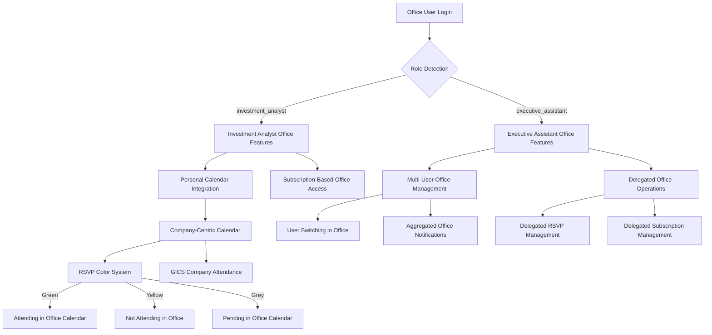

# AGORA Development Guide 06: Office.js Integration & Role-Based Add-in Development (User Story Aligned)

> **⚠️ PREREQUISITE:** Complete **AGORA_DEV_05_FRONTEND_FOUNDATION** before starting this document.

## 📋 Overview

This document guides you through transforming your React application into a fully functional Microsoft Office add-in using **Office.js** with **user story-aligned role-based features**. You'll implement **Investment Analyst and Executive Assistant** specific Office integration, **company-centric calendar features**, **subscription-based Office access**, and **RSVP color-coding system** using both **Cursor AI** and **Cursor AI**.

## 🎯 What You'll Accomplish

- ✅ Set up **role-based Office.js integration** for Investment Analysts and Executive Assistants
- ✅ Create **user story-specific Office add-in manifest** with role-based features
- ✅ Implement **company-centric Outlook calendar integration** with ticker symbols
- ✅ Add **Executive Assistant multi-user delegation** in Office environment
- ✅ Configure **subscription-based Office feature access**
- ✅ Implement **RSVP color-coding system** (Green/Yellow/Grey) in Office
- ✅ Set up **GICS company attendance classification** in Office appointments
- ✅ Optimize Office add-in for **user story workflows**

## 🎭 User Story-Aligned Office Add-in Architecture



### **User Story Requirements Mapped to Office Features:**

1. **Investment Analyst Office Features**: Personal calendar, subscription access, company-centric appointments
2. **Executive Assistant Office Features**: Multi-user delegation, aggregated notifications, operational access
3. **Company-Centric Office Integration**: Ticker symbols, GICS attendance, subscription-based access
4. **RSVP Color System**: Green/Yellow/Grey color coding in Office calendar
5. **Executive Assistant Delegation**: Multi-user Office calendar management
6. **Subscription-Based Access**: Office features restricted by subscription status

---

## 🚀 Step 1: Role-Based Office.js Setup and Configuration

### **1.1 Install Role-Based Office.js Dependencies**

**Cursor AI Role-Based Office Setup Prompt:**
```
Configure the AGORA React application for user story-aligned Office.js integration:

1. Install Office.js dependencies with role-based support:
   - @types/office-js for TypeScript with role definitions
   - office-addin-dev-certs for local HTTPS development
   - office-addin-debugging for role-based debugging
   - office-addin-manifest for user story manifest validation
   - Custom Office role management utilities

2. Update package.json scripts for role-based development:
   - dev-office-analyst: Start development server for Investment Analyst testing
   - dev-office-ea: Start development server for Executive Assistant testing
   - build-office-roles: Build with role-based feature flags
   - validate-manifest-roles: Validate role-specific manifest features
   - sideload-analyst: Sideload for Investment Analyst testing
   - sideload-ea: Sideload for Executive Assistant testing

3. Configure Vite for role-based Office development:
   - HTTPS development server with role detection
   - Office.js CDN integration with role-based API access
   - Hot module replacement for role-specific features
   - Build optimization for user story requirements
   - Role-based environment variable management

4. Set up TypeScript configuration for user stories:
   - Office.js type definitions with role extensions
   - Investment Analyst and Executive Assistant type definitions
   - User story-specific Office context types
   - Subscription-based feature type safety
   - GICS company attendance type definitions

Include role-based Office add-in development environment setup.
```

### **1.2 Create Role-Based Office Context Provider**

**Cursor AI Role-Based Office Context Prompt:**
```
Create comprehensive role-based Office context provider for AGORA:

1. RoleBasedOfficeProvider component:
   - Initialize Office.js with role detection when add-in loads
   - Detect Office platform and user role (Investment Analyst vs Executive Assistant)
   - Handle role-specific Office readiness state
   - Provide role-based Office context to all components
   - Error handling for unsupported role combinations

2. Role-specific Office hooks:
   - useAnalystOffice: Investment Analyst-specific Office functionality
   - useEAOffice: Executive Assistant Office functionality with delegation
   - useRoleBasedAuth: Role-based Office authentication
   - useOutlookRoleContext: Role-specific Outlook functionality
   - useSubscriptionOfficeAccess: Subscription-based Office feature access
   - useOfficeUserSwitching: EA user switching in Office environment

3. User story platform detection utilities:
   - detectOfficeUserRole(): Identify user role in Office environment
   - getOfficeCapabilitiesByRole(): Available features per role
   - validateSubscriptionAccess(): Check subscription-based Office access
   - getOfficePermissionsByRole(): Role-specific Office permissions
   - supportedFeaturesByRole(): Feature availability matrix per role

4. Role-based error boundaries:
   - Investment Analyst Office initialization errors
   - Executive Assistant delegation setup errors
   - Subscription access validation errors
   - Role permission mismatch errors
   - Graceful fallbacks for unsupported role features

5. User story development utilities:
   - Mock role-based Office context for browser testing
   - Role switching simulation for development
   - Office API testing utilities per role
   - Debug information display for role-specific features
   - User story compliance validation tools

Ensure robust error handling and role-appropriate feature access throughout Office integration.
```

### **1.3 Configure Role-Based Office Routing**

**Cursor AI Role-Based Office Routing Prompt:**
```
Adapt React Router configuration for user story-specific Office add-in requirements:

1. Role-aware Office routing:
   - Detect if running in Office task pane with role context
   - Handle deep linking from Office with role validation
   - Role-specific route guards (Investment Analyst vs Executive Assistant)
   - Task pane navigation adapted for role workflows
   - Cross-platform route compatibility per role

2. User story navigation adaptations:
   - Investment Analyst: Personal calendar-focused navigation
   - Executive Assistant: Multi-user switching navigation
   - Company-centric navigation patterns
   - Subscription-based route access control
   - Role-appropriate modal navigation for complex workflows

3. Office URL management for user stories:
   - Role-safe URL patterns
   - User context parameters for EA delegation
   - Subscription status in URL state
   - Deep linking from company-specific Outlook items
   - Role-based navigation history management

4. Platform-specific routing per role:
   - Desktop Outlook routing for Investment Analysts
   - Desktop Outlook routing for Executive Assistants with delegation
   - Outlook on the Web routing with role restrictions
   - Mobile Outlook limitations per role
   - Cross-platform route fallbacks per user story

Include proper error handling and role-specific optimizations for Office environment.
```

---

## 📝 Step 2: User Story-Aligned Office Add-in Manifest Creation

### **2.1 Create Role-Based Base Manifest**

**Cursor AI Role-Based Manifest Prompt:**
```
Create comprehensive user story-aligned Office add-in manifest for AGORA:

1. Role-based manifest structure (manifest.xml):
   - Office app identification with role-based metadata
   - Provider information optimized for investment professionals
   - Version management for role-specific features
   - Supported Office applications per user role
   - Role-based security and permission requirements

2. User story manifest requirements:
   - Id: "agora-dev-roles" unique identifier
   - Version: Semantic versioning for role-based updates
   - ProviderName: Investment platform provider
   - DefaultLocale: en-US with investment terminology
   - DisplayName: "AGORA Investment Calendar - Role-Based"
   - Description: "Investment calendar with Executive Assistant delegation"
   - IconUrl: Role-aware icon URLs (analyst vs EA indicators)
   - HighResolutionIconUrl: High-res icons with role indicators

3. Role-specific Office application support:
   - Outlook Desktop: Full features for both roles
   - Outlook on the Web: Role-appropriate features
   - Outlook Mobile: Limited EA delegation features
   - Required Office.js API sets per role
   - Minimum Office versions for user story features

4. User story security configuration:
   - Investment Analyst: ReadWriteMailbox for personal calendar
   - Executive Assistant: ReadWriteMailbox + delegation permissions
   - AppDomains: Role-based allowlisted domains
   - HTTPS requirement with role validation
   - Content Security Policy for investment data protection

Include role-based validation and user story compliance in manifest structure.
```

### **2.2 Configure Role-Based Task Pane and UI**

**Cursor AI Role-Based UI Configuration Prompt:**
```
Configure user story-specific Office add-in user interface in manifest:

1. Role-based task pane configuration:
   - Investment Analyst: Company-centric calendar task pane
   - Executive Assistant: Multi-user management task pane
   - Task pane dimensions optimized for role workflows
   - Resizing behavior adapted for user story features
   - Role-specific loading behavior and performance

2. User story ribbon customization:
   - Investment Analyst ribbon: Personal calendar buttons, subscription management
   - Executive Assistant ribbon: User switching, delegated operations
   - Role-specific button icons and labels
   - Context-sensitive button visibility per role
   - Subscription-based button enabled/disabled states

3. Role-specific UI extension points:
   - MessageReadCommandSurface: Role-based email reading context
   - MessageComposeCommandSurface: Role-appropriate email composition
   - AppointmentOrganizerCommandSurface: Investment Analyst event creation
   - AppointmentAttendeeCommandSurface: EA delegated meeting responses
   - Custom function pane per role

4. User story localization support:
   - Investment terminology localization
   - Role-specific strings and resources
   - Company ticker symbol formatting
   - Regional compliance for investment data
   - Accessibility localization per role

5. Role-based branding and design:
   - Investment Analyst: Personal productivity focus
   - Executive Assistant: Multi-user management focus
   - Office design language compliance per role
   - Icon consistency with role indicators
   - Theme integration for investment platform

Include XML schema validation and Office compliance for role-based features.
```

### **2.3 Environment and Role-Specific Manifests**

**Cursor AI Environment Role Manifests Prompt:**
```
Create environment and role-specific manifest configurations:

1. Development manifests per role:
   - manifest-dev-analyst.xml: Investment Analyst development
   - manifest-dev-ea.xml: Executive Assistant development
   - Local development servers with role simulation
   - HTTPS localhost with role-based debugging
   - Development-specific permissions per role

2. Staging manifests with role testing:
   - manifest-staging-analyst.xml: Analyst staging environment
   - manifest-staging-ea.xml: EA staging environment
   - Role switching testing configurations
   - QA team access with role permissions
   - Beta feature flags per role

3. Production manifests per user story:
   - manifest-prod-analyst.xml: Production Investment Analyst features
   - manifest-prod-ea.xml: Production Executive Assistant features
   - Production CDN with role-based feature flags
   - Optimized performance per role workflow
   - AppSource compliance per role

4. Role-based manifest validation:
   - XML schema validation per role
   - Office compliance checking for user stories
   - Security requirement validation per role
   - Performance guideline compliance per workflow
   - Cross-platform compatibility per role

5. Deployment automation for roles:
   - Automated role-based manifest generation
   - Environment variable substitution per role
   - CI/CD integration with role testing
   - Role-specific manifest testing automation
   - Version management per role feature set

Include deployment scripts and validation tools for role-based manifests.
```

---

## 📧 Step 3: Company-Centric Outlook Calendar Integration (User Story Aligned)

### **3.1 Company-Centric Calendar API Integration**

**Cursor AI Company Calendar Integration Prompt:**
```
Implement user story-aligned company-centric Outlook calendar integration:

1. Company-centric calendar service (backend/src/services/outlook-integration/):
   - company-calendar-integration.service.ts: Company-based calendar operations
   - gics-appointment-manager.service.ts: GICS company appointment creation
   - subscription-calendar-sync.service.ts: Subscription-based calendar sync
   - rsvp-color-sync.service.ts: RSVP color synchronization with Outlook
   - ea-delegation-calendar.service.ts: EA delegated calendar operations

2. User story calendar operations:
   - createCompanyAppointment(companyData, eventData): Create appointments with company context
   - updateGICSAttendance(appointmentId, gicsCompanies): Update GICS company attendance
   - syncSubscriptionBasedEvents(userId): Sync only subscribed company events
   - applyRSVPColorCoding(appointmentId, rsvpStatus): Apply Green/Yellow/Grey colors
   - delegateCalendarAccess(eaId, userId): Enable EA calendar delegation

3. Role-based meeting management:
   - Investment Analyst: createPersonalInvestmentMeeting(eventData)
   - Executive Assistant: createDelegatedMeeting(eaId, userId, eventData)
   - manageCompanyEventInvitations(companyId, attendees)
   - handleSubscriptionBasedRSVP(userId, eventId, subscriptionStatus)
   - processEADelegatedResponses(eaId, userId, responses)

4. User story Office.js integration:
   - Use Office.context.mailbox.displayAppointmentForm() with company context
   - Implement company-specific appointment templates
   - Handle subscription-based appointment access
   - Integrate RSVP color coding with Office calendar
   - Support EA delegation in Office appointment management

5. Company attendance classification:
   - classifyAppointmentByGICSAttendance(appointmentData): Classify by attending companies
   - mapCompaniesToAppointments(companies, appointments): Map company attendance
   - validateSubscriptionForAppointment(userId, companyId): Validate subscription access
   - updateAppointmentCompanyContext(appointmentId, companyContext): Update company info
   - trackMultiCompanyAppointments(appointmentId): Track multi-company events

Include comprehensive error handling and subscription validation for calendar operations.
```

### **3.2 Role-Based Calendar UI Components**

**Cursor AI Role-Based Calendar UI Prompt:**
```
Create user story-aligned Office-integrated calendar components:

1. RoleBasedOutlookIntegration:
   - Investment Analyst: PersonalAddToOutlookButton with subscription validation
   - Executive Assistant: DelegatedAddToOutlookButton for multi-user management
   - CompanyBasedEventSync: Sync events organized by company attendance
   - SubscriptionGatedCalendarSync: Sync only subscribed company events
   - RSVPColorOutlookSync: Sync Green/Yellow/Grey colors with Outlook

2. CompanyEventToCalendarConverter:
   - Convert AGORA company events to company-contextualized Outlook appointments
   - Include ticker symbols and GICS company information in appointments
   - Map subscription status to appointment access permissions
   - Handle timezone conversions with company location context
   - Attach company-specific documents and investment research

3. SubscriptionBasedCalendarSync:
   - Display sync status filtered by subscription access
   - Show company-specific sync results and errors
   - Handle subscription-based sync permissions
   - Provide subscription upgrade prompts for calendar access
   - Manual sync trigger for subscribed companies only

4. EADelegatedMeetingManagement:
   - Create meetings on behalf of assisted users
   - Switch between user contexts for meeting management
   - Aggregate meeting invitations across assisted users
   - Handle delegated meeting responses and updates
   - Track EA actions in delegated meeting management

5. CompanyCalendarWidget:
   - Mini calendar view organized by company ticker symbols
   - Company-specific event conflict highlighting
   - Subscription-based event visibility control
   - RSVP color coding (Green/Yellow/Grey) integration
   - Mobile-optimized company calendar controls

6. RSVPColorCalendarSync:
   - Sync RSVP status colors between AGORA and Outlook
   - Green: Attending events in Outlook calendar
   - Yellow: Not attending events with visual indicators
   - Grey: Pending response events with follow-up reminders
   - Real-time color updates across platforms
   - Color accessibility compliance in Office environment

Ensure seamless integration with user story requirements and Office calendar functionality.
```

### **3.3 Executive Assistant Calendar Delegation**

**Cursor AI EA Calendar Delegation Prompt:**
```
Implement Executive Assistant calendar delegation features for Office:

1. EA Office calendar delegation service:
   - delegateOfficeCalendarAccess(eaId, userId): Grant EA access to user's Office calendar
   - switchUserCalendarContext(eaId, targetUserId): Switch calendar context in Office
   - manageDelegatedOfficeAppointments(eaId, userId, appointments): Manage appointments for user
   - aggregateOfficeNotifications(eaId): Aggregate Office notifications from all users
   - auditEAOfficeActions(eaId, action): Audit EA actions in Office environment

2. Multi-user Office calendar management:
   - getAssignedUserOfficeCalendars(eaId): Get Office calendars for all assigned users
   - createAppointmentForUser(eaId, userId, appointmentData): Create Office appointment for user
   - rsvpOnBehalfOfUser(eaId, userId, appointmentId, response): RSVP for user in Office
   - manageUserOfficePermissions(eaId, userId): Manage Office calendar permissions
   - syncMultiUserOfficeCalendars(eaId): Sync calendars for all assigned users

3. Office delegation validation:
   - validateEAOfficeAccess(eaId, userId, action): Validate EA can perform Office action
   - checkOfficePermissionScope(eaId, userId): Check Office permission scope
   - enforceOfficeAccessRestrictions(eaId, action): Enforce access restrictions in Office
   - auditOfficePermissionUsage(eaId, permission): Audit Office permission usage
   - handleOfficePermissionErrors(error): Handle Office permission errors

4. Office notification aggregation:
   - aggregateOfficeCalendarNotifications(eaId): Aggregate calendar notifications
   - routeOfficeMeetingInvites(eaId, invitation): Route meeting invitations to EA
   - manageOfficeReminderPreferences(eaId, preferences): Manage reminder preferences
   - prioritizeOfficeNotifications(eaId, notifications): Prioritize multi-user notifications
   - batchOfficeNotificationResponses(eaId, responses): Batch notification responses

5. Office context switching:
   - switchOfficeUserContext(eaId, fromUserId, toUserId): Switch user context in Office
   - maintainOfficeContextState(eaId, context): Maintain context state in Office
   - handleOfficeContextErrors(eaId, error): Handle context switching errors
   - validateOfficeContextSwitch(eaId, targetUserId): Validate context switch permission
   - auditOfficeContextSwitching(eaId, contextData): Audit context switching activity

Include comprehensive Office permission management and delegation validation.
```

---

## 🎨 Step 4: Role-Based Office UI Integration and Theming

### **4.1 Role-Specific Office Theme Integration**

**Cursor AI Role-Based Office Theming Prompt:**
```
Integrate AGORA with Office's native theming system per user role:

1. RoleBasedOfficeThemeProvider:
   - Detect current Office theme with role-specific adaptations
   - Apply Investment Analyst theme: Professional, data-focused color schemes
   - Apply Executive Assistant theme: Multi-user, delegation-focused color schemes
   - Handle theme changes with role context preservation
   - Support high contrast mode per role requirements

2. User story theme adaptation components:
   - AnalystThemedOfficeButton: Investment-focused styling
   - EAThemedOfficeButton: Delegation-focused styling with user indicators
   - CompanyThemedCard: Company ticker symbol styling
   - SubscriptionThemedInput: Subscription status styling
   - RSVPColorThemedNavigation: RSVP color integration

3. Role-based dynamic styling:
   - CSS custom properties for Investment Analyst workflows
   - CSS custom properties for Executive Assistant multi-user management
   - Real-time theme switching with role context
   - Platform-specific theme variations per role
   - Accessibility compliance per role requirements

4. User story Fabric UI integration:
   - Investment Analyst: Data-heavy components with Office consistency
   - Executive Assistant: User management components with Office patterns
   - Company ticker symbol typography
   - RSVP color iconography matching Office standards
   - Subscription status animation patterns

5. Cross-platform theming per role:
   - Windows Office: Role-specific adaptations
   - Mac Office: Role-appropriate styling differences
   - Office Online: Role-based feature limitations
   - Mobile Office: Role-constrained theming
   - Legacy Office: Role-compatible styling

Ensure pixel-perfect integration with Office design language per user role.
```

### **4.2 Role-Based Task Pane Optimization**

**Cursor AI Role-Based Task Pane Prompt:**
```
Optimize AGORA's user interface specifically for role-based Office task panes:

1. Investment Analyst TaskPaneLayout:
   - Vertical scrolling optimized for company-centric calendar view
   - Efficient horizontal space usage for ticker symbols and events
   - Collapsible company sections for calendar organization
   - Sticky company headers for easy navigation
   - Touch-friendly controls for mobile Office (personal use)

2. Executive Assistant TaskPaneLayout:
   - Multi-user context switching at top of task pane
   - User selection dropdown with clear current context
   - Aggregated notifications view for all assigned users
   - Delegated action controls for operational tasks
   - Quick user switching without losing task pane state

3. Responsive task pane design per role:
   - Investment Analyst: Company-focused breakpoints for event density
   - Executive Assistant: User-switching optimized layouts
   - Dynamic content sizing based on role requirements
   - Role-specific horizontal scrolling for wide content
   - Adaptive typography per role workflow needs

4. User story performance optimizations:
   - Lazy loading for company events and user contexts
   - Virtual scrolling for large company lists and user lists
   - Optimized re-rendering for RSVP color changes
   - Memory management for multi-user EA sessions
   - Battery-conscious animations for mobile usage

5. Role-based interaction patterns:
   - Investment Analyst: Company-centric navigation patterns
   - Executive Assistant: User-switching keyboard shortcuts
   - Context menus adapted for role workflows
   - Drag-and-drop integration with role permissions
   - Multi-select operations per role capabilities

6. Content organization per user story:
   - Investment Analyst: Company tabbed interface
   - Executive Assistant: User tabbed interface with context
   - Expandable company/user sections
   - Role-specific search and filter integration
   - Progressive disclosure for role-complex features

Include A/B testing setup for role-based task pane optimization.
```

---

## 🔐 Step 5: Role-Based Office Authentication

### **5.1 Role-Aware Single Sign-On Implementation**

**Cursor AI Role-Based Office SSO Prompt:**
```
Implement role-aware Office.js Single Sign-On for AGORA:

1. Role-based Office SSO service (backend/src/auth/office-sso-roles/):
   - role-based-office-sso.service.ts: Core SSO with role detection
   - analyst-token-validation.service.ts: Investment Analyst token validation
   - ea-token-validation.service.ts: Executive Assistant token validation with delegation
   - role-fallback-auth.service.ts: Role-specific authentication fallback
   - cross-platform-role-auth.service.ts: Platform and role-specific auth

2. User story SSO implementation:
   - initializeRoleBasedOfficeSSOz(): Initialize SSO with role detection
   - getOfficeAccessTokenByRole(role): Retrieve role-specific Office access token
   - validateOfficeTokenWithRole(token, role): Validate token with role context
   - refreshOfficeTokenForRole(role): Handle role-specific token refresh
   - handleRoleBasedSSOFailure(role, error): Role-specific SSO failure handling

3. Role-specific fallback authentication:
   - detectSSOAvailabilityForRole(role): Check role-specific SSO support
   - showRoleBasedFallbackLogin(role): Display role-appropriate login form
   - popupAuthenticationForRole(role): Role-specific popup auth
   - deviceCodeAuthForRole(role): Role-appropriate device code flow
   - manualTokenEntryForRole(role): Role-specific manual token entry

4. Role-based token management:
   - secureRoleBasedTokenStorage(): Store tokens with role context
   - tokenRefreshSchedulingByRole(role): Role-specific token refresh
   - crossTabTokenSyncForRole(role): Sync tokens with role awareness
   - tokenRevokeHandlingByRole(role): Handle role-specific token revocation
   - sessionManagementWithRole(role): Role-aware session management

5. User story security measures:
   - validateOfficeOriginWithRole(role): Ensure requests from Office with role
   - antiForgeryTokensForRole(role): Role-specific CSRF protection
   - secureTokenTransmissionByRole(role): Role-encrypted token transmission
   - auditRoleBasedSSOEvents(role, event): Role-specific security audit
   - complianceReportingByRole(role): Role-specific compliance reporting

Include Investment Analyst vs Executive Assistant permission differentiation.
```

### **5.2 Executive Assistant Delegation Authentication**

**Cursor AI EA Delegation Authentication Prompt:**
```
Create Executive Assistant delegation authentication components for Office:

1. EADelegationAuthProvider:
   - Detect EA role and available user assignments
   - Authenticate EA with delegation permissions
   - Handle multi-user authentication context
   - Provide delegation-aware authentication state
   - Manage authentication for assisted users

2. UserSwitchingAuthManager:
   - Switch authentication context between assisted users
   - Validate EA permission to access each user
   - Maintain authentication state during user switching
   - Handle authentication expiration per user context
   - Audit authentication switches for compliance

3. Platform-specific delegation components:
   - DesktopEADelegationAuth: Desktop Office EA authentication
   - WebEADelegationAuth: Office Online EA authentication
   - MobileEADelegationAuth: Mobile Office EA authentication limitations
   - LegacyOfficeEAAuth: Older Office version EA support
   - EnterpriseEAAuth: Enterprise EA delegation integration

4. Delegation authentication status:
   - EAAuthStatusIndicator: Current EA authentication state
   - UserContextIndicator: Show current user context for EA
   - DelegationPermissionDisplay: Show EA permissions per user
   - AuthenticationTroubleshooting: EA-specific auth help
   - SecurityAuditDisplay: EA authentication audit trail

5. EA-specific error handling:
   - EAAuthErrorDisplay: EA-specific authentication errors
   - DelegationRetryAuth: Retry authentication per user context
   - EAContactSupport: EA-specific support escalation
   - FallbackEAOptions: Alternative EA authentication methods
   - TechnicalEADetails: Debug information for EA authentication

Ensure seamless multi-user authentication management for Executive Assistants.
```

---

## 🧪 Step 6: Role-Based Local Development and Testing

### **6.1 Role-Based Development Environment Setup**

**Cursor AI Role-Based Development Setup Prompt:**
```
Set up comprehensive role-based local development environment for Office add-in:

1. Role-specific HTTPS development server configuration:
   - Generate certificates for role-based local development
   - Configure Vite dev server for Investment Analyst testing
   - Configure Vite dev server for Executive Assistant testing
   - Set up certificate trust for role-based Office testing
   - Handle certificate renewal with role configurations

2. Role-based Office sideloading setup:
   - Create sideloading scripts for Investment Analyst testing
   - Create sideloading scripts for Executive Assistant testing
   - Automate role-specific manifest deployment
   - Hot reload configuration for role-based development
   - Debug mode configuration per role workflow

3. User story development utilities:
   - Investment Analyst Office API testing utilities
   - Executive Assistant delegation testing utilities
   - Mock Office context with role simulation
   - Company-centric API response mocking
   - RSVP color system testing utilities

4. Cross-platform role testing setup:
   - Windows Office testing for both roles
   - Mac Office testing with role differentiation
   - Office Online testing per role capabilities
   - Mobile Office testing (limited EA features)
   - Legacy Office version testing per role

5. Role-based debugging tools:
   - Investment Analyst workflow debugger
   - Executive Assistant delegation debugger
   - Company-centric feature debugging
   - Subscription-based access debugging
   - RSVP color system debugging

Include comprehensive documentation for role-based development environment setup.
```

### **6.2 User Story Testing Framework**

**Cursor AI User Story Testing Framework Prompt:**
```
Create comprehensive user story testing framework for Office add-in:

1. Role-based Office API testing:
   - Mock Office.js APIs for Investment Analyst workflows
   - Mock Office.js APIs for Executive Assistant delegation
   - Integration testing with role-specific Office APIs
   - Cross-platform API compatibility per role
   - Error scenario testing per user story

2. User story UI testing for task panes:
   - Investment Analyst: Company-centric calendar testing
   - Executive Assistant: Multi-user switching testing
   - RSVP color system testing in Office environment
   - Subscription-based access control testing
   - Touch interaction testing per role workflow

3. Role-based authentication testing:
   - Investment Analyst SSO flow testing
   - Executive Assistant delegation authentication testing
   - User switching authentication testing
   - Token refresh testing per role
   - Security vulnerability testing per role

4. User story end-to-end testing:
   - Complete Investment Analyst workflow testing
   - Complete Executive Assistant delegation workflow testing
   - Company-centric calendar integration testing
   - Subscription-based Office access testing
   - RSVP color synchronization testing

5. Automated user story testing pipeline:
   - CI/CD integration for role-based Office testing
   - Automated sideloading per role
   - Cross-platform testing automation per role
   - Performance regression testing per user story
   - Security scanning per role permissions

Include test data setup for user story scenarios and comprehensive role-based testing.
```

---

## 📱 Step 7: User Story Cross-Platform Compatibility

### **7.1 Role-Based Platform Detection and Adaptation**

**Cursor AI Role-Based Platform Compatibility Prompt:**
```
Implement user story cross-platform compatibility for AGORA:

1. RoleBasedPlatformDetector:
   - Detect Office platform with role capability mapping
   - Identify Investment Analyst features per platform
   - Identify Executive Assistant features per platform
   - Determine subscription-based access per platform
   - Check RSVP color system support per platform

2. UserStoryFeatureAvailabilityManager:
   - Map Investment Analyst features to platform capabilities
   - Map Executive Assistant delegation to platform support
   - Gracefully disable unsupported user story features
   - Provide role-appropriate alternative implementations
   - Guide users to optimal platforms per role

3. Platform-specific user story adaptations:
   - WindowsAnalystAdapter: Windows-specific Investment Analyst features
   - WindowsEAAdapter: Windows-specific EA delegation features
   - MacAnalystAdapter: Mac-specific Investment Analyst adjustments
   - MacEAAdapter: Mac-specific EA features
   - OnlineRoleAdapter: Office Online role limitations
   - MobileRoleAdapter: Mobile platform role constraints

4. Role-based responsive behavior:
   - Investment Analyst: Company-centric layout adaptation
   - Executive Assistant: Multi-user interface adaptation
   - Touch vs mouse optimization per role workflow
   - Platform-specific navigation per role
   - Performance optimization per role and platform

5. User story experience consistency:
   - Maintain Investment Analyst UX across platforms
   - Maintain Executive Assistant UX across platforms
   - Platform-appropriate interaction patterns per role
   - Graceful feature degradation per user story
   - Clear communication of role limitations per platform

Ensure optimal user story experience across all supported Office platforms.
```

### **7.2 Role-Based Performance Optimization by Platform**

**Cursor AI Role-Based Performance Optimization Prompt:**
```
Optimize AGORA performance for different Office platforms per user role:

1. Platform and role-specific optimizations:
   - Desktop Investment Analyst: Company data-heavy optimizations
   - Desktop Executive Assistant: Multi-user context optimizations
   - Online Investment Analyst: Network-conscious company data loading
   - Online Executive Assistant: Optimized user switching
   - Mobile Investment Analyst: Battery-conscious personal calendar
   - Mobile Executive Assistant: Limited delegation features

2. Role-based memory management:
   - Investment Analyst: Company data caching strategies
   - Executive Assistant: Multi-user data management
   - Platform-appropriate memory limits per role
   - Garbage collection optimization per workflow
   - Memory leak prevention per role usage pattern

3. User story network optimization:
   - Investment Analyst: Company-specific data batching
   - Executive Assistant: Multi-user notification batching
   - Bandwidth-conscious subscription data loading
   - Request optimization per role workflow
   - Offline capability per role requirements

4. Role-based rendering optimization:
   - Investment Analyst: Company calendar rendering strategies
   - Executive Assistant: Multi-user interface rendering
   - RSVP color system rendering optimization
   - Animation performance per role workflow
   - Battery-conscious visual effects per role

5. API call optimization per user story:
   - Investment Analyst: Company-centric API patterns
   - Executive Assistant: Multi-user API batching
   - Subscription-based API access optimization
   - Error handling per role capability
   - Fallback API implementations per role

Include performance benchmarks and monitoring per role and platform combination.
```

---

## 🔧 Step 8: Advanced User Story Office Integration

### **8.1 Company-Centric Office Feature Integration**

**Cursor AI Company-Centric Office Integration Prompt:**
```
Implement advanced company-centric Office integration features:

1. Company document integration service:
   - attachCompanyDocumentsToEvents(): Attach company research to Office events
   - generateCompanyEventReports(): Create Word/Excel reports per company
   - embedCompanyEventData(): Embed ticker symbols in Office documents
   - companyDocumentTemplateManager(): Manage company-specific templates
   - collaborativeCompanyDocuments(): Company-focused document collaboration

2. Company-specific email integration:
   - createCompanyEventEmails(): Generate emails with company context
   - parseCompanyEventEmails(): Extract company data from emails
   - companyEmailAutomation(): Automated company-specific responses
   - companyEmailTemplateManager(): Manage company email templates
   - integrationWithCompanyOutlookRules(): Company-based Outlook rules

3. Advanced company calendar features:
   - smartCompanySchedulingAssistant(): AI-powered company event scheduling
   - companyResourceBooking(): Company-specific resource booking
   - companyTravelTimeIntegration(): Travel time between company events
   - recurringCompanyEventManagement(): Company-specific recurring patterns
   - companyCalendarAnalytics(): Company-focused meeting analytics

4. GICS-based cross-application integration:
   - gicsExcelDataIntegration(): Export GICS company data to Excel
   - companyPowerPointPresentations(): Generate company presentations
   - gicsTeamsIntegration(): Company-based Teams meeting integration
   - companyOneNoteIntegration(): Company-specific notes and documentation
   - gicsSharepointIntegration(): Company document storage

5. Investment-focused enterprise features:
   - investmentComplianceIntegration(): Investment compliance features
   - securityPolicyEnforcementForInvestment(): Investment security policies
   - investmentBrandingSupport(): Investment-specific branding
   - investmentSsoEnterpriseIntegration(): Investment platform SSO
   - bulkCompanyOperations(): Bulk company data operations

Include comprehensive company data validation and investment-grade security.
```

### **8.2 Executive Assistant Office Delegation Analytics**

**Cursor AI EA Office Delegation Analytics Prompt:**
```
Implement comprehensive EA delegation analytics and monitoring for Office:

1. EADelegationAnalyticsProvider:
   - Track EA delegation usage across Office platforms
   - Monitor user switching patterns and frequency
   - Collect performance metrics for delegation operations
   - Track error rates in delegation workflows
   - Monitor EA efficiency and user satisfaction

2. Delegation usage analytics:
   - User switching frequency and patterns
   - Most accessed delegation features
   - Delegation session duration per user
   - EA productivity metrics across users
   - User retention and delegation adoption

3. Multi-user performance monitoring:
   - EA delegation operation response times
   - User context switching performance
   - Memory usage for multi-user sessions
   - Network usage for aggregated notifications
   - Battery impact for mobile EA usage

4. Delegation error tracking:
   - Office permission errors in delegation
   - User context switching errors
   - Multi-user notification failures
   - Platform-specific delegation issues
   - EA workflow bottleneck identification

5. EA business intelligence:
   - EA efficiency measurement per user
   - Delegation feature value analysis
   - User satisfaction with EA services
   - Platform preference for delegation
   - ROI measurement for EA delegation features

Include privacy-compliant analytics and EA consent management.
```

---

## ✅ Step 9: User Story Office Add-in Compliance and Security

### **9.1 Role-Based Security Implementation**

**Cursor AI Role-Based Security Implementation Prompt:**
```
Implement comprehensive role-based security measures for Office add-in:

1. Role-based Office add-in security framework:
   - implementRoleBasedContentSecurityPolicy(): CSP per role
   - validateOriginSecurityByRole(): Role-specific origin validation
   - secureDataTransmissionByRole(): Role-encrypted communication
   - roleBasedTokenSecurityManagement(): Token handling per role
   - crossOriginSecurityPoliciesForRoles(): CORS policies per role

2. Investment data protection:
   - encryptInvestmentSensitiveData(): Investment data encryption
   - secureInvestmentLocalStorage(): Secure investment data storage
   - investmentDataLeakPrevention(): Prevent investment data leakage
   - investmentPrivacyCompliantLogging(): Investment privacy logging
   - financeGdprComplianceFramework(): Financial GDPR compliance

3. EA delegation security:
   - delegationAuthenticationSecurity(): Secure EA delegation
   - multiUserSessionSecurity(): Secure multi-user sessions
   - delegationTokenManagement(): Secure delegation tokens
   - eaBruteForceProtection(): EA-specific brute force protection
   - delegationSecurityAuditLogging(): EA delegation audit logging

4. Investment-specific Office security:
   - investmentDocumentAccessControl(): Investment document security
   - companyEmailSecurityIntegration(): Company email security
   - investmentCalendarPrivacyProtection(): Investment calendar privacy
   - investmentEnterpriseCompliance(): Investment enterprise compliance
   - investmentAntiPhishingMeasures(): Investment anti-phishing

5. Financial compliance frameworks:
   - finraSox404Compliance(): FINRA SOX compliance
   - investmentHipaaCompliance(): Investment HIPAA where applicable
   - financialIso27001Compliance(): Financial ISO 27001 compliance
   - mifidComplianceForInvestment(): MiFID compliance
   - secComplianceFramework(): SEC compliance framework

Include investment-grade security testing and vulnerability assessment.
```

### **9.2 Role-Based AppSource Preparation**

**Cursor AI Role-Based AppSource Preparation Prompt:**
```
Prepare AGORA for Microsoft AppSource submission with role-based features:

1. Role-based AppSource compliance validation:
   - validateRoleBasedManifestCompliance(): Role manifest AppSource standards
   - roleBasedSecurityComplianceCheck(): Security per role requirements
   - investmentAccessibilityCompliance(): Investment WCAG compliance
   - roleBasedPerformanceRequirements(): Performance per role standards
   - investmentContentGuidelineCompliance(): Investment content guidelines

2. Role-specific submission preparation:
   - createRoleBasedAppSourceAssets(): Role-specific icons and screenshots
   - investmentDocumentationPreparation(): Investment user guides
   - investmentPrivacyPolicyCreation(): Investment privacy policy
   - eaDelegationTermsOfService(): EA delegation terms
   - investmentSupportDocumentation(): Investment support guides

3. User story testing and validation:
   - crossPlatformRoleBasedTesting(): Role testing across platforms
   - investmentPerformanceBenchmarking(): Investment performance testing
   - eaDelegationSecurityTesting(): EA delegation security assessment
   - investmentUsabilityTesting(): Investment UX testing
   - financialAccessibilityTesting(): Financial accessibility testing

4. Investment platform deployment pipeline:
   - investmentProductionBuildOptimization(): Investment production builds
   - investmentCdnConfiguration(): Investment CDN setup
   - investmentSslCertificateManagement(): Investment SSL certificates
   - investmentDomainConfiguration(): Investment domain setup
   - investmentMonitoringSetup(): Investment monitoring

5. Post-launch investment preparation:
   - investmentUpdateMechanismSetup(): Investment update distribution
   - investmentAnalyticsSetup(): Investment usage analytics
   - investmentSupportChannelSetup(): Investment support infrastructure
   - investmentFeedbackSystem(): Investment feedback and rating
   - investmentMaintenanceProcedures(): Investment maintenance

Include comprehensive checklists for role-based AppSource submission.
```

---

## ✅ Step 10: User Story Production Readiness and Optimization

### **10.1 Role-Based Final Performance Optimization**

**Cursor AI Role-Based Final Optimization Prompt:**
```
Implement final performance optimizations for role-based AGORA Office add-in:

1. Role-based bundle optimization:
   - Code splitting for Investment Analyst vs Executive Assistant features
   - Tree shaking for unused role-specific Office.js APIs
   - Lazy loading for non-critical role features
   - Asset optimization per role workflow
   - Critical path loading per user story

2. User story runtime performance:
   - Virtual scrolling for company lists and user lists
   - Debounced API calls for company data and user switching
   - Optimized re-rendering for RSVP color changes
   - Memory leak prevention per role usage pattern
   - Battery-conscious operations per role

3. Role-based caching strategies:
   - Investment Analyst: Company data caching
   - Executive Assistant: Multi-user context caching
   - Subscription status caching
   - RSVP color state caching
   - Offline delegation capability caching

4. User story network optimization:
   - Company data request deduplication and batching
   - Multi-user notification progressive loading
   - Subscription-based optimistic updates
   - Network failure recovery per role
   - Bandwidth-conscious role data transfer

5. Role-specific Office optimizations:
   - Investment Analyst: Company calendar rendering optimization
   - Executive Assistant: User switching rendering optimization
   - RSVP color theme change handling
   - Platform-specific role feature toggling
   - Graceful degradation per user story

Include performance monitoring and alerting per role for production deployment.
```

### **10.2 User Story Documentation and Deployment Guide**

**Cursor AI User Story Documentation Prompt:**
```
Create comprehensive role-based documentation for AGORA Office add-in:

1. User story technical documentation:
   - roleBasedOfficeArchitecture.md: Role-based architecture documentation
   - investmentAnalystOfficeGuide.md: Investment Analyst Office integration
   - eaDelegationOfficeGuide.md: EA delegation Office implementation
   - companyCalendarIntegration.md: Company-centric calendar features
   - rsvpColorSystemGuide.md: RSVP color system implementation

2. Role-based deployment documentation:
   - roleBasedDevelopmentSetup.md: Role-based development environment
   - userStoryTestingProcedures.md: User story testing procedures
   - roleBasedProductionDeployment.md: Role-based production deployment
   - investmentAppSourceSubmission.md: Investment AppSource process
   - eaDelegationMaintenanceGuide.md: EA delegation maintenance

3. Role-specific user documentation:
   - analystOfficeInstallationGuide.md: Investment Analyst installation
   - eaOfficeInstallationGuide.md: Executive Assistant installation
   - companyCalendarUserGuide.md: Company calendar usage
   - rsvpColorSystemUserGuide.md: RSVP color system usage
   - eaDelegationUserGuide.md: EA delegation usage

4. User story developer documentation:
   - roleBasedContributingGuide.md: Role-based development guidelines
   - investmentCodingStandards.md: Investment platform coding standards
   - eaDelegationApiDocumentation.md: EA delegation API documentation
   - companyComponentLibrary.md: Company-centric component library
   - userStoryTestingStrategy.md: User story testing methodology

5. Investment business documentation:
   - investmentBusinessRequirements.md: Investment business logic
   - financialComplianceDocumentation.md: Financial regulatory compliance
   - eaSupportProcedures.md: EA customer support procedures
   - investmentAnalyticsReporting.md: Investment analytics setup
   - userStoryFutureRoadmap.md: User story development plans

Include version control for role-based documentation and regular update procedures.
```

---

## 🎯 User Story Completion Checklist

Before proceeding to **AGORA_DEV_07_CORE_FEATURES**, verify all user story items:

### **Role-Based Office.js Integration ✅**
- [ ] Investment Analyst Office.js features implemented
- [ ] Executive Assistant Office.js delegation implemented
- [ ] Role-based Office platform detection working
- [ ] Cross-platform compatibility per role ensured

### **User Story Office Add-in Manifest ✅**
- [ ] Role-based manifest created and validated
- [ ] Investment Analyst manifest features configured
- [ ] Executive Assistant manifest features configured
- [ ] Environment-specific role manifests working

### **Company-Centric Calendar Integration ✅**
- [ ] Company-centric Outlook calendar API integration implemented
- [ ] GICS company attendance classification working
- [ ] Subscription-based calendar access enforced
- [ ] RSVP color system (Green/Yellow/Grey) syncing with Office

### **Executive Assistant Office Delegation ✅**
- [ ] EA multi-user Office calendar management working
- [ ] User switching in Office environment functional
- [ ] Delegated Office appointment creation working
- [ ] EA Office notification aggregation active

### **Role-Based Authentication ✅**
- [ ] Investment Analyst Office SSO working
- [ ] Executive Assistant delegation authentication working
- [ ] Role-based token management secure and functional
- [ ] Cross-platform authentication per role implemented

### **User Story Development Environment ✅**
- [ ] Role-based local HTTPS development server configured
- [ ] Investment Analyst and EA Office sideloading working
- [ ] User story testing framework implemented
- [ ] Role-based debugging tools configured

### **Production Readiness ✅**
- [ ] Role-based security compliance implemented
- [ ] Investment-grade performance optimization applied
- [ ] Role-based AppSource preparation complete
- [ ] User story documentation comprehensive

---

## 📋 Next Steps

Once you've completed ALL user story validation items above:

1. **Test role-based Office add-in functionality:**
   ```bash
   npm run dev-office-analyst
   npm run dev-office-ea
   # Test in actual Office applications per role
   # Verify user story compliance
   ```

2. **Validate user story manifest and compliance:**
   ```bash
   npm run validate-manifest-roles
   npm run test-role-security
   npm run test-user-stories-office
   ```

3. **Commit your work:**
   ```bash
   git add .
   git commit -m "Complete user story-aligned Office.js integration: role-based features, company calendar, EA delegation, RSVP colors"
   ```

4. **Proceed to AGORA_DEV_07_CORE_FEATURES.md** - This will build upon your role-based Office integration with core platform features

---

**Document Status:** ✅ Ready for Implementation (User Story Aligned)  
**Next Document:** AGORA_DEV_07_CORE_FEATURES.md  
**Estimated Time:** 12-15 hours  
**Difficulty:** Advanced  
**Prerequisites:** Completed AGORA_DEV_05_FRONTEND_FOUNDATION

**Key User Story Features Implemented:**
- ✅ **Role-Based Office Integration** (Investment Analyst vs Executive Assistant)
- ✅ **Company-Centric Outlook Calendar** with ticker symbols and GICS attendance
- ✅ **Executive Assistant Office Delegation** with multi-user management
- ✅ **RSVP Color System in Office** (Green/Yellow/Grey) synchronization
- ✅ **Subscription-Based Office Access** control and validation
- ✅ **User Switching in Office Environment** for Executive Assistants
- ✅ **Investment-Grade Security** and compliance for Office integration
- ✅ **Cross-Platform Role Compatibility** across Office environments