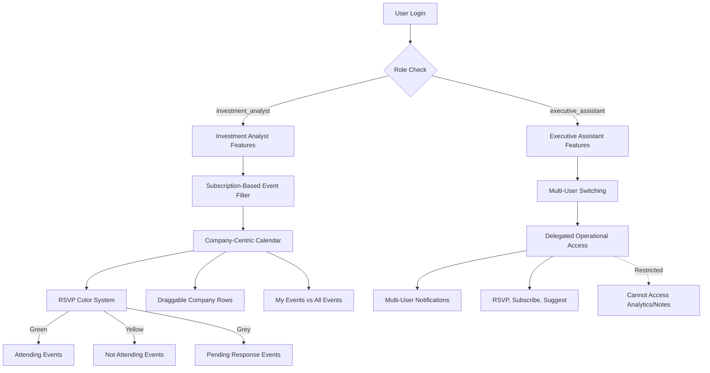

# AGORA Development Guide 07: Core Features Implementation (User Story Aligned)

> **⚠️ PREREQUISITE:** Complete **AGORA_DEV_06_OFFICE_ADDIN** before starting this document.

## 📋 Overview

This document guides you through implementing the complete core feature set for AGORA using both **Cursor AI** for backend logic and **Cursor AI** for frontend components. You'll build the **company-centric investment calendar**, **subscription-based event access**, **Executive Assistant delegation**, **RSVP color-coding system**, and **role-based features** that make AGORA a comprehensive investment platform aligned with user story requirements.

## 🎯 What You'll Accomplish

- ✅ Implement **company-centric calendar** with ticker symbol rows
- ✅ Build **subscription-based event filtering** (only subscribed company events)
- ✅ Create **GICS company attendance classification** system
- ✅ Develop **Executive Assistant multi-user delegation** features
- ✅ Implement **RSVP color-coding** (Green/Yellow/Grey) system
- ✅ Build **drag-and-drop company row ordering**
- ✅ Create **"My Events" vs "All Events"** views

- ✅ Add **company-specific event "blow-up"** views

## 🎭 User Story-Aligned Core Features Architecture



### **User Story Requirements Mapped to Core Features:**

1. **Company-Centric Calendar**: Events organized by ticker symbol rows based on GICS company attendance
2. **Subscription-Based Access**: Only events from subscribed companies visible
3. **Executive Assistant Delegation**: Multi-user management with operational access
4. **RSVP Color System**: Green (attending), Yellow (not attending), Grey (pending)
5. **Company Row Ordering**: Drag-and-drop reordering with persistent preferences
6. **Event Views**: "My Events" (accepted) vs "All Events" (subscribed companies)

8. **Company Blow-Up View**: Detailed calendar view for individual companies

---

## 📅 Step 1: Company-Centric Calendar Implementation (User Story Aligned)

### **1.1 Company-Centric Calendar Backend Services**

**Cursor AI Company-Centric Calendar Prompt:**
```
Create user story-aligned company-centric calendar system in backend/src/services/calendar/:

1. company-calendar.service.ts - Core company-centric calendar logic:
   - getCompanyCalendar(userId, dateRange): Get calendar organized by subscribed companies
   - organizeEventsByGICSAttendance(events, companies): Organize events by GICS company attendance
   - filterEventsBySubscriptions(events, subscriptions): Show only subscribed company events
   - getCompanyEventMatrix(userId, dateRange): Matrix of companies vs events
   - updateCompanyRowOrder(userId, companyOrder): Save user's company row preferences

2. gics-attendance.service.ts - GICS company attendance classification:
   - classifyEventsByGICSAttendance(eventId): Determine which GICS companies are attending
   - getEventAttendanceByCompany(companyId, dateRange): Get events by company attendance
   - detectMultiCompanyEvents(events): Identify events with multiple GICS companies
   - validateGICSCompanyAttendance(eventId, companyId): Validate attendance classification
   - updateEventCompanyAttendance(eventId, companyAttendance): Update attendance data

3. subscription-filter.service.ts - Subscription-based event filtering:
   - filterEventsByUserSubscriptions(userId, events): Filter to only subscribed company events
   - getSubscribedCompanyEvents(userId, dateRange): Get events for subscribed companies only
   - validateEventAccess(userId, eventId): Check if user has subscription access to event
   - getAvailableEvents(userId): Get events user can access based on subscriptions
   - enforceSubscriptionGates(userId, eventAccess): Enforce subscription requirements

4. company-preferences.service.ts - Company row ordering and preferences:
   - saveCompanyRowOrder(userId, companyOrder): Save user's preferred company row order
   - getCompanyRowOrder(userId): Get user's company row order preferences
   - updateCompanyRowPreferences(userId, preferences): Update company display preferences
   - syncCompanyOrderAcrossDevices(userId): Synchronize order across user devices
   - getDefaultCompanyOrder(userId): Get default ordering for new users

5. event-views.service.ts - "My Events" vs "All Events" views:
   - getMyEvents(userId, dateRange): Get events user has accepted (green status)
   - getAllEvents(userId, dateRange): Get all events from subscribed companies
   - getEventsByRSVPStatus(userId, status): Get events by RSVP status (green/yellow/grey)
   - getEventViewPreferences(userId): Get user's preferred event view settings
   - updateEventViewFilter(userId, viewFilter): Update event view filtering preferences

Include subscription validation and company-based event organization as core requirements.
```

### **1.2 Company-Centric Calendar UI Components**

**Cursor AI Company-Centric Calendar UI Prompt:**
```
Create user story-aligned company-centric calendar UI components:

1. CompanyCentricCalendarView:
   - Calendar organized by ticker symbol rows (horizontal rows for each subscribed company)
   - Events displayed under company ticker symbols based on GICS attendance classification
   - Drag-and-drop company row reordering with visual feedback
   - Multi-company events show under each attending company with visual indicators
   - Mobile-friendly horizontal and vertical scrolling
   - Subscription-based event filtering (only subscribed companies visible)

2. CompanyRowComponent:
   - Ticker symbol display with company name
   - Draggable row handles for reordering
   - Company-specific event count indicators
   - Click to expand to company "blow-up" view
   - Visual indicators for subscription status
   - Company logo/branding integration

3. EventRSVPColorSystem:
   - Green color coding for events user is attending
   - Yellow color coding for events user is not attending  
   - Grey color coding for events pending user response
   - No category legend display (color-only system as per user story)
   - Real-time color updates on RSVP changes
   - Consistent color system across all views

4. EventViewToggle:
   - "My Events" view showing only accepted events (green status)
   - "All Events" view showing all events from subscribed companies
   - Toggle button with clear visual state indication
   - Event count display for each view
   - Filter persistence across sessions

5. CompanyBlowUpView:
   - Detailed standard calendar view for single company
   - All events for the selected company in chronological order
   - RSVP functionality with color-coded status
   - Event details and attendee information
   - Navigation back to main company-centric view

6. MultiCompanyEventIndicator:
   - Visual badges showing when events have multiple GICS companies
   - Tooltip showing all attending companies
   - Consistent styling across company rows
   - Click to see full company attendance list

7. SubscriptionGateUI:
   - Clear indication when events require subscription
   - Payment prompts for unsubscribed companies
   - Visual differentiation between accessible and restricted events
   - Subscription upgrade flows

Include mobile responsiveness and accessibility for company-centric calendar navigation.
```

### **1.3 Executive Assistant Multi-User Calendar Management**

**Cursor AI Executive Assistant Calendar Management Prompt:**
```
Create Executive Assistant multi-user calendar management system:

1. ea-calendar-management.service.ts - EA calendar delegation:
   - switchUserCalendarContext(eaId, targetUserId): Switch calendar context for EA
   - getAssignedUserCalendars(eaId): Get calendars for all users EA assists
   - manageDelegatedCalendar(eaId, userId, calendarActions): Perform calendar actions for user
   - validateEACalendarAccess(eaId, userId, action): Validate EA can perform calendar action
   - auditEACalendarActions(eaId, userId, action): Log all EA calendar activities

2. ea-event-management.service.ts - EA event delegation:
   - rsvpForUser(eaId, userId, eventId, status): RSVP to events on behalf of user
   
   - manageUserSubscriptions(eaId, userId, subscriptionData): Manage subscriptions for user
   
   - handleMultiUserNotifications(eaId, notifications): Process notifications for all assisted users

3. user-context-switching.service.ts - User context switching for EAs:
   - setActiveUserContext(eaId, userId): Set current user context for EA
   - getActiveUserContext(eaId): Get EA's current user context
   - getUserSwitchingHistory(eaId): Get history of user context switches
   - validateUserSwitchPermission(eaId, userId): Validate EA can switch to user
   - clearUserContext(eaId): Clear EA's current user context

4. ea-notification-aggregation.service.ts - EA notification management:
   - aggregateNotificationsForEA(eaId): Get all notifications for EA's assisted users
   - routeNotificationToEA(notification, eaId): Route user notifications to EA
   - manageEANotificationPreferences(eaId, preferences): Manage EA notification settings
   - getNotificationsByUser(eaId, userId): Get notifications for specific assisted user
   - markNotificationAsHandled(eaId, notificationId): Mark notification as handled by EA

5. operational-access-control.service.ts - EA operational access restrictions:
   - validateOperationalAccess(eaId, userId, action): Validate EA can perform operational task
   - blockSensitiveDataAccess(eaId, userId, resource): Block access to analytics/private notes
   - auditOperationalActions(eaId, userId, action): Audit all operational actions
   - getPermittedActions(eaId, userId): Get list of actions EA can perform for user
   - enforceAccessRestrictions(eaId, action): Enforce EA access restrictions

Include comprehensive audit logging and role-based access control for EA delegation.
```

---

## 💼 Step 2: Subscription-Based Event Access (User Story Aligned)

### **2.1 Subscription-Based Event Filtering Backend**

**Cursor AI Subscription Event Filtering Prompt:**
```
Create subscription-based event filtering system in backend/src/services/subscriptions/:

1. subscription-event-filter.service.ts - Core subscription filtering:
   - filterEventsBySubscriptions(userId, events): Show only events from subscribed companies
   - validateEventAccess(userId, eventId): Validate user has subscription access to event
   - getAccessibleEvents(userId, dateRange): Get all events user can access
   - enforceSubscriptionGates(userId, eventRequest): Enforce subscription requirements
   - getSubscriptionBasedCalendar(userId): Get calendar filtered by subscriptions

2. subsector-access-control.service.ts - Subsector-based access:
   - getSubscribedSubsectors(userId): Get user's active subsector subscriptions
   - validateSubsectorAccess(userId, subsector): Validate access to subsector events
   - getSubsectorEventAccess(userId, eventId): Check subsector-based event access
   - enforceSubsectorPaymentGates(userId, subsector): Enforce payment requirements
   - updateSubsectorAccess(userId, subscriptionChanges): Update access based on subscription changes

3. payment-integration.service.ts - Payment-based access control:
   - validatePaymentForAccess(userId, subsector): Validate payment for subscription
   - processSubscriptionPayment(userId, paymentData): Process subsector subscription payment
   - handlePaymentFailures(userId, paymentError): Handle failed payment scenarios
   - updateAccessOnPaymentSuccess(userId, subscriptionId): Grant access after successful payment
   - revokeAccessOnPaymentFailure(userId, subscriptionId): Revoke access on payment issues

4. company-subscription-mapping.service.ts - Company-subscription mapping:
   - mapCompaniesToSubscriptions(companies, subscriptions): Map companies to user subscriptions
   - getSubscribedCompanies(userId): Get companies user has access to via subscriptions
   - validateCompanyAccess(userId, companyId): Validate access to specific company events
   - getCompanyEventsBySubscription(userId, companyId): Get company events based on subscription
   - syncCompanySubscriptionStatus(userId): Synchronize company access with subscription status

5. subscription-enforcement.service.ts - Access enforcement:
   - enforceSubscriptionRequirements(userId, resource): Enforce subscription requirements
   - redirectToPaymentIfNeeded(userId, requestedResource): Handle payment redirects
   - blockUnsubscribedContent(userId, content): Block access to unsubscribed content
   - auditSubscriptionAccess(userId, resource, accessResult): Audit subscription-based access
   - generateAccessDeniedResponse(userId, resource): Generate appropriate access denied responses

Include real-time subscription status validation and payment integration.
```

### **2.2 Subscription Management UI (User Story Enhanced)**

**Cursor AI Subscription Management UI Prompt:**
```
Create user story-aligned subscription management interface:

1. SubscriptionEventFilter:
   - Visual indication of which events require subscriptions
   - Clear messaging when events are hidden due to subscription requirements
   - Quick subscription upgrade prompts for desired events
   - Real-time filtering as subscriptions change
   - Event count display showing accessible vs total events

2. SubsectorSubscriptionManager:
   - Browse available subsectors with company listings
   - Clear payment requirements before subscribing
   - Payment flow integration (before subscription activation)
   - Visual confirmation of successful subscription
   - Access to events only after payment completion

3. SubscriptionBasedCalendar:
   - Calendar view showing only subscribed company events
   - Visual indicators for subscription status per company
   - Empty state messaging when no subscriptions exist
   - Quick access to subscription management from calendar
   - Real-time updates when subscriptions change

4. PaymentGateInterface:
   - Payment prompts when selecting unsubscribed subsectors
   - Clear pricing and subscription benefits
   - Secure payment processing integration
   - Payment confirmation and access activation
   - Failed payment handling and retry flows

5. CompanyAccessIndicator:
   - Visual badges showing subscription status per company
   - Clear indication of which companies user has access to
   - Quick subscription options for unsubscribed companies
   - Access expiration warnings and renewal prompts
   - Company grouping by subscription status

6. EventAccessControl:
   - Clear visual differentiation between accessible and restricted events
   - Subscription upgrade calls-to-action for restricted events
   - Event detail pages with subscription requirements
   - Bulk subscription options for multiple companies
   - Subscription-based event recommendations

Include clear value proposition communication and friction-free payment flows.
```

---

## 🎯 Step 3: RSVP Color-Coding System (User Story Specific)

### **3.1 RSVP Color System Backend**

**Cursor AI RSVP Color System Prompt:**
```
Create user story-specific RSVP color-coding system in backend/src/services/rsvp/:

1. rsvp-color-system.service.ts - Core color system logic:
   - getRSVPColorStatus(userId, eventId): Get color status (green/yellow/grey) for event
   - updateRSVPColorStatus(userId, eventId, status): Update RSVP status and color
   - validateRSVPColorTransition(currentStatus, newStatus): Validate status changes
   - getEventsByColorStatus(userId, colorStatus): Get events by color status
   - syncRSVPColorsAcrossDevices(userId): Synchronize RSVP colors across devices

2. event-status-management.service.ts - Status management:
   - setEventAttending(userId, eventId): Set event to attending (green)
   - setEventNotAttending(userId, eventId): Set event to not attending (yellow)
   - setEventPending(userId, eventId): Set event to pending (grey)
   - getEventStatusCounts(userId): Get count of events by status
   - bulkUpdateEventStatus(userId, eventStatusUpdates): Bulk status updates

3. rsvp-validation.service.ts - RSVP validation:
   - validateRSVPPermission(userId, eventId): Validate user can RSVP to event
   - checkEventAccessForRSVP(userId, eventId): Check subscription access for RSVP
   - enforceRSVPBusinessRules(userId, eventId, status): Enforce RSVP business rules
   - auditRSVPChanges(userId, eventId, statusChange): Audit RSVP status changes
   - notifyRSVPStatusChange(userId, eventId, status): Notify relevant parties of status changes

4. attendee-list-management.service.ts - Real-time attendee management:
   - updateAttendeeList(eventId): Update real-time attendee list
   - getEventAttendeesByStatus(eventId): Get attendees by RSVP status
   - notifyAttendeeListChanges(eventId): Notify attendee list updates
   - calculateEventCapacity(eventId): Calculate event capacity and availability
   - manageWaitingList(eventId): Manage event waiting lists if applicable

5. ea-rsvp-delegation.service.ts - EA RSVP delegation:
   - rsvpOnBehalfOfUser(eaId, userId, eventId, status): EA RSVP for assisted user
   - validateEARSVPPermission(eaId, userId, eventId): Validate EA can RSVP for user
   - auditEARSVPActions(eaId, userId, eventId, action): Audit EA RSVP actions
   - notifyUserOfEARSVP(userId, eventId, status): Notify user of EA RSVP on their behalf
   - getEARSVPHistory(eaId, userId): Get history of EA RSVP actions for user

Include real-time status updates and Executive Assistant delegation capabilities.
```

### **3.2 RSVP Color System UI Components**

**Cursor AI RSVP Color System UI Prompt:**
```
Create user story-specific RSVP color-coding UI components:

1. EventColorCoding:
   - Green color for events user is attending
   - Yellow color for events user is not attending
   - Grey color for events pending user response
   - NO category legend display (color-only system as specified in user story)
   - Consistent color application across all event displays
   - Color accessibility compliance (colorblind-friendly)

2. RSVPStatusButtons:
   - Three-state RSVP buttons with color coding
   - Clear visual feedback on status selection
   - Real-time status updates without page refresh
   - Disabled states for events user cannot RSVP to
   - Executive Assistant delegation support

3. EventStatusFilters:
   - Filter events by color status (green/yellow/grey)
   - Visual filter indicators using the same color system
   - Event count display for each status
   - Quick filter toggles for status combinations
   - Filter state persistence across sessions

4. AttendeeListDisplay:
   - Real-time attendee list with RSVP status indicators
   - Color-coded attendee status (if user has permission to see)
   - Attendee count by status (attending/not attending/pending)
   - Executive Assistant visibility for assisted users
   - Mobile-optimized attendee list display

5. MyEventsView:
   - Display only green (attending) events as specified in user story
   - Clear visual confirmation of "My Events" scope
   - Easy navigation between "My Events" and "All Events"
   - Event count display for attended events
   - Calendar integration for attended events only

6. EventDetailRSVP:
   - Large, clear RSVP status display with color coding
   - Status change confirmation dialogs
   - Historical RSVP status for past events
   
   - Social proof (attendee information where appropriate)

Include consistent color theming and accessibility features for color-based interface.
```

---

## 🔄 Step 4: Executive Assistant Multi-User Features (User Story Aligned)

### **4.1 Executive Assistant User Switching System**

**Cursor AI EA User Switching Prompt:**
```
Create comprehensive Executive Assistant user switching system in backend/src/services/ea-delegation/:

1. user-switching.service.ts - Core user switching logic:
   - switchToUser(eaId, targetUserId): Switch EA context to specific user
   - getAssignedUsers(eaId): Get all users assigned to EA
   - validateUserSwitchPermission(eaId, targetUserId): Validate EA can switch to user
   - getCurrentUserContext(eaId): Get EA's current user context
   - getUserSwitchingHistory(eaId): Get history of user context switches

2. multi-user-calendar.service.ts - Multi-user calendar management:
   - getCalendarForUser(eaId, userId): Get calendar in context of specific user
   - manageEventsForUser(eaId, userId, eventActions): Manage events for specific user
   - getAggregatedCalendars(eaId): Get combined view of all assisted users' calendars
   - switchCalendarContext(eaId, fromUserId, toUserId): Switch between user calendars
   - getCalendarPermissions(eaId, userId): Get EA permissions for user's calendar

3. multi-user-notifications.service.ts - Multi-user notification handling:
   - aggregateNotificationsForEA(eaId): Aggregate notifications from all assisted users
   - routeNotificationToEA(notification, targetEA): Route user notifications to EA
   - manageNotificationPriority(eaId, notifications): Prioritize multi-user notifications
   - getNotificationsByUser(eaId, userId): Get notifications for specific user
   - markNotificationAsHandledByEA(eaId, notificationId): Mark EA-handled notifications

4. operational-task-delegation.service.ts - Operational task management:
   - performRSVPForUser(eaId, userId, eventId, status): RSVP on behalf of user
   - manageSubscriptionsForUser(eaId, userId, subscriptionData): Manage user subscriptions
   
   - updateUserPreferences(eaId, userId, preferences): Update user preferences
   - auditOperationalActions(eaId, userId, action): Audit all operational actions

5. access-restriction-enforcement.service.ts - EA access restrictions:
   - blockSensitiveAnalytics(eaId, userId, analyticsRequest): Block analytics access
   - blockPrivateNotes(eaId, userId, notesRequest): Block private notes access
   - validateOperationalAccess(eaId, userId, action): Validate operational access only
   - auditAccessAttempts(eaId, userId, resource): Audit access attempts
   - enforceDataRestrictions(eaId, dataRequest): Enforce data access restrictions

Include comprehensive audit logging and role-based access restrictions.
```

### **4.2 Executive Assistant UI Components**

**Cursor AI Executive Assistant UI Prompt:**
```
Create comprehensive Executive Assistant interface components:

1. UserSwitchingInterface:
   - Dropdown or sidebar showing all assigned users
   - Current user context indicator with clear visual state
   - Quick switching between users with confirmation
   - User profile information and status indicators
   - Search functionality for large user lists

2. MultiUserDashboard:
   - Aggregated view of all assisted users' events and notifications
   - User-specific notification counts and priorities
   - Quick access to each user's calendar and events
   - Urgent action items across all users
   - Multi-user task completion tracking

3. DelegatedCalendarView:
   - Calendar view clearly showing which user's calendar is active
   - Context switching without losing calendar state
   - Multi-user event overlay options
   - Delegated action indicators (actions taken by EA)
   - User-specific subscription and access indicators

4. OperationalTaskInterface:
   - RSVP controls for current user context
   - Subscription management for assisted users
   
   - Preference management for users
   - Bulk action capabilities across users

5. NotificationAggregator:
   - Notifications grouped by user with clear attribution
   - Priority sorting across all users
   - Mark as handled/read functionality
   - Notification filtering by user or type
   - Real-time notification updates for all users

6. RestrictedAccessIndicator:
   - Clear visual indicators when trying to access sensitive data
   - Alternative action suggestions for restricted content
   - Educational messaging about EA role limitations
   - Redirects to appropriate operational alternatives
   - Contact information for accessing restricted data

7. EAAuditTrail:
   - History of actions taken on behalf of users
   - User context switching history
   - Audit trail for compliance and transparency
   - Action impact tracking across users
   - Reporting capabilities for EA activities

Include clear user context indicators and role-appropriate functionality throughout the interface.
```

---


## 🏢 Step 6: Company-Specific Features (User Story Aligned)

### **6.1 Company Blow-Up View System**

**Cursor AI Company Blow-Up View Prompt:**
```
Create company-specific "blow-up" view system in backend/src/services/company-views/:

1. company-blow-up.service.ts - Company-specific detailed view:
   - getCompanyDetailedCalendar(userId, companyId): Get detailed calendar for single company
   - getCompanyEventHistory(userId, companyId): Get historical events for company
   - getCompanyUpcomingEvents(userId, companyId): Get upcoming events for company
   - getCompanyEventAnalytics(userId, companyId): Get company-specific event analytics
   - validateCompanyAccess(userId, companyId): Validate user access to company events

2. company-event-aggregation.service.ts - Company event aggregation:
   - aggregateCompanyEvents(companyId, dateRange): Aggregate all events for company
   - categorizeCompanyEvents(companyId, events): Categorize events by type
   - getCompanyEventParticipation(companyId): Get event participation metrics
   - generateCompanyEventSummary(companyId): Generate company event summary
   - trackCompanyEventEngagement(userId, companyId): Track user engagement with company

3. company-preference-management.service.ts - Company-specific preferences:
   - setCompanyNotificationPreferences(userId, companyId, preferences): Set company notifications
   - getCompanySpecificSettings(userId, companyId): Get company-specific user settings
   - updateCompanyPriority(userId, companyId, priority): Update company priority for user
   - manageCompanySubscriptionSettings(userId, companyId): Manage company subscription settings
   - syncCompanyPreferences(userId): Sync preferences across devices

4. company-navigation.service.ts - Company navigation:
   - navigateToCompanyView(userId, companyId): Navigate to company detailed view
   - getCompanyNavigationHistory(userId): Get company navigation history
   - suggestRelatedCompanies(userId, companyId): Suggest related companies
   - getCompanyQuickActions(userId, companyId): Get available quick actions for company
   - manageCompanyBookmarks(userId, companyId): Manage company bookmarks

5. company-context.service.ts - Company context management:
   - setCompanyContext(userId, companyId): Set current company context
   - getCompanyContext(userId): Get current company context
   - clearCompanyContext(userId): Clear company context
   - trackCompanyContextSwitching(userId): Track context switching patterns
   - optimizeCompanyContextExperience(userId): Optimize context switching experience

Include subscription validation and company-specific access controls.
```

### **6.2 Company Blow-Up UI Components**

**Cursor AI Company Blow-Up UI Prompt:**
```
Create company-specific detailed view interface:

1. CompanyDetailedView:
   - Full-screen company-specific calendar view
   - Standard calendar layout (month/week/day views) for single company
   - Company branding and information header
   - Easy navigation back to main company-centric calendar
   - Company-specific event filtering and search

2. CompanyEventTimeline:
   - Chronological timeline of all company events
   - Historical and upcoming events in single view
   - Event importance and impact indicators
   - Interactive timeline navigation
   - Event clustering for high-activity periods

3. CompanyEventAnalytics:
   - Company-specific event participation metrics
   - Event type distribution and trends
   - User engagement with company events
   - ROI and impact analysis for company events
   - Comparative analysis with other companies

4. CompanyQuickActions:
   - Quick RSVP to all upcoming company events
   - Subscription management for company subsector
   - Company notification preferences
   
   - Company-specific settings and preferences

5. CompanyEventExport:
   - Export company-specific calendar to external calendars
   - Company event report generation
   - Event sharing and collaboration features
   - Calendar sync with company-specific filters
   - Mobile calendar integration for company events

6. RelatedCompanySuggestions:
   - Suggest related companies based on current company view
   - Cross-company event participation insights
   - Company portfolio management features
   - Industry and sector navigation
   - Company comparison tools

Include consistent navigation and user experience with main calendar view.
```

---

## 📱 Step 7: Mobile-Friendly Calendar Features

### **7.1 Mobile Calendar Backend Optimization**

**Cursor AI Mobile Calendar Optimization Prompt:**
```
Create mobile-optimized calendar backend services:

1. mobile-calendar-optimization.service.ts - Mobile-specific optimizations:
   - getOptimizedCalendarForMobile(userId, viewport): Get mobile-optimized calendar data
   - optimizeEventDataForMobile(events): Optimize event data for mobile consumption
   - handleMobileScrolling(userId, scrollPosition): Handle mobile scrolling state
   - getMobileCalendarPreferences(userId): Get mobile-specific preferences
   - cacheMobileCalendarData(userId, calendarData): Cache data for mobile performance

2. touch-gesture-handling.service.ts - Touch gesture support:
   - processTouchGestures(userId, gestureData): Process mobile touch gestures
   - handleSwipeNavigation(direction, currentView): Handle swipe navigation
   - processPinchZoom(zoomLevel, calendarView): Handle pinch zoom on calendar
   - handleTouchDragDrop(dragData): Handle touch-based drag and drop
   - optimizeTouchResponseTime(interactions): Optimize touch response performance

3. mobile-performance.service.ts - Mobile performance optimization:
   - optimizeDataLoadingForMobile(userId): Optimize data loading for mobile
   - implementLazyLoadingForMobile(calendarSections): Implement mobile lazy loading
   - manageMobileDataCache(userId): Manage mobile-specific data caching
   - optimizeMobileNetworkUsage(userId): Optimize network usage for mobile
   - handleOfflineMobileAccess(userId): Handle offline calendar access

4. responsive-layout.service.ts - Responsive layout optimization:
   - getResponsiveLayoutConfig(viewport): Get responsive layout configuration
   - optimizeLayoutForScreen(screenSize, orientation): Optimize layout for screen
   - handleOrientationChanges(orientation): Handle mobile orientation changes
   - optimizeTextAndIconSizes(screenDensity): Optimize text and icons for mobile
   - adaptUIElementsForTouch(elements): Adapt UI elements for touch interaction

5. mobile-accessibility.service.ts - Mobile accessibility:
   - optimizeForScreenReaders(calendarData): Optimize for mobile screen readers
   - implementVoiceNavigation(commands): Implement voice navigation support
   - optimizeForMotorImpairments(interactions): Optimize for motor impairments
   - handleHighContrastMode(displaySettings): Handle high contrast mode
   - implementMobileAccessibilityShortcuts(): Implement accessibility shortcuts

Include performance monitoring and mobile-specific analytics.
```

### **7.2 Mobile Calendar UI Components**

**Cursor AI Mobile Calendar UI Prompt:**
```
Create mobile-optimized calendar interface components:

1. MobileCompanyCalendar:
   - Touch-optimized company row scrolling (horizontal and vertical)
   - Swipe gestures for navigation between dates
   - Pinch-to-zoom for calendar detail levels
   - Touch-friendly company row reordering
   - Mobile-optimized event display and interaction

2. MobileTouchControls:
   - Large touch targets for all interactive elements
   - Gesture-based navigation (swipe, pinch, tap)
   - Touch feedback and haptic responses
   - Long-press context menus for events
   - Touch-optimized drag and drop for company rows

3. MobileEventDetails:
   - Full-screen event detail modal for mobile
   - Swipe-to-dismiss event details
   - Mobile-optimized RSVP controls
   - Touch-friendly attendee list display
   - Quick action buttons for common tasks

4. MobileCalendarNavigation:
   - Bottom navigation bar for calendar functions
   - Swipe-based date navigation
   - Quick date picker optimized for mobile
   - Gesture shortcuts for common actions
   - Mobile-friendly calendar view switching

5. MobileResponsiveLayout:
   - Adaptive layout for different screen sizes
   - Orientation-aware calendar display
   - Dynamic font and spacing adjustments
   - Touch-optimized button and control sizing
   - Mobile-specific loading and error states

6. OfflineMobileCalendar:
   - Offline calendar data caching
   - Sync indicator for online/offline status
   - Offline RSVP with sync when online
   - Cached event data for offline viewing
   - Mobile data usage optimization

Include performance monitoring and mobile usability testing capabilities.
```

---

## ✅ Step 8: User Story Validation and Testing

### **8.1 User Story Compliance Testing**

**Cursor AI User Story Testing Prompt:**
```
Create comprehensive user story compliance testing:

1. company-centric-calendar.test.ts - Company-centric calendar testing:
   - Test calendar organization by ticker symbol rows
   - Test GICS company attendance classification
   - Test subscription-based event filtering (only subscribed companies)
   - Test company row drag-and-drop ordering
   - Test company "blow-up" detailed view functionality

2. rsvp-color-system.test.ts - RSVP color system testing:
   - Test green color for attending events
   - Test yellow color for not attending events
   - Test grey color for pending response events
   - Test no category legend display (color-only system)
   - Test real-time color updates on RSVP changes

3. executive-assistant-delegation.test.ts - EA delegation testing:
   - Test EA user switching functionality
   - Test operational access (RSVP, subscribe)
   - Test multi-user notification handling
   - Test sensitive data access restrictions (analytics, private notes)
   - Test audit logging for all EA actions

4. subscription-access-control.test.ts - Subscription access testing:
   - Test events only visible for subscribed companies
   - Test payment required before subscription activation
   - Test subscription-based event access control
   - Test subsector payment integration
   - Test access revocation on subscription expiration

5. event-views.test.ts - Event view testing:
   - Test "My Events" view showing only accepted events (green)
   - Test "All Events" view showing all subscribed company events
   - Test view switching and persistence
   - Test event counts for each view
   - Test mobile-friendly view display


   - Test suggestion notifications and responses
   - Test EA suggestion delegation
   - Test suggestion validation and limits
   - Test suggestion tracking and analytics

7. mobile-calendar-features.test.ts - Mobile features testing:
   - Test horizontal and vertical calendar scrolling
   - Test touch-optimized interactions
   - Test responsive layout on different screen sizes
   - Test gesture-based navigation
   - Test mobile performance and loading

Include end-to-end testing that validates all user story acceptance criteria.
```

### **8.2 User Story Feature Validation Checklist**

**User Story Feature Validation:**

#### **Company-Centric Calendar ✅**
- [ ] Calendar organized by ticker symbol rows (companies as horizontal rows)
- [ ] Events classified by GICS company attendance (not just hosting)
- [ ] Multi-company events appear under each attending company
- [ ] Drag-and-drop company row reordering with persistence
- [ ] Company-specific "blow-up" view with detailed calendar

#### **Subscription-Based Access ✅**
- [ ] Only events from subscribed companies visible in calendar
- [ ] Payment required before subsector subscription activation
- [ ] Subscription-based event filtering working correctly
- [ ] Access control enforced for unsubscribed content
- [ ] Real-time subscription status updates

#### **RSVP Color System ✅**
- [ ] Green color for events user is attending
- [ ] Yellow color for events user is not attending
- [ ] Grey color for events pending user response
- [ ] NO category legend displayed (color-only system)
- [ ] Real-time color updates on RSVP changes

#### **Executive Assistant Features ✅**
- [ ] EA can switch between assigned users
- [ ] EA can perform operational tasks (RSVP, subscribe, suggest)
- [ ] EA receives notifications for all assisted users
- [ ] EA cannot access sensitive analytics or private notes
- [ ] Audit logging for all EA actions

#### **Event Views ✅**
- [ ] "My Events" shows only accepted events (green status)
- [ ] "All Events" shows all events from subscribed companies
- [ ] View switching working correctly
- [ ] Event counts accurate for each view
- [ ] View preferences persist across sessions


- [ ] Suggestion validation and rate limiting
- [ ] Suggestion response tracking

#### **Mobile Features ✅**
- [ ] Horizontal and vertical calendar scrolling
- [ ] Touch-optimized interactions and gestures
- [ ] Responsive layout for mobile devices
- [ ] Mobile-friendly event details and RSVP
- [ ] Performance optimized for mobile

#### **Real-Time Features ✅**
- [ ] Real-time attendee list updates
- [ ] Live RSVP status changes
- [ ] Real-time notification delivery
- [ ] Live subscription status updates
- [ ] Real-time multi-user EA notifications

---

## 📋 Next Steps

Once you've completed ALL user story validation items above:

1. **Test core features against user stories:**
   ```bash
   npm run test:user-stories
   npm run test:company-calendar
   npm run test:rsvp-system
   npm run test:ea-delegation
   ```

2. **Validate subscription integration:**
   ```bash
   npm run test:subscription-access
   npm run test:payment-integration
   ```

3. **Test mobile functionality:**
   ```bash
   npm run test:mobile-features
   npm run test:responsive-design
   ```

4. **Commit your work:**
   ```bash
   git add .
   git commit -m "Complete user story-aligned core features: company-centric calendar, RSVP colors, EA delegation, subscription access"
   ```

5. **Proceed to AGORA_DEV_08_INTEGRATIONS.md** - This will build upon your core features with external integrations

---

**Document Status:** ✅ Ready for Implementation (User Story Aligned)  
**Next Document:** AGORA_DEV_08_INTEGRATIONS.md  
**Estimated Time:** 15-18 hours  
**Difficulty:** Advanced  
**Prerequisites:** Completed AGORA_DEV_06_OFFICE_ADDIN

**Key User Story Features Implemented:**
- ✅ **Company-Centric Calendar** with ticker symbol rows and GICS attendance
- ✅ **Subscription-Based Event Access** (only subscribed company events)
- ✅ **RSVP Color System** (Green/Yellow/Grey, no legend)
- ✅ **Executive Assistant Multi-User Delegation** with operational access
- ✅ **Company Row Drag-and-Drop** with persistent preferences
- ✅ **"My Events" vs "All Events"** views with proper filtering

- ✅ **Mobile-Friendly Calendar** with touch gestures
- ✅ **Real-Time Updates** for all interactive features