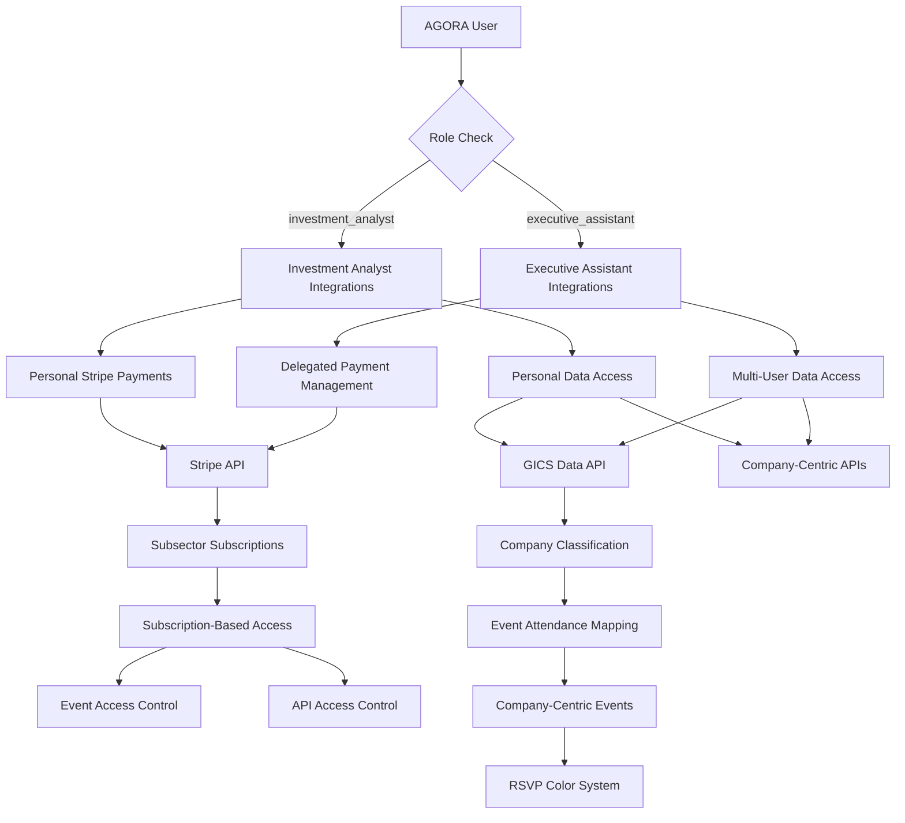

# AGORA Development Guide 08: User Story-Aligned External API Integrations & Services

> **⚠️ PREREQUISITE:** Complete **AGORA_DEV_07_CORE_FEATURES** before starting this document.

## 📋 Overview

This document guides you through integrating AGORA with external APIs and services **aligned with user story requirements** using both **Cursor AI** for backend integrations and **Cursor AI** for frontend components. You'll implement **Stripe payment integration** for subsector subscriptions, **GICS data integration** for company classification, **role-based external API access**, and **Executive Assistant delegation** for third-party services to create a comprehensive investment platform that directly supports your user stories.

## 🎯 What You'll Accomplish

- ✅ Integrate **Stripe payment system** for subsector subscription purchases
- ✅ Implement **GICS data integration** for company classification and subsector mapping
- ✅ Add **role-based external API access** (Investment Analyst vs Executive Assistant)
- ✅ Set up **Executive Assistant delegation** for third-party service management
- ✅ Create **subscription-based integration access** control
- ✅ Implement **company-centric external data** integration
- ✅ Build **investment-focused API management** and rate limiting
- ✅ Create **user story-specific error handling** and fallback systems

## 🎭 User Story-Aligned Integration Architecture



### **User Story Requirements Mapped to Integrations:**

1. **Stripe Payment Integration**: Subsector subscription purchases with payment-before-access
2. **GICS Data Integration**: Company classification and subsector mapping for subscriptions
3. **Role-Based API Access**: Investment Analyst vs Executive Assistant permissions
4. **Executive Assistant Delegation**: Multi-user integration management
5. **Subscription-Based Access Control**: Integration features locked by subscription status
6. **Company-Centric Data**: All external data organized by company/ticker symbols

---

## 💳 Step 1: Stripe Payment Integration (User Story Aligned)

### **1.1 Stripe Payment Services Backend**

**Cursor AI Stripe Payment Integration Prompt:**
```
Create comprehensive user story-aligned Stripe payment integration in backend/src/services/payment/:

1. stripe-subscription.service.ts - Core Stripe subscription management:
   - createSubsectorSubscription(userId, subsector, paymentMethodId): Create subsector subscription
   - validatePaymentBeforeAccess(userId, subsector): Validate payment before granting access
   - processSubscriptionPayment(subscriptionData): Process subscription payments
   - handlePaymentFailures(paymentError): Handle failed payments and access revocation
   - manageSubscriptionLifecycle(subscriptionId): Manage subscription lifecycle

2. subscription-access-control.service.ts - Subscription-based access control:
   - grantAccessAfterPayment(userId, subsector): Grant access after successful payment
   - revokeAccessOnPaymentFailure(userId, subscriptionId): Revoke access on payment issues
   - validateSubsectorAccess(userId, subsector): Validate subscription-based access
   - getAccessibleSubsectors(userId): Get user's accessible subsectors
   - enforcePaymentGates(userId, resource): Enforce payment requirements

3. ea-payment-delegation.service.ts - Executive Assistant payment delegation:
   - manageDelegatedPayments(eaId, userId, paymentData): Manage payments for assisted users
   - validateEAPaymentPermission(eaId, userId): Validate EA can manage payments for user
   - processDelegatedSubscriptions(eaId, userId, subscriptions): Process delegated subscriptions
   - auditEAPaymentActions(eaId, paymentAction): Audit EA payment activities
   - handleDelegatedPaymentFailures(eaId, userId, error): Handle delegated payment failures

4. stripe-webhook.service.ts - Stripe webhook handling:
   - handlePaymentSuccessWebhook(webhook): Process successful payment webhooks
   - handlePaymentFailureWebhook(webhook): Process failed payment webhooks
   - handleSubscriptionUpdateWebhook(webhook): Process subscription update webhooks
   - validateStripeWebhook(webhook, signature): Validate webhook authenticity
   - syncSubscriptionStatus(webhookData): Sync subscription status with Stripe

5. payment-compliance.service.ts - Payment compliance and security:
   - ensurePCICompliance(paymentData): Ensure PCI compliance
   - validatePaymentSecurity(paymentRequest): Validate payment security
   - auditPaymentTransactions(transactions): Audit payment transactions
   - handlePaymentDisputes(disputes): Handle payment disputes and chargebacks
   - generatePaymentReports(timeframe): Generate payment compliance reports

Include comprehensive PCI compliance and payment security measures.
```

### **1.2 Payment Integration UI Components**

**Cursor AI Payment Integration UI Prompt:**
```
Create user story-aligned payment integration components:

1. SubsectorSubscriptionPurchase:
   - Subsector selection with company listings
   - Clear pricing display per subsector
   - Stripe payment form integration
   - Payment method management
   - Subscription confirmation flow

2. PaymentBeforeAccessGate:
   - Payment required messaging for unsubscribed content
   - Quick subscription purchase flow
   - Payment status indicators
   - Access granted confirmation
   - Failed payment handling with retry options

3. SubscriptionManagementDashboard:
   - Current subscriptions overview with subsector details
   - Payment history and invoices
   - Subscription renewal management
   - Payment method updates
   - Subscription cancellation with access impact warning

4. EADelegatedPaymentManager:
   - Payment management for assisted users
   - Multi-user subscription overview
   - Delegated payment authorization
   - Payment approval workflows
   - Cost allocation and reporting

5. PaymentStatusIndicator:
   - Real-time payment processing status
   - Subscription activation confirmation
   - Payment failure notifications with resolution steps
   - Access level indicators based on subscription status
   - Payment retry and recovery options

6. StripeSecurityInterface:
   - PCI-compliant payment forms
   - Secure payment method storage
   - Payment security indicators
   - Fraud prevention displays
   - Payment verification workflows

Include comprehensive payment security and user experience optimization.
```

### **1.3 Advanced Payment Features for Investment Platform**

**Cursor AI Advanced Payment Features Prompt:**
```
Implement advanced payment features for investment platform subscriptions:

1. investment-subscription-pricing.service.ts - Investment-specific pricing:
   - calculateSubsectorPricing(subsector, tier): Calculate subsector-specific pricing
   - applyInvestmentDiscounts(userId, subscriptions): Apply volume discounts
   - manageTieredSubscriptions(userId, tiers): Manage tiered subscription levels
   - handleCorporateSubscriptions(organizationId): Handle corporate subscriptions
   - optimizePricingStrategies(pricingData): Optimize pricing strategies

2. subscription-billing-intelligence.service.ts - Billing intelligence:
   - predictSubscriptionRenewal(userId): Predict renewal likelihood
   - analyzeSubscriptionUsage(userId): Analyze subscription usage patterns
   - optimizeBillingCycles(userId): Optimize billing cycles
   - detectChurnRisks(subscriptions): Detect churn risks
   - generateRetentionOffers(userId): Generate retention offers

3. payment-analytics.service.ts - Payment analytics:
   - analyzePaymentPatterns(userId): Analyze payment behavior
   - trackSubscriptionROI(userId): Track subscription ROI
   - measurePaymentSuccess(payments): Measure payment success rates
   - generatePaymentInsights(paymentData): Generate payment insights
   - optimizePaymentFlows(flowData): Optimize payment flows

4. regulatory-compliance.service.ts - Investment regulatory compliance:
   - ensureFinancialCompliance(payments): Ensure financial regulatory compliance
   - handleInvestmentTaxes(transactions): Handle investment-related taxes
   - manageKYCRequirements(userId): Manage KYC requirements
   - auditInvestmentPayments(payments): Audit investment payments
   - generateRegulatoryReports(timeframe): Generate regulatory reports

5. enterprise-payment-features.service.ts - Enterprise payment features:
   - manageBulkSubscriptions(subscriptions): Manage bulk subscriptions
   - implementCostCenters(costCenters): Implement cost center allocation
   - handleEnterpriseInvoicing(invoices): Handle enterprise invoicing
   - manageBudgetControls(budgets): Manage budget controls
   - generateEnterpriseReporting(reports): Generate enterprise reports

Include comprehensive investment industry compliance and enterprise features.
```

---

## 🏢 Step 2: GICS Data Integration (User Story Aligned)

### **2.1 GICS Data Services Backend**

**Cursor AI GICS Data Integration Prompt:**
```
Create comprehensive GICS data integration for company classification in backend/src/services/gics/:

1. gics-data-provider.service.ts - Core GICS data integration:
   - fetchGICSClassificationData(): Fetch comprehensive GICS classification data
   - updateCompanyGICSMapping(companyId, gicsData): Update company GICS classification
   - validateGICSClassification(gicsData): Validate GICS classification accuracy
   - syncGICSDataUpdates(): Sync real-time GICS data updates
   - cacheGICSData(gicsData, ttl): Intelligent GICS data caching

2. company-subsector-mapping.service.ts - Company-subsector mapping:
   - mapCompaniesToSubsectors(companies): Map companies to GICS subsectors
   - getSubsectorCompanies(subsector): Get all companies in a subsector
   - validateSubsectorMembership(companyId, subsector): Validate company subsector membership
   - updateSubsectorMappings(mappings): Update subsector company mappings
   - trackSubsectorChanges(changes): Track subsector classification changes

3. event-attendance-classification.service.ts - GICS-based event attendance:
   - classifyEventsByGICSAttendance(eventId): Classify events by GICS company attendance
   - mapEventAttendanceToSubsectors(eventId): Map event attendance to subsectors
   - determineEventSubscriptionRequirements(eventId): Determine subscription requirements
   - validateEventAccessByGICS(userId, eventId): Validate event access by GICS subscription
   - trackGICSEventPatterns(events): Track GICS-based event patterns

4. subscription-gics-integration.service.ts - Subscription-GICS integration:
   - linkSubscriptionsToGICSSubsectors(subscriptions): Link subscriptions to GICS subsectors
   - validateGICSSubscriptionAccess(userId, gicsCode): Validate subscription access by GICS
   - getAccessibleGICSCompanies(userId): Get accessible companies by GICS subscription
   - enforceGICSAccessControl(userId, resource): Enforce GICS-based access control
   - optimizeGICSSubscriptionStrategy(userId): Optimize subscription strategy by GICS

5. gics-analytics.service.ts - GICS analytics and insights:
   - analyzeGICSPerformance(gicsCode): Analyze GICS sector/subsector performance
   - trackGICSEventActivity(gicsCode): Track event activity by GICS classification
   - generateGICSInsights(userId): Generate GICS-based insights
   - predictGICSEventTrends(gicsCode): Predict event trends by GICS
   - measureGICSSubscriptionValue(userId): Measure subscription value by GICS

Include comprehensive GICS data validation and real-time updates.
```

### **2.2 GICS Integration UI Components**

**Cursor AI GICS Integration UI Prompt:**
```
Create GICS data integration components for company classification:

1. GICSSubsectorBrowser:
   - Hierarchical GICS classification browser (Sector > Industry Group > Industry > Sub-Industry)
   - Company listings organized by GICS subsector
   - Subscription status indicators per subsector
   - Quick subscription purchase for subsectors
   - GICS classification search and filtering

2. CompanyGICSProfile:
   - Complete GICS classification display for companies
   - Subsector membership visualization
   - Related companies in same GICS classification
   - Event attendance patterns by GICS
   - Subscription requirements for company access

3. GICSEventClassification:
   - Event classification by attending GICS companies
   - Multi-subsector event indicators
   - Subscription requirements visualization
   - GICS-based event filtering
   - Attendance patterns by GICS subsector

4. SubscriptionGICSMapper:
   - Subscription coverage by GICS subsector
   - Visual mapping of subscription access
   - Gap analysis for incomplete subsector coverage
   - Recommended subscription additions
   - GICS-based subscription optimization

5. GICSAnalyticsDashboard:
   - GICS sector/subsector performance metrics
   - Event activity by GICS classification
   - Subscription utilization by GICS
   - GICS-based investment insights
   - Trend analysis by GICS subsector

6. GICSDataValidation:
   - GICS classification accuracy indicators
   - Data freshness timestamps
   - Classification change notifications
   - Data quality metrics
   - Manual classification override controls

Include comprehensive GICS data visualization and subscription integration.
```

### **2.3 Advanced GICS Intelligence**

**Cursor AI Advanced GICS Intelligence Prompt:**
```
Implement advanced GICS intelligence for investment analysis:

1. gics-intelligence.service.ts - GICS intelligence:
   - analyzeGICSCorrelations(gicsCodes): Analyze correlations between GICS classifications
   - predictGICSPerformance(gicsCode): Predict GICS sector/subsector performance
   - generateGICSRecommendations(userId): Generate GICS-based recommendations
   - optimizeGICSPortfolio(portfolio): Optimize portfolio by GICS allocation
   - measureGICSRisk(gicsCodes): Measure risk by GICS classification

2. gics-event-intelligence.service.ts - GICS event intelligence:
   - analyzeEventImpactByGICS(eventId, gicsCode): Analyze event impact by GICS
   - predictEventAttendanceByGICS(eventId): Predict attendance by GICS classification
   - generateGICSEventInsights(events): Generate GICS-based event insights
   - optimizeEventSchedulingByGICS(events): Optimize event scheduling by GICS
   - correlateGICSEventPerformance(events, performance): Correlate events with performance

3. gics-subscription-optimization.service.ts - Subscription optimization:
   - optimizeGICSSubscriptionPortfolio(userId): Optimize subscription portfolio by GICS
   - recommendGICSSubscriptions(userId): Recommend GICS subscriptions
   - analyzeGICSSubscriptionROI(userId): Analyze subscription ROI by GICS
   - predictGICSSubscriptionValue(userId, gicsCode): Predict subscription value
   - optimizeGICSCoverage(userId): Optimize GICS coverage strategy

4. gics-risk-analysis.service.ts - GICS risk analysis:
   - analyzeGICSConcentrationRisk(portfolio): Analyze GICS concentration risk
   - assessGICSDiversification(portfolio): Assess GICS diversification
   - measureGICSVolatility(gicsCodes): Measure volatility by GICS
   - predictGICSRiskFactors(gicsCode): Predict risk factors by GICS
   - generateGICSRiskReports(portfolio): Generate GICS risk reports

5. gics-market-intelligence.service.ts - Market intelligence:
   - analyzeGICSMarketTrends(gicsCodes): Analyze market trends by GICS
   - correlateGICSWithMarketFactors(gicsCodes, factors): Correlate GICS with market factors
   - predictGICSMarketMovements(gicsCode): Predict market movements by GICS
   - generateGICSMarketInsights(market): Generate GICS market insights
   - optimizeGICSMarketTiming(gicsCodes): Optimize market timing by GICS

Include advanced quantitative analysis and machine learning for GICS intelligence.
```

---

## 🔐 Step 3: Role-Based External API Access (User Story Aligned)

### **3.1 Role-Based API Access Control Backend**

**Cursor AI Role-Based API Access Prompt:**
```
Create comprehensive role-based external API access control in backend/src/services/role-api-access/:

1. role-based-api-gateway.service.ts - Role-based API gateway:
   - routeAPIRequestsByRole(request, role): Route API requests based on user role
   - validateRoleAPIAccess(userId, apiEndpoint): Validate role-based API access
   - enforceRolePermissions(role, apiAction): Enforce role-based permissions
   - auditRoleBasedAPIUsage(userId, apiCall): Audit role-based API usage
   - optimizeRoleBasedRouting(routing): Optimize routing by role

2. analyst-api-access.service.ts - Investment Analyst API access:
   - manageAnalystAPIAccess(userId, apiEndpoints): Manage API access for analysts
   - validateAnalystPermissions(userId, action): Validate analyst-specific permissions
   - enforceAnalystSubscriptionAccess(userId, api): Enforce subscription-based API access
   - trackAnalystAPIUsage(userId): Track API usage for analysts
   - optimizeAnalystAPIPerformance(userId): Optimize API performance for analysts

3. ea-api-delegation.service.ts - Executive Assistant API delegation:
   - manageDelegatedAPIAccess(eaId, userId, apis): Manage delegated API access
   - validateEAAPIPermissions(eaId, userId, api): Validate EA API permissions
   - enforceDelegatedAPILimits(eaId, userId): Enforce delegated API limits
   - auditEAAPIActions(eaId, apiAction): Audit EA API actions
   - optimizeEAAPIPerformance(eaId): Optimize API performance for EAs

4. subscription-api-integration.service.ts - Subscription-based API access:
   - enforceSubscriptionAPIAccess(userId, api): Enforce subscription-based API access
   - validateAPISubscriptionRequirements(userId, api): Validate subscription requirements
   - manageAPIAccessLevels(userId, subscriptions): Manage access levels by subscription
   - trackSubscriptionAPIUsage(userId): Track API usage by subscription
   - optimizeSubscriptionAPIStrategy(userId): Optimize API strategy by subscription

5. api-access-analytics.service.ts - API access analytics:
   - analyzeRoleBasedAPIUsage(role): Analyze API usage by role
   - trackAPIAccessPatterns(userId): Track user API access patterns
   - measureAPIAccessEfficiency(userId): Measure API access efficiency
   - generateAPIAccessInsights(data): Generate API access insights
   - optimizeAPIAccessStrategies(strategies): Optimize API access strategies

Include comprehensive role-based security and audit logging.
```

### **3.2 Role-Based API Management UI Components**

**Cursor AI Role-Based API Management UI Prompt:**
```
Create role-based API management interface components:

1. RoleBasedAPIDashboard:
   - API access overview by user role
   - Available APIs based on role and subscription
   - API usage metrics per role
   - Role-specific API documentation
   - Permission-based feature availability

2. AnalystAPIManager:
   - Investment Analyst-specific API controls
   - Subscription-based API access indicators
   - Personal API usage tracking
   - Analyst-focused API recommendations
   - Performance optimization tools

3. EADelegatedAPIManager:
   - Multi-user API management for EAs
   - Delegated API access controls
   - User switching for API contexts
   - Aggregated API usage across assisted users
   - EA-specific API limitations display

4. SubscriptionAPIAccess:
   - API access levels by subscription tier
   - Subscription-required API indicators
   - Upgrade prompts for restricted APIs
   - API feature comparison by subscription
   - Access control visualization

5. APIPermissionMatrix:
   - Visual permission matrix by role
   - Role-based API capability comparison
   - Permission request workflows
   - Access denial explanations
   - Role upgrade recommendations

6. APISecurityMonitor:
   - Role-based API security monitoring
   - Unauthorized access attempt tracking
   - API usage anomaly detection
   - Security policy enforcement display
   - Compliance reporting for API access

Include comprehensive role-based API management and security features.
```

---

## 📊 Step 4: Executive Assistant Integration Delegation

### **4.1 EA Integration Delegation Backend**

**Cursor AI EA Integration Delegation Prompt:**
```
Create comprehensive Executive Assistant integration delegation in backend/src/services/ea-integration/:

1. ea-integration-management.service.ts - EA integration management:
   - manageDelegatedIntegrations(eaId, userId, integrations): Manage integrations for users
   - validateEAIntegrationAccess(eaId, userId, integration): Validate EA integration access
   - switchIntegrationContext(eaId, fromUserId, toUserId): Switch integration context
   - auditEAIntegrationActions(eaId, action): Audit EA integration actions
   - optimizeEAIntegrationPerformance(eaId): Optimize integration performance

2. multi-user-integration.service.ts - Multi-user integration management:
   - aggregateIntegrationData(eaId): Aggregate integration data for all assisted users
   - manageMultiUserConnections(eaId, connections): Manage multi-user connections
   - synchronizeIntegrationSettings(eaId, settings): Synchronize settings across users
   - handleIntegrationConflicts(eaId, conflicts): Handle integration conflicts
   - optimizeMultiUserPerformance(eaId): Optimize multi-user performance

3. ea-payment-integration.service.ts - EA payment integration delegation:
   - manageDelegatedPaymentIntegrations(eaId, userId): Manage payment integrations
   - validateEAPaymentIntegrationAccess(eaId, userId): Validate payment integration access
   - processDelegatedPayments(eaId, userId, payments): Process delegated payments
   - auditEAPaymentIntegrations(eaId, action): Audit EA payment integration actions
   - optimizeEAPaymentPerformance(eaId): Optimize payment performance

4. ea-data-integration.service.ts - EA data integration delegation:
   - manageDelegatedDataAccess(eaId, userId, data): Manage delegated data access
   - validateEADataPermissions(eaId, userId, dataType): Validate EA data permissions
   - aggregateUserData(eaId): Aggregate data across assisted users
   - enforceDataAccessRestrictions(eaId, restrictions): Enforce data access restrictions
   - optimizeEADataPerformance(eaId): Optimize data performance

5. ea-notification-integration.service.ts - EA notification integration:
   - aggregateIntegrationNotifications(eaId): Aggregate notifications from integrations
   - manageNotificationPriorities(eaId, notifications): Manage notification priorities
   - routeNotificationsToEA(notifications, eaId): Route notifications to EA
   - handleIntegrationAlerts(eaId, alerts): Handle integration alerts
   - optimizeNotificationDelivery(eaId): Optimize notification delivery

Include comprehensive delegation validation and multi-user coordination.
```

### **4.2 EA Integration Delegation UI Components**

**Cursor AI EA Integration Delegation UI Prompt:**
```
Create Executive Assistant integration delegation interface components:

1. EAIntegrationDashboard:
   - Multi-user integration overview
   - Integration status across all assisted users
   - Delegated integration controls
   - User switching for integration management
   - Aggregated integration metrics

2. MultiUserIntegrationManager:
   - Integration management for multiple users
   - User-specific integration settings
   - Bulk integration operations
   - Integration synchronization controls
   - Conflict resolution interface

3. DelegatedPaymentIntegrationPanel:
   - Payment integration management for assisted users
   - Delegated payment authorization
   - Multi-user billing oversight
   - Payment integration status monitoring
   - Cost allocation and reporting

4. EADataIntegrationAccess:
   - Data integration access for assisted users
   - Role-appropriate data visibility controls
   - Aggregated data views across users
   - Data permission management
   - Integration data quality monitoring

5. IntegrationNotificationAggregator:
   - Aggregated notifications from all user integrations
   - Priority-based notification sorting
   - Integration alert management
   - Multi-user notification routing
   - Integration health monitoring

6. EAIntegrationAuditTrail:
   - Audit trail for all EA integration actions
   - User context tracking for integrations
   - Integration permission history
   - Compliance reporting for delegated actions
   - Security monitoring for integration access

Include comprehensive multi-user coordination and delegation management.
```

---

## 🔗 Step 5: Company-Centric External Data Integration

### **5.1 Company-Centric Data Services Backend**

**Cursor AI Company-Centric Data Integration Prompt:**
```
Create comprehensive company-centric external data integration in backend/src/services/company-data/:

1. company-data-aggregator.service.ts - Company data aggregation:
   - aggregateCompanyData(tickerSymbol): Aggregate data from multiple sources
   - normalizeCompanyDataFormats(data): Normalize data formats across sources
   - validateCompanyDataQuality(data): Validate data quality and accuracy
   - cacheCompanyData(tickerSymbol, data): Intelligent company data caching
   - optimizeCompanyDataRetrieval(symbols): Optimize bulk data retrieval

2. financial-data-integration.service.ts - Financial data integration:
   - getCompanyFinancialData(tickerSymbol): Get comprehensive financial data
   - trackCompanyPerformanceMetrics(symbol): Track performance metrics
   - analyzeCompanyFundamentals(symbol): Analyze fundamental data
   - generateCompanyInsights(symbol): Generate company insights
   - compareCompanyMetrics(symbols): Compare multiple companies

3. news-sentiment-integration.service.ts - News and sentiment integration:
   - getCompanyNews(tickerSymbol): Get company-specific news
   - analyzeCompanySentiment(symbol): Analyze sentiment data
   - trackCompanyMentions(symbol): Track social media mentions
   - generateSentimentInsights(symbol): Generate sentiment insights
   - correlateNewsWithEvents(symbol, events): Correlate news with events

4. analyst-research-integration.service.ts - Analyst research integration:
   - getAnalystRecommendations(tickerSymbol): Get analyst recommendations
   - trackAnalystRatingChanges(symbol): Track rating changes
   - aggregateAnalystConsensus(symbol): Aggregate consensus data
   - analyzeAnalystAccuracy(symbol): Analyze analyst accuracy
   - generateResearchSummaries(symbol): Generate research summaries

5. company-event-correlation.service.ts - Company event correlation:
   - correlateDataWithEvents(symbol, events): Correlate external data with events
   - analyzeEventImpact(symbol, eventId): Analyze event impact on company data
   - predictEventInfluence(symbol, eventData): Predict event influence
   - generateEventInsights(symbol, events): Generate event-based insights
   - optimizeEventDataCorrelation(correlations): Optimize correlation analysis

Include comprehensive data validation and real-time updates for company-centric data.
```

### **5.2 Company-Centric Data UI Components**

**Cursor AI Company-Centric Data UI Prompt:**
```
Create company-centric external data integration components:

1. CompanyDataDashboard:
   - Comprehensive company data overview
   - Multi-source data integration display
   - Real-time data updates
   - Data quality indicators
   - Subscription-based data access controls

2. CompanyFinancialProfile:
   - Integrated financial data from multiple sources
   - Performance metrics and trends
   - Fundamental analysis display
   - Peer comparison tools
   - Financial data export capabilities

3. CompanyNewsSentimentFeed:
   - Real-time news feed for companies
   - Sentiment analysis visualization
   - Social media mention tracking
   - News impact analysis
   - Sentiment trend charts

4. CompanyResearchAggregator:
   - Analyst research compilation
   - Rating change tracking
   - Consensus data display
   - Research summary generation
   - Research quality indicators

5. CompanyEventCorrelation:
   - Event impact visualization on company data
   - Data correlation with event timing
   - Event influence prediction
   - Multi-data source event analysis
   - Event-driven data insights

6. CompanyDataSubscriptionGate:
   - Subscription-based data access controls
   - Premium data feature indicators
   - Data upgrade prompts
   - Access level visualization
   - Subscription value demonstration

Include comprehensive company-centric data visualization and subscription integration.
```

---

## ⚡ Step 6: Real-Time Data Synchronization (User Story Aligned)

### **6.1 Real-Time Sync Services Backend**

**Cursor AI Real-Time Sync Prompt:**
```
Create real-time data synchronization for user story requirements in backend/src/services/real-time/:

1. subscription-sync.service.ts - Subscription status synchronization:
   - syncSubscriptionStatusRealTime(userId): Real-time subscription status sync
   - handleSubscriptionChangeEvents(event): Handle subscription change events
   - updateAccessPermissionsRealTime(userId, permissions): Update permissions real-time
   - broadcastSubscriptionUpdates(userId, updates): Broadcast updates to user
   - validateSubscriptionConsistency(userId): Validate subscription consistency

2. gics-data-sync.service.ts - GICS data synchronization:
   - syncGICSClassificationUpdates(): Sync GICS classification updates
   - handleCompanyReclassifications(reclassifications): Handle company reclassifications
   - updateEventAttendanceClassification(eventId): Update event attendance classification
   - broadcastGICSUpdates(updates): Broadcast GICS updates
   - validateGICSDataConsistency(): Validate GICS data consistency

3. ea-context-sync.service.ts - EA context synchronization:
   - syncEAUserContext(eaId, context): Sync EA user context across systems
   - handleUserSwitchingEvents(eaId, switchData): Handle user switching events
   - updateDelegatedPermissions(eaId, permissions): Update delegated permissions
   - broadcastContextChanges(eaId, changes): Broadcast context changes
   - validateEAContextConsistency(eaId): Validate EA context consistency

4. rsvp-color-sync.service.ts - RSVP color system synchronization:
   - syncRSVPColorStatus(userId, eventId, status): Sync RSVP color status
   - handleRSVPChangeEvents(event): Handle RSVP change events
   - updateColorSystemRealTime(userId, updates): Update color system real-time
   - broadcastRSVPUpdates(eventId, updates): Broadcast RSVP updates
   - validateColorSystemConsistency(userId): Validate color system consistency

5. company-data-sync.service.ts - Company data synchronization:
   - syncCompanyDataUpdates(tickerSymbol): Sync company data updates
   - handleCompanyEventUpdates(updates): Handle company event updates
   - updateCompanyRelatedData(symbol, data): Update company-related data
   - broadcastCompanyUpdates(symbol, updates): Broadcast company updates
   - validateCompanyDataConsistency(symbol): Validate company data consistency

Include comprehensive real-time synchronization and consistency validation.
```

### **6.2 Real-Time Sync UI Components**

**Cursor AI Real-Time Sync UI Prompt:**
```
Create real-time synchronization interface components:

1. RealTimeStatusIndicator:
   - Real-time connection status display
   - Synchronization progress indicators
   - Data freshness timestamps
   - Sync error notifications
   - Manual refresh controls

2. SubscriptionSyncMonitor:
   - Real-time subscription status updates
   - Access permission change notifications
   - Payment status synchronization
   - Subscription-based feature updates
   - Sync conflict resolution

3. GICSDataSyncIndicator:
   - GICS classification update notifications
   - Company reclassification alerts
   - Event attendance updates
   - Data consistency indicators
   - Sync validation status

4. EAContextSyncManager:
   - Real-time user context updates for EAs
   - User switching synchronization
   - Permission change notifications
   - Context consistency validation
   - Multi-device sync status

5. RSVPColorSyncStatus:
   - Real-time RSVP color updates
   - Color system synchronization across devices
   - RSVP change notifications
   - Color consistency validation
   - Sync conflict resolution

6. CompanyDataSyncMonitor:
   - Real-time company data updates
   - Multi-source data synchronization
   - Data quality monitoring
   - Update frequency indicators
   - Sync performance metrics

Include comprehensive real-time update visualization and sync management.
```

---

## 🛡️ Step 7: User Story-Specific Error Handling and Fallback Systems

### **7.1 User Story Error Handling Backend**

**Cursor AI User Story Error Handling Prompt:**
```
Create user story-specific error handling and resilience system in backend/src/services/user-story-error-handling/:

1. payment-error-handling.service.ts - Payment-specific error handling:
   - handleStripePaymentErrors(error): Handle Stripe payment errors
   - recoverFromPaymentFailures(paymentId): Recover from payment failures
   - implementPaymentRetryLogic(paymentData): Implement payment retry logic
   - fallbackToAlternativePayments(paymentData): Fallback to alternative payment methods
   - auditPaymentErrorRecovery(error, recovery): Audit payment error recovery

2. subscription-access-errors.service.ts - Subscription access error handling:
   - handleSubscriptionAccessErrors(error): Handle subscription access errors
   - recoverFromAccessDenial(userId, resource): Recover from access denial
   - implementGracefulAccessDegradation(userId): Implement graceful access degradation
   - fallbackToFreeFeatures(userId): Fallback to free features
   - auditAccessErrorRecovery(error, recovery): Audit access error recovery

3. gics-data-errors.service.ts - GICS data error handling:
   - handleGICSDataErrors(error): Handle GICS data errors
   - recoverFromClassificationFailures(symbol): Recover from classification failures
   - implementGICSDataFallbacks(symbol): Implement GICS data fallbacks
   - fallbackToManualClassification(symbol): Fallback to manual classification
   - auditGICSErrorRecovery(error, recovery): Audit GICS error recovery

4. ea-delegation-errors.service.ts - EA delegation error handling:
   - handleEADelegationErrors(error): Handle EA delegation errors
   - recoverFromPermissionFailures(eaId, userId): Recover from permission failures
   - implementDelegationFallbacks(eaId): Implement delegation fallbacks
   - fallbackToDirectUserAccess(userId): Fallback to direct user access
   - auditDelegationErrorRecovery(error, recovery): Audit delegation error recovery

5. role-based-errors.service.ts - Role-based error handling:
   - handleRoleBasedErrors(error): Handle role-based errors
   - recoverFromRoleFailures(userId, role): Recover from role failures
   - implementRolePermissionFallbacks(userId): Implement role permission fallbacks
   - fallbackToBasicFeatures(userId): Fallback to basic features
   - auditRoleErrorRecovery(error, recovery): Audit role error recovery

Include comprehensive user story-specific error recovery and fallback mechanisms.
```

### **7.2 User Story Error Handling UI Components**

**Cursor AI User Story Error Handling UI Prompt:**
```
Create user story-specific error handling interface components:

1. PaymentErrorRecovery:
   - Payment failure notifications with recovery options
   - Alternative payment method suggestions
   - Payment retry interfaces
   - Subscription restoration workflows
   - Payment error help and support

2. SubscriptionAccessErrorHandler:
   - Access denied notifications with upgrade options
   - Graceful feature degradation displays
   - Subscription renewal prompts
   - Free feature fallback interfaces
   - Access restoration workflows

3. GICSDataErrorHandler:
   - GICS data unavailable notifications
   - Manual classification interfaces
   - Data fallback indicators
   - Alternative data source options
   - Data recovery progress displays

4. EADelegationErrorHandler:
   - EA delegation failure notifications
   - Permission restoration workflows
   - Alternative access method suggestions
   - Direct user access fallbacks
   - Delegation recovery interfaces

5. RoleBasedErrorHandler:
   - Role permission error notifications
   - Feature restriction explanations
   - Role upgrade suggestions
   - Basic feature fallback interfaces
   - Permission recovery workflows

6. UserStoryErrorDashboard:
   - Comprehensive error status overview
   - Error recovery progress tracking
   - System health indicators for user story features
   - Error prevention recommendations
   - Support escalation interfaces

Include comprehensive user story-specific error recovery and user experience optimization.
```

---

## ✅ User Story Integration Completion Checklist

Before proceeding to **AGORA_DEV_09_TESTING**, verify all user story items:

### **Stripe Payment Integration ✅**
- [ ] Subsector subscription purchase workflow implemented
- [ ] Payment-before-access validation working
- [ ] Executive Assistant delegated payment management functional
- [ ] Stripe webhook handling for subscription status updates active
- [ ] PCI compliance and payment security implemented

### **GICS Data Integration ✅**
- [ ] GICS company classification data integration complete
- [ ] Company-subsector mapping for subscriptions working
- [ ] Event attendance classification by GICS implemented
- [ ] Subscription-GICS integration functional
- [ ] Real-time GICS data updates active

### **Role-Based API Access ✅**
- [ ] Investment Analyst API access controls implemented
- [ ] Executive Assistant API delegation working
- [ ] Subscription-based API access enforcement active
- [ ] Role-based API gateway functional
- [ ] API access analytics and monitoring implemented

### **Executive Assistant Integration Delegation ✅**
- [ ] Multi-user integration management working
- [ ] Delegated payment integration access functional
- [ ] Integration context switching for EAs implemented
- [ ] Aggregated integration notifications active
- [ ] EA integration audit trail working

### **Company-Centric Data Integration ✅**
- [ ] Company-centric external data aggregation implemented
- [ ] Financial data integration by ticker symbol working
- [ ] News and sentiment integration functional
- [ ] Analyst research integration active
- [ ] Company event correlation implemented

### **Real-Time Synchronization ✅**
- [ ] Subscription status real-time sync working
- [ ] GICS data synchronization functional
- [ ] EA context synchronization implemented
- [ ] RSVP color system sync active
- [ ] Company data real-time updates working

### **User Story Error Handling ✅**
- [ ] Payment error handling and recovery implemented
- [ ] Subscription access error handling working
- [ ] GICS data error fallbacks functional
- [ ] EA delegation error recovery active
- [ ] Role-based error handling implemented

---

## 📋 Next Steps

Once you've completed ALL user story validation items above:

1. **Test user story-specific integrations:**
   ```bash
   npm run test:stripe-integration
   npm run test:gics-integration
   npm run test:role-based-apis
   npm run test:ea-delegation
   ```

2. **Validate payment and subscription flows:**
   ```bash
   npm run test:payment-flows
   npm run test:subscription-access
   npm run test:real-time-sync
   ```

3. **Test error handling and fallbacks:**
   ```bash
   npm run test:error-handling
   npm run test:fallback-systems
   npm run test:user-story-resilience
   ```

4. **Commit your work:**
   ```bash
   git add .
   git commit -m "Complete user story-aligned integrations: Stripe payments, GICS data, role-based APIs, EA delegation, and company-centric data"
   ```

5. **Proceed to AGORA_DEV_09_TESTING.md** - This will guide you through comprehensive user story testing

---

**Document Status:** ✅ Ready for Implementation (User Story Aligned)  
**Next Document:** AGORA_DEV_09_TESTING.md  
**Estimated Time:** 14-16 hours  
**Difficulty:** Advanced  
**Prerequisites:** Completed AGORA_DEV_07_CORE_FEATURES

**Key User Story Features Implemented:**
- ✅ **Stripe Payment Integration** for subsector subscriptions with payment-before-access
- ✅ **GICS Data Integration** for company classification and subsector mapping
- ✅ **Role-Based External API Access** (Investment Analyst vs Executive Assistant)
- ✅ **Executive Assistant Integration Delegation** with multi-user management
- ✅ **Company-Centric External Data** organized by ticker symbols
- ✅ **Subscription-Based Integration Access** control and validation
- ✅ **Real-Time Data Synchronization** for all user story features
- ✅ **User Story-Specific Error Handling** and fallback systems