# AGORA Development Guide 09: Comprehensive Testing Implementation

> **⚠️ PREREQUISITE:** Complete **AGORA_DEV_08_INTEGRATIONS** before starting this document.

## 📋 Overview

This document guides you through implementing a comprehensive testing strategy for AGORA using both **Cursor AI** for backend testing and **Cursor AI** for frontend testing. You'll create unit tests, integration tests, end-to-end tests, performance tests, security tests, and Office add-in specific tests to ensure AGORA is production-ready.

## 🎯 What You'll Accomplish

- ✅ Implement comprehensive unit testing
- ✅ Create integration testing suite
- ✅ Build end-to-end testing framework
- ✅ Set up performance and load testing
- ✅ Implement security and penetration testing
- ✅ Create Office add-in specific tests
- ✅ Build automated testing pipeline
- ✅ Set up continuous testing and monitoring

## 🧪 Testing Architecture Overview

```mermaid
graph TB
    TestingSuite[AGORA Testing Suite]
    
    UnitTests[Unit Tests]
    IntegrationTests[Integration Tests]
    E2ETests[End-to-End Tests]
    PerformanceTests[Performance Tests]
    SecurityTests[Security Tests]
    OfficeTests[Office Add-in Tests]
    
    TestingSuite --> UnitTests
    TestingSuite --> IntegrationTests
    TestingSuite --> E2ETests
    TestingSuite --> PerformanceTests
    TestingSuite --> SecurityTests
    TestingSuite --> OfficeTests
    
    UnitTests --> Backend[Backend Tests]
    UnitTests --> Frontend[Frontend Tests]
    
    IntegrationTests --> API[API Tests]
    IntegrationTests --> Database[Database Tests]
    IntegrationTests --> External[External API Tests]
    
    E2ETests --> UserFlows[User Flow Tests]
    E2ETests --> CrossPlatform[Cross-Platform Tests]
    
    PerformanceTests --> Load[Load Tests]
    PerformanceTests --> Stress[Stress Tests]
    
    SecurityTests --> Penetration[Penetration Tests]
    SecurityTests --> Compliance[Compliance Tests]
    
    OfficeTests --> AddIn[Add-in Tests]
    OfficeTests --> Office365[Office 365 Tests]
```



---

## 🔧 Step 1: Unit Testing Implementation

### **1.1 Backend Unit Testing**

**Cursor AI Backend Unit Testing Prompt:**
```
Create comprehensive unit testing framework for AGORA backend in backend/tests/unit/:

1. Test setup and configuration:
   - jest.config.js: Jest configuration for backend testing
   - test-setup.ts: Global test setup and utilities
   - test-helpers.ts: Common testing helper functions
   - mock-data.ts: Mock data generators for tests
   - database-test-setup.ts: Database testing configuration

2. Service layer tests:
   - user-service.test.ts: User management service tests
   - event-service.test.ts: Event management service tests
   - subscription-service.test.ts: Subscription service tests
   - notification-service.test.ts: Notification service tests
   - calendar-service.test.ts: Calendar service tests

3. API endpoint tests:
   - auth-routes.test.ts: Authentication endpoint tests
   - user-routes.test.ts: User management endpoint tests
   - event-routes.test.ts: Event management endpoint tests
   - subscription-routes.test.ts: Subscription endpoint tests
   - calendar-routes.test.ts: Calendar endpoint tests

4. Utility and helper tests:
   - validation.test.ts: Validation utility tests
   - encryption.test.ts: Encryption utility tests
   - email.test.ts: Email utility tests
   - date-utils.test.ts: Date utility tests
   - security-utils.test.ts: Security utility tests

5. External integration tests:
   - microsoft-graph.test.ts: Microsoft Graph integration tests
   - financial-apis.test.ts: Financial API integration tests
   - weather-api.test.ts: Weather API integration tests
   - email-service.test.ts: Email service integration tests
   - analytics.test.ts: Analytics integration tests

Include comprehensive mocking, assertion libraries, and test coverage requirements (>90%).
```

### **1.2 Frontend Unit Testing**

**Cursor AI Frontend Unit Testing Prompt:**
```
Create comprehensive unit testing framework for AGORA frontend:

1. Test setup and configuration:
   - Configure Jest and React Testing Library for the project
   - Set up MSW (Mock Service Worker) for API mocking
   - Create custom render function with providers
   - Set up test utilities and helper functions
   - Configure coverage reporting and thresholds

2. Component testing:
   - Test all core UI components (Calendar, EventCard, CompanyCard, etc.)
   - Test user interaction scenarios (clicks, form submissions, navigation)
   - Test responsive behavior and different screen sizes
   - Test accessibility features and keyboard navigation
   - Test error states and loading states

3. Hook testing:
   - Test custom hooks (useAuth, useEvents, useSubscriptions, etc.)
   - Test hook state management and side effects
   - Test hook error handling and edge cases
   - Test hook performance and optimization
   - Test hook integration with external APIs

4. Store and state testing:
   - Test Zustand stores and state management
   - Test React Query cache and data fetching
   - Test state persistence and hydration
   - Test optimistic updates and rollbacks
   - Test state synchronization across components

5. Utility and helper testing:
   - Test date formatting and manipulation utilities
   - Test validation functions and form helpers
   - Test API client functions and error handling
   - Test Office.js integration utilities
   - Test security and encryption utilities

Include comprehensive component testing, snapshot testing, and accessibility testing.
```

### **1.3 Advanced Unit Testing**

**Cursor AI Advanced Unit Testing Prompt:**
```
Implement advanced unit testing patterns and strategies:

1. Test data factories and builders:
   - Create test data factories for all domain entities
   - Implement builder pattern for complex test scenarios
   - Generate realistic test data with faker.js
   - Create test data relationships and dependencies
   - Implement test data cleanup and isolation

2. Advanced mocking strategies:
   - Mock external dependencies and services
   - Create realistic mock implementations
   - Implement mock data synchronization
   - Handle async operations and promises
   - Mock time-dependent functionality

3. Property-based testing:
   - Implement property-based tests for critical functions
   - Generate random test inputs and edge cases
   - Test invariants and mathematical properties
   - Validate business rule consistency
   - Test data transformation accuracy

4. Performance unit testing:
   - Test function execution performance
   - Memory usage testing for critical paths
   - Algorithm complexity validation
   - Database query performance testing
   - API response time testing

5. Contract testing:
   - Define and test API contracts
   - Validate data schema compliance
   - Test external API integration contracts
   - Implement consumer-driven contract testing
   - Validate backward compatibility

Include advanced testing patterns, mutation testing, and comprehensive edge case coverage.
```

---

## 🔗 Step 2: Integration Testing Suite

### **2.1 API Integration Testing**

**Cursor AI API Integration Testing Prompt:**
```
Create comprehensive API integration testing in backend/tests/integration/:

1. API integration test setup:
   - integration-test-setup.ts: Integration test configuration
   - test-database.ts: Test database setup and teardown
   - api-test-client.ts: HTTP client for API testing
   - auth-test-helpers.ts: Authentication testing utilities
   - test-data-seeding.ts: Test data seeding and cleanup

2. Authentication integration tests:
   - auth-flow.test.ts: Complete authentication flow testing
   - microsoft-sso.test.ts: Microsoft SSO integration testing
   - token-management.test.ts: Token refresh and management
   - session-management.test.ts: Session creation and validation
   - permission-testing.test.ts: Role-based access control testing

3. Business logic integration tests:
   - user-management.test.ts: User CRUD operations with database
   - event-management.test.ts: Event operations with calendar sync
   - subscription-flow.test.ts: Subscription lifecycle testing
   - notification-delivery.test.ts: Notification system integration
   - calendar-sync.test.ts: Calendar synchronization testing

4. External API integration tests:
   - microsoft-graph-integration.test.ts: Graph API integration
   - financial-data-integration.test.ts: Financial API integration
   - weather-api-integration.test.ts: Weather API integration
   - email-service-integration.test.ts: Email service integration
   - analytics-integration.test.ts: Analytics service integration

5. Database integration tests:
   - database-operations.test.ts: CRUD operations testing
   - data-consistency.test.ts: Data integrity and consistency
   - transaction-testing.test.ts: Database transaction testing
   - migration-testing.test.ts: Database migration testing
   - performance-testing.test.ts: Database performance testing

Include comprehensive error handling, retry logic, and failure scenario testing.
```

### **2.2 Frontend Integration Testing**

**Cursor AI Frontend Integration Testing Prompt:**
```
Create comprehensive frontend integration testing:

1. User flow integration tests:
   - Test complete user authentication flow
   - Test event discovery and subscription flow
   - Test calendar integration and sync
   - Test notification preferences and delivery
   - Test subscription management flow

2. API integration tests:
   - Test API client integration with backend
   - Test error handling and retry logic
   - Test caching and offline scenarios
   - Test real-time updates and WebSocket connections
   - Test optimistic updates and rollbacks

3. State management integration tests:
   - Test React Query integration with components
   - Test Zustand store integration
   - Test state persistence and hydration
   - Test cross-component state synchronization
   - Test state cleanup and memory management

4. Office.js integration tests:
   - Test Office context initialization
   - Test Office API calls and responses
   - Test cross-platform Office compatibility
   - Test Office SSO integration
   - Test task pane functionality

5. External service integration tests:
   - Test Microsoft Graph integration
   - Test calendar synchronization
   - Test email integration
   - Test analytics tracking
   - Test error reporting and monitoring

Include comprehensive mock scenarios and edge case testing.
```

### **2.3 Database Integration Testing**

**Cursor AI Database Integration Testing Prompt:**
```
Implement comprehensive database integration testing:

1. Data layer integration tests:
   - Test Supabase client integration
   - Test Row Level Security (RLS) policies
   - Test database triggers and functions
   - Test data migration and versioning
   - Test backup and restore procedures

2. Business logic database tests:
   - Test complex queries and joins
   - Test transaction handling and rollbacks
   - Test data consistency across operations
   - Test concurrent access and locking
   - Test data validation and constraints

3. Performance integration tests:
   - Test query performance under load
   - Test index effectiveness and usage
   - Test connection pooling and management
   - Test database scaling scenarios
   - Test cache invalidation and updates

4. Data integrity tests:
   - Test referential integrity constraints
   - Test data validation rules
   - Test audit trail functionality
   - Test soft delete implementation
   - Test data archiving procedures

5. Security integration tests:
   - Test RLS policy effectiveness
   - Test user access control
   - Test data encryption at rest
   - Test audit logging functionality
   - Test compliance data handling

Include comprehensive test data management and cleanup procedures.
```

---

## 🎭 Step 3: End-to-End Testing Framework

### **3.1 E2E Testing Setup**

**Cursor AI E2E Testing Framework Prompt:**
```
Create comprehensive end-to-end testing framework using Playwright in e2e-tests/:

1. E2E test setup and configuration:
   - playwright.config.ts: Playwright configuration for multiple browsers
   - test-setup.ts: Global E2E test setup and utilities
   - page-objects/: Page object models for all major pages
   - fixtures/: Custom Playwright fixtures and utilities
   - test-data/: E2E test data management

2. Core user journey tests:
   - user-onboarding.test.ts: Complete user onboarding flow
   - authentication-flow.test.ts: Login/logout and SSO testing
   - event-discovery.test.ts: Event search and filtering
   - subscription-management.test.ts: Subscription lifecycle
   - calendar-integration.test.ts: Calendar sync and management

3. Office add-in E2E tests:
   - office-addin-loading.test.ts: Add-in loading and initialization
   - task-pane-functionality.test.ts: Task pane interactions
   - office-integration.test.ts: Office API integration
   - cross-platform-office.test.ts: Multiple Office platform testing
   - office-sso.test.ts: Office SSO flow testing

4. Cross-browser and device tests:
   - responsive-design.test.ts: Responsive design testing
   - browser-compatibility.test.ts: Cross-browser compatibility
   - accessibility.test.ts: Accessibility compliance testing
   - performance.test.ts: Page load and interaction performance
   - offline-functionality.test.ts: Offline capabilities testing

5. Integration scenario tests:
   - real-time-updates.test.ts: Real-time notification testing
   - external-api-integration.test.ts: External service integration
   - error-handling.test.ts: Error scenarios and recovery
   - security-scenarios.test.ts: Security and privacy testing
   - data-synchronization.test.ts: Data sync across devices

Include comprehensive screenshot testing, video recording, and test reporting.
```

### **3.2 User Journey Testing**

**Cursor AI User Journey Testing Prompt:**
```
Create comprehensive user journey testing scenarios:

1. Investment Professional Journey Tests:
   - New user onboarding and profile setup
   - Company research and subscription management
   - Event discovery and calendar integration
   - Notification preferences and management
   - Analytics and reporting usage

2. Power User Journey Tests:
   - Advanced filtering and search scenarios
   - Bulk operations and data management
   - Custom dashboard and preference configuration
   - API integration and external tool usage
   - Administrative functions and user management

3. Mobile and Cross-Platform Journey Tests:
   - Mobile Office app usage scenarios
   - Touch interaction and gesture testing
   - Offline usage and data synchronization
   - Cross-device session management
   - Platform-specific feature availability

4. Error and Edge Case Journey Tests:
   - Network connectivity issues and recovery
   - Authentication failures and fallbacks
   - API rate limiting and timeout scenarios
   - Data corruption and recovery procedures
   - System maintenance and degraded functionality

5. Performance and Load Journey Tests:
   - High-volume data handling scenarios
   - Concurrent user interactions
   - Long-running session testing
   - Memory usage and cleanup testing
   - Battery usage optimization (mobile)

Include comprehensive user experience validation and accessibility testing.
```

### **3.3 Office Add-in E2E Testing**

**Cursor AI Office Add-in E2E Testing Prompt:**
```
Implement specialized Office add-in end-to-end testing:

1. Office platform testing:
   - Windows Desktop Outlook testing
   - Mac Desktop Outlook testing
   - Outlook on the Web testing
   - Mobile Outlook testing (limited)
   - Legacy Office version testing

2. Office integration testing:
   - Calendar appointment creation and management
   - Email integration and processing
   - Contact synchronization testing
   - Document attachment and sharing
   - Teams meeting integration

3. Office add-in lifecycle testing:
   - Add-in installation and activation
   - Add-in update and version management
   - Add-in uninstallation and cleanup
   - Multi-add-in compatibility testing
   - Office restart and recovery testing

4. Office security testing:
   - SSO integration across Office platforms
   - Permission and consent flow testing
   - Cross-origin security validation
   - Data isolation and privacy testing
   - Compliance and audit trail validation

5. Office performance testing:
   - Add-in loading time testing
   - Memory usage and resource management
   - Background processing and sync
   - Large dataset handling in Office
   - Battery impact testing (mobile)

Include Office-specific test automation and validation procedures.
```

---

## ⚡ Step 4: Performance and Load Testing

### **4.1 Performance Testing Setup**

**Cursor AI Performance Testing Framework Prompt:**
```
Create comprehensive performance testing framework in performance-tests/:

1. Performance testing setup:
   - k6-config.js: K6 load testing configuration
   - artillery-config.yml: Artillery load testing setup
   - lighthouse-config.js: Lighthouse performance testing
   - performance-utils.ts: Performance testing utilities
   - metrics-collection.ts: Performance metrics collection

2. Load testing scenarios:
   - user-load-simulation.js: Realistic user load simulation
   - api-load-testing.js: API endpoint load testing
   - database-load-testing.js: Database performance under load
   - concurrent-user-testing.js: Concurrent user scenarios
   - spike-load-testing.js: Sudden load spike testing

3. Stress testing scenarios:
   - system-stress-testing.js: System breaking point testing
   - memory-stress-testing.js: Memory usage stress testing
   - cpu-stress-testing.js: CPU usage stress testing
   - network-stress-testing.js: Network bandwidth stress testing
   - storage-stress-testing.js: Storage I/O stress testing

4. Scalability testing:
   - horizontal-scaling.test.js: Horizontal scaling validation
   - vertical-scaling.test.js: Vertical scaling validation
   - auto-scaling.test.js: Auto-scaling trigger testing
   - load-balancing.test.js: Load balancer effectiveness
   - resource-optimization.test.js: Resource optimization validation

5. Real-world performance testing:
   - geographic-distribution.test.js: Global user simulation
   - network-condition-testing.js: Various network conditions
   - device-performance.test.js: Different device capabilities
   - office-platform-performance.test.js: Office-specific performance
   - mobile-performance.test.js: Mobile device performance

Include comprehensive performance monitoring, alerting, and optimization recommendations.
```

### **4.2 Frontend Performance Testing**

**Cursor AI Frontend Performance Testing Prompt:**
```
Create frontend-specific performance testing and optimization:

1. Page Performance Testing:
   - Core Web Vitals measurement and optimization
   - First Contentful Paint (FCP) testing
   - Largest Contentful Paint (LCP) testing
   - Cumulative Layout Shift (CLS) testing
   - First Input Delay (FID) testing

2. JavaScript Performance Testing:
   - Bundle size analysis and optimization
   - Code splitting effectiveness testing
   - Lazy loading performance validation
   - Memory leak detection and prevention
   - CPU usage optimization testing

3. Rendering Performance Testing:
   - Component re-render optimization
   - Virtual scrolling performance
   - Large dataset rendering testing
   - Animation performance validation
   - Image loading optimization testing

4. Mobile Performance Testing:
   - Touch interaction responsiveness
   - Battery usage optimization
   - Network-conscious loading
   - Offline performance testing
   - Progressive Web App (PWA) features

5. Office Add-in Performance Testing:
   - Task pane loading performance
   - Office API call optimization
   - Cross-platform performance validation
   - Memory usage in Office environment
   - Background sync performance

Include automated performance testing and continuous monitoring setup.
```

### **4.3 Database Performance Testing**

**Cursor AI Database Performance Testing Prompt:**
```
Implement comprehensive database performance testing:

1. Query performance testing:
   - Complex query optimization testing
   - Index effectiveness validation
   - Join performance optimization
   - Subquery vs. join performance comparison
   - Full-text search performance testing

2. Concurrent access testing:
   - Multiple user concurrent operations
   - Lock contention and resolution
   - Transaction isolation testing
   - Deadlock detection and recovery
   - Connection pool optimization

3. Data volume performance testing:
   - Large dataset query performance
   - Bulk operation performance
   - Data archiving performance
   - Index maintenance performance
   - Storage growth impact testing

4. Real-time performance testing:
   - Subscription and real-time update performance
   - WebSocket connection performance
   - Cache invalidation performance
   - Event streaming performance
   - Notification delivery performance

5. Backup and recovery performance:
   - Backup operation performance impact
   - Recovery time objective (RTO) testing
   - Recovery point objective (RPO) validation
   - Point-in-time recovery testing
   - High availability failover testing

Include database monitoring, query optimization, and scaling recommendations.
```

---

## 🔒 Step 5: Security and Penetration Testing

### **5.1 Security Testing Framework**

**Cursor AI Security Testing Framework Prompt:**
```
Create comprehensive security testing framework in security-tests/:

1. Security testing setup:
   - security-test-config.ts: Security testing configuration
   - penetration-test-suite.ts: Penetration testing utilities
   - vulnerability-scanner.ts: Automated vulnerability scanning
   - security-test-data.ts: Security-focused test data
   - compliance-testing.ts: Compliance validation testing

2. Authentication security testing:
   - auth-bypass-attempts.test.ts: Authentication bypass testing
   - session-hijacking.test.ts: Session security testing
   - token-manipulation.test.ts: JWT token security testing
   - brute-force-protection.test.ts: Brute force protection testing
   - multi-factor-auth.test.ts: MFA implementation testing

3. Authorization security testing:
   - privilege-escalation.test.ts: Privilege escalation testing
   - rbac-validation.test.ts: Role-based access control testing
   - data-access-control.test.ts: Data access permission testing
   - api-authorization.test.ts: API endpoint authorization testing
   - cross-tenant-isolation.test.ts: Data isolation testing

4. Input validation security testing:
   - sql-injection.test.ts: SQL injection prevention testing
   - xss-prevention.test.ts: Cross-site scripting prevention
   - csrf-protection.test.ts: CSRF token validation testing
   - input-sanitization.test.ts: Input sanitization testing
   - file-upload-security.test.ts: File upload security testing

5. Infrastructure security testing:
   - network-security.test.ts: Network security configuration
   - ssl-tls-configuration.test.ts: SSL/TLS security testing
   - cors-policy.test.ts: CORS policy validation
   - security-headers.test.ts: HTTP security headers testing
   - api-rate-limiting.test.ts: Rate limiting effectiveness

Include automated security scanning, OWASP compliance, and vulnerability reporting.
```

### **5.2 Data Protection Testing**

**Cursor AI Data Protection Testing Prompt:**
```
Implement comprehensive data protection and privacy testing:

1. Data encryption testing:
   - data-encryption-at-rest.test.ts: Data encryption validation
   - data-encryption-in-transit.test.ts: Transport encryption testing
   - key-management.test.ts: Encryption key management testing
   - pii-protection.test.ts: PII data protection testing
   - data-masking.test.ts: Data masking and anonymization

2. Privacy compliance testing:
   - gdpr-compliance.test.ts: GDPR compliance validation
   - ccpa-compliance.test.ts: CCPA compliance testing
   - data-retention.test.ts: Data retention policy testing
   - right-to-be-forgotten.test.ts: Data deletion testing
   - consent-management.test.ts: User consent validation

3. Data access auditing:
   - audit-trail.test.ts: Audit trail completeness testing
   - data-access-logging.test.ts: Data access logging validation
   - compliance-reporting.test.ts: Compliance report generation
   - security-monitoring.test.ts: Security event monitoring
   - breach-detection.test.ts: Data breach detection testing

4. Secure communication testing:
   - api-communication.test.ts: Secure API communication
   - third-party-integration.test.ts: Third-party security validation
   - webhook-security.test.ts: Webhook security testing
   - email-security.test.ts: Email communication security
   - office-integration-security.test.ts: Office integration security

5. Compliance validation testing:
   - sox-compliance.test.ts: SOX compliance testing (if applicable)
   - iso27001-compliance.test.ts: ISO 27001 compliance validation
   - finra-compliance.test.ts: FINRA compliance testing
   - hipaa-compliance.test.ts: HIPAA compliance (if applicable)
   - pci-compliance.test.ts: PCI compliance (if applicable)

Include comprehensive compliance reporting and audit trail validation.
```

### **5.3 Office Add-in Security Testing**

**Cursor AI Office Add-in Security Testing Prompt:**
```
Implement Office add-in specific security testing:

1. Office integration security:
   - office-sso-security.test.ts: Office SSO security validation
   - task-pane-isolation.test.ts: Task pane security isolation
   - office-api-security.test.ts: Office API security testing
   - manifest-security.test.ts: Manifest security validation
   - cross-origin-security.test.ts: Cross-origin request security

2. Microsoft Graph security testing:
   - graph-permission-testing.test.ts: Graph API permission testing
   - graph-token-security.test.ts: Graph token security validation
   - graph-data-access.test.ts: Graph data access control testing
   - graph-rate-limiting.test.ts: Graph API rate limiting testing
   - graph-audit-logging.test.ts: Graph API audit logging

3. Office data security testing:
   - calendar-data-protection.test.ts: Calendar data protection
   - email-data-security.test.ts: Email data security testing
   - contact-data-protection.test.ts: Contact data protection
   - document-security.test.ts: Document access security
   - user-profile-protection.test.ts: User profile data protection

4. Add-in deployment security:
   - appsource-security.test.ts: AppSource security validation
   - enterprise-deployment.test.ts: Enterprise deployment security
   - update-security.test.ts: Add-in update security testing
   - certificate-validation.test.ts: SSL certificate validation
   - domain-security.test.ts: Domain security configuration

5. Office platform security:
   - cross-platform-security.test.ts: Cross-platform security testing
   - mobile-office-security.test.ts: Mobile Office security
   - web-office-security.test.ts: Office on the Web security
   - desktop-office-security.test.ts: Desktop Office security
   - legacy-office-security.test.ts: Legacy Office version security

Include Office-specific security compliance and penetration testing.
```

---

## 🤖 Step 6: Automated Testing Pipeline

### **6.1 CI/CD Testing Integration**

**Cursor AI CI/CD Testing Pipeline Prompt:**
```
Create comprehensive CI/CD testing pipeline in .github/workflows/:

1. Continuous integration workflow:
   - ci-pipeline.yml: Main CI pipeline configuration
   - test-matrix.yml: Test matrix for multiple environments
   - parallel-testing.yml: Parallel test execution
   - test-reporting.yml: Test result reporting and aggregation
   - failure-notification.yml: Test failure notification system

2. Testing stages configuration:
   - unit-tests.yml: Unit test execution stage
   - integration-tests.yml: Integration test execution stage
   - e2e-tests.yml: End-to-end test execution stage
   - security-tests.yml: Security test execution stage
   - performance-tests.yml: Performance test execution stage

3. Environment-specific testing:
   - development-testing.yml: Development environment testing
   - staging-testing.yml: Staging environment testing
   - production-testing.yml: Production smoke testing
   - branch-testing.yml: Feature branch testing
   - pull-request-testing.yml: PR validation testing

4. Cross-platform testing:
   - windows-testing.yml: Windows environment testing
   - macos-testing.yml: macOS environment testing
   - linux-testing.yml: Linux environment testing
   - browser-testing.yml: Cross-browser testing
   - mobile-testing.yml: Mobile platform testing

5. Advanced pipeline features:
   - test-parallelization.yml: Test parallelization optimization
   - flaky-test-detection.yml: Flaky test detection and handling
   - test-coverage.yml: Code coverage reporting
   - performance-regression.yml: Performance regression detection
   - dependency-testing.yml: Dependency update testing

Include comprehensive test reporting, notifications, and quality gates.
```

### **6.2 Test Automation Framework**

**Cursor AI Test Automation Framework Prompt:**
```
Create comprehensive test automation framework and utilities:

1. Test Automation Dashboard:
   - Test execution status and progress tracking
   - Test result visualization and reporting
   - Flaky test identification and management
   - Test coverage visualization and trends
   - Performance test result analysis

2. Test Management Interface:
   - Test suite configuration and management
   - Test case creation and editing
   - Test data management and generation
   - Test environment configuration
   - Test scheduling and automation

3. Quality Assurance Tools:
   - Code quality metrics and analysis
   - Test coverage gap identification
   - Technical debt tracking
   - Bug tracking and test correlation
   - Quality trend analysis and reporting

4. Test Result Analytics:
   - Test execution time analysis
   - Success/failure rate trending
   - Test effectiveness measurement
   - Resource usage optimization
   - ROI analysis for testing efforts

5. Continuous Testing Monitoring:
   - Real-time test execution monitoring
   - Alert system for test failures
   - Performance degradation detection
   - Automated test maintenance
   - Test optimization recommendations

Include comprehensive test automation and continuous quality assurance.
```

### **6.3 Test Data Management**

**Cursor AI Test Data Management Prompt:**
```
Implement comprehensive test data management system:

1. Test data generation:
   - realistic-data-generator.ts: Realistic test data generation
   - synthetic-data-creation.ts: Synthetic data for edge cases
   - anonymized-production-data.ts: Production data anonymization
   - test-data-relationships.ts: Related test data generation
   - performance-test-data.ts: Large dataset generation

2. Test data lifecycle management:
   - test-data-provisioning.ts: Automated data provisioning
   - test-data-cleanup.ts: Post-test data cleanup
   - test-data-versioning.ts: Test data version management
   - test-data-backup.ts: Test data backup and restore
   - test-data-migration.ts: Test data migration utilities

3. Test environment management:
   - environment-provisioning.ts: Test environment setup
   - environment-isolation.ts: Environment isolation management
   - environment-reset.ts: Environment reset utilities
   - environment-monitoring.ts: Environment health monitoring
   - environment-optimization.ts: Environment performance tuning

4. Data privacy and compliance:
   - pii-anonymization.ts: PII data anonymization
   - gdpr-test-compliance.ts: GDPR-compliant test data
   - data-masking.ts: Sensitive data masking
   - test-audit-trail.ts: Test data access auditing
   - compliance-validation.ts: Test data compliance validation

5. Test data analytics:
   - data-usage-analytics.ts: Test data usage analysis
   - data-quality-metrics.ts: Test data quality measurement
   - data-coverage-analysis.ts: Test data coverage analysis
   - data-optimization.ts: Test data optimization
   - data-insights.ts: Test data insights generation

Include comprehensive data governance and privacy protection for testing.
```

---

## 📊 Step 7: Test Monitoring and Reporting

### **7.1 Test Metrics and Analytics**

**Cursor AI Test Analytics Framework Prompt:**
```
Create comprehensive test metrics and analytics system in test-analytics/:

1. Test execution analytics:
   - test-execution-metrics.ts: Execution time and success rate metrics
   - test-coverage-analytics.ts: Code coverage analysis and trends
   - test-effectiveness-measurement.ts: Test effectiveness metrics
   - flaky-test-detection.ts: Flaky test identification and analysis
   - test-maintenance-metrics.ts: Test maintenance effort tracking

2. Quality metrics dashboard:
   - quality-score-calculation.ts: Overall quality score calculation
   - defect-density-metrics.ts: Defect density measurement
   - test-roi-analysis.ts: Return on investment for testing
   - quality-trend-analysis.ts: Quality trend tracking over time
   - benchmark-comparison.ts: Industry benchmark comparison

3. Performance testing analytics:
   - performance-trend-analysis.ts: Performance regression detection
   - resource-usage-metrics.ts: Resource utilization analysis
   - scalability-metrics.ts: Scalability testing analytics
   - user-experience-metrics.ts: UX performance measurement
   - sla-compliance-tracking.ts: SLA compliance monitoring

4. Security testing analytics:
   - vulnerability-trend-analysis.ts: Security vulnerability trends
   - compliance-score-tracking.ts: Compliance score monitoring
   - security-test-coverage.ts: Security test coverage analysis
   - threat-detection-metrics.ts: Threat detection effectiveness
   - security-incident-correlation.ts: Security incident analysis

5. Predictive testing analytics:
   - test-failure-prediction.ts: Test failure prediction models
   - quality-forecasting.ts: Quality forecasting algorithms
   - resource-prediction.ts: Testing resource prediction
   - risk-assessment.ts: Testing risk assessment models
   - optimization-recommendations.ts: Testing optimization suggestions

Include machine learning-powered analytics and predictive insights.
```

### **7.2 Test Reporting Dashboard**

**Cursor AI Test Reporting Dashboard Prompt:**
```
Create comprehensive test reporting dashboard and visualization:

1. Executive Test Dashboard:
   - High-level quality metrics and KPIs
   - Test execution status and progress
   - Quality trend visualization over time
   - Risk assessment and mitigation status
   - Business impact of quality issues

2. Technical Test Dashboard:
   - Detailed test execution results
   - Code coverage metrics and gaps
   - Performance test results and trends
   - Security test findings and status
   - Technical debt and maintenance metrics

3. Test Result Visualization:
   - Interactive test result charts and graphs
   - Drill-down capabilities for detailed analysis
   - Historical trend analysis and comparison
   - Cross-platform and cross-browser results
   - Real-time test execution monitoring

4. Quality Assurance Reports:
   - Automated quality report generation
   - Customizable report templates
   - Scheduled report delivery
   - Export capabilities (PDF, Excel, PowerPoint)
   - Stakeholder-specific report views

5. Test Analytics Insights:
   - AI-powered test insights and recommendations
   - Anomaly detection in test results
   - Predictive quality analytics
   - Resource optimization suggestions
   - Test strategy optimization recommendations

Include comprehensive data visualization and business intelligence capabilities.
```

### **7.3 Continuous Quality Monitoring**

**Cursor AI Continuous Quality Monitoring Prompt:**
```
Implement continuous quality monitoring and alerting system:

1. Real-time quality monitoring:
   - continuous-test-monitoring.ts: Real-time test execution monitoring
   - quality-threshold-monitoring.ts: Quality threshold alerting
   - performance-regression-detection.ts: Performance regression alerts
   - security-vulnerability-monitoring.ts: Security vulnerability alerts
   - compliance-drift-detection.ts: Compliance drift monitoring

2. Intelligent alerting system:
   - smart-alert-generation.ts: Intelligent alert generation
   - alert-prioritization.ts: Alert priority scoring
   - escalation-management.ts: Alert escalation workflows
   - noise-reduction.ts: Alert noise reduction algorithms
   - contextual-alerting.ts: Context-aware alerting

3. Quality trend analysis:
   - quality-trend-detection.ts: Quality trend identification
   - predictive-quality-modeling.ts: Predictive quality models
   - anomaly-detection.ts: Quality anomaly detection
   - root-cause-analysis.ts: Automated root cause analysis
   - impact-assessment.ts: Quality impact assessment

4. Automated quality actions:
   - auto-remediation.ts: Automated issue remediation
   - test-maintenance-automation.ts: Automated test maintenance
   - quality-improvement-suggestions.ts: Quality improvement automation
   - resource-optimization.ts: Automated resource optimization
   - preventive-actions.ts: Preventive quality measures

5. Quality governance:
   - quality-policy-enforcement.ts: Quality policy automation
   - compliance-monitoring.ts: Automated compliance monitoring
   - audit-trail-generation.ts: Quality audit trail generation
   - governance-reporting.ts: Governance report automation
   - stakeholder-communication.ts: Automated stakeholder updates

Include comprehensive quality governance and continuous improvement capabilities.
```

---

## 🎯 Step 8: Office Add-in Specific Testing

### **8.1 Office Platform Testing**

**Cursor AI Office Platform Testing Prompt:**
```
Create comprehensive Office platform-specific testing in office-tests/:

1. Cross-platform Office testing:
   - windows-outlook-testing.ts: Windows Desktop Outlook testing
   - mac-outlook-testing.ts: Mac Desktop Outlook testing
   - outlook-web-testing.ts: Outlook on the Web testing
   - outlook-mobile-testing.ts: Outlook Mobile testing
   - legacy-office-testing.ts: Legacy Office version testing

2. Office API testing:
   - office-js-api-testing.ts: Office.js API functionality testing
   - graph-api-integration.ts: Microsoft Graph API integration testing
   - calendar-api-testing.ts: Calendar API testing
   - email-api-testing.ts: Email API testing
   - authentication-api-testing.ts: Office authentication testing

3. Add-in lifecycle testing:
   - addin-installation.test.ts: Add-in installation testing
   - addin-activation.test.ts: Add-in activation and loading
   - addin-update.test.ts: Add-in update and versioning
   - addin-uninstall.test.ts: Add-in uninstallation testing
   - addin-recovery.test.ts: Add-in error recovery testing

4. Office integration testing:
   - task-pane-integration.test.ts: Task pane functionality testing
   - ribbon-integration.test.ts: Ribbon customization testing
   - context-menu-integration.test.ts: Context menu integration
   - dialog-integration.test.ts: Dialog box functionality
   - content-integration.test.ts: Content add-in integration

5. Office security testing:
   - sso-integration.test.ts: Single Sign-On integration testing
   - permission-testing.test.ts: Office permission testing
   - data-isolation.test.ts: Data isolation testing
   - cross-domain-security.test.ts: Cross-domain security testing
   - certificate-validation.test.ts: Certificate validation testing

Include Office version compatibility and platform-specific feature testing.
```

### **8.2 Office Add-in UI Testing**

**Cursor AI Office Add-in UI Testing Prompt:**
```
Create Office add-in specific UI testing framework:

1. Task Pane UI Testing:
   - Task pane responsive design testing
   - Office theme integration testing
   - Cross-platform UI consistency testing
   - Touch interaction testing (mobile Office)
   - Keyboard navigation testing

2. Office Integration UI Testing:
   - Calendar integration UI testing
   - Email composition integration testing
   - Contact management UI testing
   - Document collaboration UI testing
   - Meeting scheduling UI testing

3. Cross-Platform UI Testing:
   - Windows Office UI testing
   - Mac Office UI testing
   - Web Office UI testing
   - Mobile Office UI testing
   - High DPI display testing

4. Accessibility Testing:
   - Office accessibility standard compliance
   - Screen reader compatibility testing
   - Keyboard-only navigation testing
   - High contrast mode testing
   - Color blind accessibility testing

5. Performance UI Testing:
   - Task pane loading performance
   - UI responsiveness testing
   - Memory usage optimization
   - Battery impact testing (mobile)
   - Network-conscious UI updates

Include comprehensive Office design language compliance and user experience testing.
```

### **8.3 Office Add-in Deployment Testing**

**Cursor AI Office Add-in Deployment Testing Prompt:**
```
Implement Office add-in deployment and distribution testing:

1. AppSource deployment testing:
   - appsource-submission.test.ts: AppSource submission validation
   - manifest-validation.test.ts: Manifest compliance testing
   - security-review.test.ts: Security review preparation testing
   - certification-testing.test.ts: Certification requirement testing
   - public-availability.test.ts: Public availability testing

2. Enterprise deployment testing:
   - enterprise-installation.test.ts: Enterprise installation testing
   - admin-deployment.test.ts: Admin-managed deployment
   - group-policy-testing.test.ts: Group policy deployment
   - bulk-installation.test.ts: Bulk installation testing
   - update-management.test.ts: Enterprise update management

3. Sideloading testing:
   - development-sideloading.test.ts: Development sideloading
   - testing-sideloading.test.ts: Testing environment sideloading
   - manual-sideloading.test.ts: Manual sideloading procedures
   - sideload-security.test.ts: Sideloading security validation
   - sideload-troubleshooting.test.ts: Sideloading issue resolution

4. Version management testing:
   - version-upgrade.test.ts: Version upgrade testing
   - backward-compatibility.test.ts: Backward compatibility testing
   - rollback-testing.test.ts: Version rollback testing
   - migration-testing.test.ts: Data migration testing
   - compatibility-matrix.test.ts: Office version compatibility

5. Distribution monitoring:
   - deployment-analytics.test.ts: Deployment analytics testing
   - usage-tracking.test.ts: Usage tracking validation
   - error-reporting.test.ts: Error reporting testing
   - feedback-collection.test.ts: User feedback collection
   - support-metrics.test.ts: Support metrics tracking

Include comprehensive deployment validation and monitoring capabilities.
```

---

## ✅ Completion Checklist

Before proceeding to **AGORA_DEV_10_DEPLOYMENT**, verify all items:

### **Unit Testing ✅**
- [ ] Backend unit tests comprehensive (>90% coverage)
- [ ] Frontend unit tests comprehensive (>90% coverage)
- [ ] Advanced testing patterns implemented
- [ ] Mock strategies and test data management working

### **Integration Testing ✅**
- [ ] API integration tests complete
- [ ] Frontend integration tests functional
- [ ] Database integration tests working
- [ ] External service integration tests active

### **End-to-End Testing ✅**
- [ ] E2E testing framework implemented
- [ ] User journey tests comprehensive
- [ ] Office add-in E2E tests working
- [ ] Cross-platform testing complete

### **Performance Testing ✅**
- [ ] Performance testing framework implemented
- [ ] Frontend performance tests working
- [ ] Database performance tests active
- [ ] Load and stress testing complete

### **Security Testing ✅**
- [ ] Security testing framework implemented
- [ ] Data protection testing complete
- [ ] Office add-in security tests working
- [ ] Penetration testing active

### **Automation ✅**
- [ ] CI/CD testing pipeline implemented
- [ ] Test automation framework working
- [ ] Test data management complete
- [ ] Quality gates and validation active

### **Monitoring ✅**
- [ ] Test analytics framework implemented
- [ ] Test reporting dashboard functional
- [ ] Continuous quality monitoring active
- [ ] Alert systems working

### **Office Add-in Testing ✅**
- [ ] Office platform testing complete
- [ ] Office add-in UI testing working
- [ ] Deployment testing implemented
- [ ] Cross-platform validation active

---

## 🚨 Troubleshooting Common Issues

### **Issue: Test execution failures**
```bash
# Solution: Check test environment setup
# Verify test data and dependencies
# Review test isolation and cleanup
# Check for async operation issues
```

### **Issue: Flaky tests**
```bash
# Solution: Implement proper wait strategies
# Add retry mechanisms for network calls
# Improve test isolation
# Use deterministic test data
```

### **Issue: Performance test inconsistencies**
```bash
# Solution: Ensure consistent test environment
# Control external dependencies
# Use baseline measurements
# Account for system resource variations
```

### **Issue: Office add-in testing challenges**
```bash
# Solution: Use Office testing tools and frameworks
# Implement proper Office context mocking
# Test across multiple Office versions
# Use Office-specific testing strategies
```

---

## 📋 Next Steps

Once you've completed ALL items in the checklist above:

1. **Execute comprehensive test suite:**
   ```bash
   npm run test:all
   npm run test:coverage
   npm run test:performance
   npm run test:security
   ```

2. **Validate test automation:**
   ```bash
   npm run test:ci-pipeline
   npm run test:quality-gates
   ```

3. **Commit your work:**
   ```bash
   git add .
   git commit -m "Complete comprehensive testing: unit, integration, E2E, performance, security, and Office add-in testing"
   ```

4. **Proceed to AGORA_DEV_10_DEPLOYMENT.md** - This will guide you through production deployment on Azure Static Web Apps

---

## 📞 Support

If you encounter issues during testing implementation:
1. Check test framework documentation and best practices
2. Verify test environment setup and configuration
3. Review test data management and cleanup procedures
4. Test individual components in isolation
5. Monitor test execution performance and optimization

**Remember:** Comprehensive testing is crucial for production readiness - ensure all test types are working correctly and providing valuable feedback.

---

**Document Status:** ✅ Ready for Implementation  
**Next Document:** AGORA_DEV_10_DEPLOYMENT.md  
**Estimated Time:** 15-20 hours  
**Difficulty:** Advanced  
**Prerequisites:** Completed AGORA_DEV_08_INTEGRATIONS