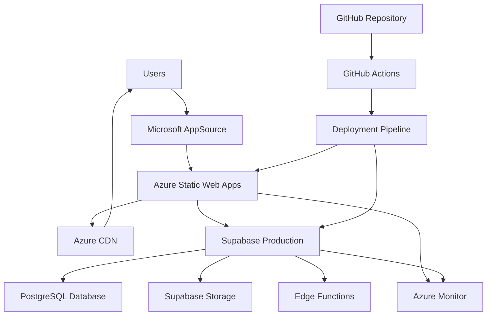

# AGORA Development Guide 10: Production Deployment & Azure Static Web Apps

> **⚠️ PREREQUISITE:** Complete **AGORA_DEV_09_TESTING** before starting this document.

## 📋 Overview

This document guides you through deploying AGORA to production using **Azure Static Web Apps** for the frontend and **Supabase** for the backend, using both **Cursor AI** for deployment automation and **Cursor AI** for frontend build optimization. You'll configure CI/CD pipelines, set up monitoring, implement security measures, and prepare for Microsoft AppSource submission.

## 🎯 What You'll Accomplish

- ✅ Set up Azure Static Web Apps deployment
- ✅ Configure Supabase production environment
- ✅ Implement CI/CD deployment pipelines
- ✅ Set up production monitoring and logging
- ✅ Configure security and performance optimization
- ✅ Prepare for Microsoft AppSource submission
- ✅ Implement backup and disaster recovery
- ✅ Set up production support and maintenance

## 🏗️ Production Architecture Overview



---

## 🚀 Step 1: Azure Static Web Apps Setup

### **1.1 Azure Infrastructure Setup**

**Cursor AI Azure Setup Prompt:**
```
Create comprehensive Azure Static Web Apps deployment setup:

1. Azure resource configuration:
   - azure-resources.bicep: Infrastructure as Code template
   - azure-deploy.yml: Azure deployment automation
   - resource-group-setup.ts: Resource group configuration
   - static-web-app-config.ts: Static Web App configuration
   - custom-domain-setup.ts: Custom domain configuration

2. Environment configuration:
   - production.env.template: Production environment variables
   - staging.env.template: Staging environment variables
   - azure-app-settings.json: Azure app settings configuration
   - secrets-management.ts: Azure Key Vault integration
   - configuration-validation.ts: Configuration validation

3. Static Web App configuration:
   - staticwebapp.config.json: Static Web App routing and settings
   - api-configuration.json: API proxy configuration
   - authentication-config.json: Azure authentication setup
   - headers-config.json: Security headers configuration
   - redirect-rules.json: URL redirect configuration

4. CDN and performance configuration:
   - cdn-profile-setup.ts: Azure CDN configuration
   - caching-rules.json: CDN caching strategy
   - compression-config.json: Content compression settings
   - ssl-certificate-setup.ts: SSL certificate management
   - performance-optimization.ts: Performance optimization settings

5. Monitoring and logging setup:
   - azure-monitor-setup.ts: Azure Monitor configuration
   - application-insights.ts: Application Insights setup
   - log-analytics.ts: Log Analytics workspace setup
   - alerting-rules.json: Monitoring alert configuration
   - dashboard-config.json: Azure dashboard configuration

Include comprehensive security, performance, and monitoring configuration.
```

### **1.2 Frontend Build Optimization**

**Cursor AI Frontend Build Optimization Prompt:**
```
Optimize the React frontend build for Azure Static Web Apps deployment:

1. Production Build Configuration:
   - Optimize Vite build configuration for production
   - Implement advanced code splitting strategies
   - Configure tree shaking and dead code elimination
   - Set up bundle analysis and optimization
   - Implement progressive loading strategies

2. Azure Static Web Apps Integration:
   - Configure routing for single-page application
   - Set up API proxy for backend integration
   - Implement proper caching strategies
   - Configure security headers and CSP
   - Set up custom domain and SSL

3. Performance Optimization:
   - Implement service worker for caching
   - Configure lazy loading for components
   - Optimize images and assets for web
   - Implement preloading strategies
   - Set up performance monitoring

4. Office Add-in Specific Optimization:
   - Optimize bundle size for Office environment
   - Configure manifest for production deployment
   - Set up HTTPS for Office add-in requirements
   - Implement Office-specific caching strategies
   - Configure cross-origin settings

5. Security Configuration:
   - Implement Content Security Policy
   - Configure CORS for Office integration
   - Set up secure authentication flows
   - Implement rate limiting and protection
   - Configure audit logging

Include comprehensive build optimization and security hardening.
```

### **1.3 Deployment Automation**

**Cursor AI Deployment Automation Prompt:**
```
Create comprehensive deployment automation scripts:

1. GitHub Actions deployment pipeline:
   - deploy-production.yml: Production deployment workflow
   - deploy-staging.yml: Staging deployment workflow
   - build-validation.yml: Build validation workflow
   - security-scanning.yml: Security scanning workflow
   - performance-testing.yml: Performance validation workflow

2. Azure deployment scripts:
   - azure-deploy.ps1: PowerShell deployment script
   - infrastructure-deploy.sh: Infrastructure deployment script
   - app-deploy.sh: Application deployment script
   - rollback-deploy.sh: Rollback deployment script
   - health-check.sh: Post-deployment health check

3. Environment management:
   - environment-setup.ts: Environment configuration management
   - secret-rotation.ts: Automated secret rotation
   - certificate-renewal.ts: SSL certificate renewal
   - backup-automation.ts: Automated backup procedures
   - disaster-recovery.ts: Disaster recovery procedures

4. Deployment validation:
   - deployment-tests.ts: Post-deployment validation tests
   - smoke-tests.ts: Smoke test suite
   - integration-validation.ts: Integration validation
   - performance-validation.ts: Performance validation
   - security-validation.ts: Security validation

5. Monitoring and alerting:
   - deployment-monitoring.ts: Deployment monitoring setup
   - alert-configuration.ts: Alert configuration
   - notification-setup.ts: Notification configuration
   - dashboard-setup.ts: Monitoring dashboard setup
   - sla-monitoring.ts: SLA monitoring configuration

Include comprehensive deployment validation and rollback capabilities.
```

---

## 🗄️ Step 2: Supabase Production Configuration

### **2.1 Supabase Production Setup**

**Cursor AI Supabase Production Setup Prompt:**
```
Configure Supabase for production deployment:

1. Production database configuration:
   - production-database-setup.sql: Production database configuration
   - performance-optimization.sql: Database performance optimization
   - security-hardening.sql: Database security configuration
   - backup-configuration.sql: Backup and recovery setup
   - monitoring-setup.sql: Database monitoring configuration

2. Environment configuration:
   - supabase-production.env: Production environment variables
   - rls-policies-production.sql: Production RLS policies
   - functions-deployment.sql: Edge Functions deployment
   - storage-configuration.json: Storage bucket configuration
   - auth-configuration.json: Authentication configuration

3. Security configuration:
   - database-security.sql: Database security settings
   - api-security.json: API security configuration
   - network-security.json: Network security settings
   - access-control.sql: Access control configuration
   - audit-logging.sql: Audit logging configuration

4. Performance optimization:
   - connection-pooling.json: Connection pool configuration
   - caching-strategy.json: Caching configuration
   - index-optimization.sql: Database index optimization
   - query-optimization.sql: Query performance optimization
   - resource-scaling.json: Auto-scaling configuration

5. Backup and recovery:
   - backup-strategy.json: Backup strategy configuration
   - disaster-recovery.json: Disaster recovery plan
   - point-in-time-recovery.json: PITR configuration
   - data-archiving.sql: Data archiving procedures
   - recovery-testing.json: Recovery testing procedures

Include comprehensive production readiness and enterprise features.
```

### **2.2 Database Migration and Optimization**

**Cursor AI Database Production Migration Prompt:**
```
Implement production database migration and optimization:

1. Production migration strategy:
   - migration-production.sql: Production-ready migrations
   - data-migration.sql: Data migration procedures
   - schema-validation.sql: Schema validation
   - rollback-procedures.sql: Migration rollback procedures
   - migration-testing.sql: Migration testing procedures

2. Performance optimization:
   - production-indexes.sql: Production index strategy
   - query-optimization.sql: Query performance optimization
   - connection-optimization.json: Connection optimization
   - resource-allocation.json: Resource allocation configuration
   - performance-monitoring.sql: Performance monitoring setup

3. Security hardening:
   - production-security.sql: Production security configuration
   - user-permissions.sql: User permission configuration
   - network-security.json: Network security settings
   - encryption-setup.sql: Encryption configuration
   - audit-trail.sql: Audit trail configuration

4. Monitoring and alerting:
   - database-monitoring.sql: Database monitoring setup
   - performance-alerts.json: Performance alert configuration
   - security-alerts.json: Security alert configuration
   - health-checks.sql: Database health check procedures
   - metrics-collection.sql: Metrics collection setup

5. Maintenance procedures:
   - maintenance-procedures.sql: Database maintenance procedures
   - vacuum-strategy.sql: Vacuum and analyze procedures
   - statistics-update.sql: Statistics update procedures
   - log-management.sql: Log management procedures
   - space-management.sql: Storage space management

Include comprehensive database administration and maintenance procedures.
```

### **2.3 Edge Functions Deployment**

**Cursor AI Edge Functions Deployment Prompt:**
```
Deploy and configure Supabase Edge Functions for production:

1. Edge Functions production setup:
   - notification-function.ts: Production notification function
   - analytics-function.ts: Analytics processing function
   - webhook-handler.ts: Webhook processing function
   - data-processing.ts: Data processing functions
   - security-function.ts: Security and validation functions

2. Function deployment configuration:
   - function-deployment.json: Function deployment configuration
   - environment-variables.json: Function environment variables
   - resource-limits.json: Function resource limits
   - scaling-configuration.json: Function scaling configuration
   - monitoring-configuration.json: Function monitoring setup

3. Security configuration:
   - function-security.ts: Function security implementation
   - api-key-management.ts: API key management
   - rate-limiting.ts: Rate limiting implementation
   - input-validation.ts: Input validation and sanitization
   - audit-logging.ts: Function audit logging

4. Performance optimization:
   - function-optimization.ts: Function performance optimization
   - caching-strategy.ts: Function caching implementation
   - connection-pooling.ts: Connection pooling for functions
   - memory-optimization.ts: Memory usage optimization
   - cold-start-optimization.ts: Cold start optimization

5. Monitoring and debugging:
   - function-monitoring.ts: Function monitoring setup
   - error-tracking.ts: Error tracking and reporting
   - performance-metrics.ts: Performance metrics collection
   - debugging-utilities.ts: Debugging and troubleshooting
   - health-checks.ts: Function health check implementation

Include comprehensive function deployment and production optimization.
```

---

## 🔄 Step 3: CI/CD Pipeline Implementation

### **3.1 GitHub Actions Production Pipeline**

**Cursor AI GitHub Actions Pipeline Prompt:**
```
Create comprehensive CI/CD pipeline for AGORA production deployment:

1. Main deployment workflow:
   - production-deploy.yml: Main production deployment workflow
   - staging-deploy.yml: Staging environment deployment
   - feature-deploy.yml: Feature branch deployment
   - rollback-deploy.yml: Automated rollback workflow
   - manual-deploy.yml: Manual deployment workflow

2. Build and test pipeline:
   - build-pipeline.yml: Build and artifact creation
   - test-pipeline.yml: Comprehensive testing pipeline
   - security-pipeline.yml: Security scanning and validation
   - quality-pipeline.yml: Code quality and coverage
   - performance-pipeline.yml: Performance testing pipeline

3. Environment management:
   - environment-promotion.yml: Environment promotion workflow
   - secret-management.yml: Secret rotation and management
   - infrastructure-deploy.yml: Infrastructure deployment
   - database-deploy.yml: Database deployment and migration
   - monitoring-deploy.yml: Monitoring and alerting deployment

4. Release management:
   - release-creation.yml: Automated release creation
   - changelog-generation.yml: Automated changelog generation
   - version-management.yml: Version tagging and management
   - artifact-management.yml: Artifact storage and management
   - documentation-deploy.yml: Documentation deployment

5. Monitoring and notifications:
   - deployment-monitoring.yml: Deployment monitoring workflow
   - health-check.yml: Post-deployment health checks
   - notification-pipeline.yml: Deployment notifications
   - metrics-collection.yml: Deployment metrics collection
   - alert-management.yml: Alert configuration management

Include comprehensive deployment validation, rollback capabilities, and monitoring.
```

### **3.2 Frontend Deployment Pipeline**

**Cursor AI Frontend Deployment Pipeline Prompt:**
```
Create optimized frontend deployment pipeline for Azure Static Web Apps:

1. Frontend Build Pipeline:
   - Optimize build process for production deployment
   - Implement advanced code splitting and bundling
   - Configure environment-specific builds
   - Set up asset optimization and compression
   - Implement build caching and optimization

2. Azure Static Web Apps Integration:
   - Configure automatic deployment from GitHub
   - Set up preview deployments for pull requests
   - Implement custom domain and SSL configuration
   - Configure API integration and routing
   - Set up authentication and authorization

3. Performance Optimization:
   - Implement progressive web app features
   - Configure service worker for caching
   - Set up lazy loading and code splitting
   - Optimize bundle size and loading performance
   - Implement performance monitoring

4. Office Add-in Deployment:
   - Configure manifest for production deployment
   - Set up AppSource submission preparation
   - Implement add-in specific optimizations
   - Configure cross-platform compatibility
   - Set up Office-specific testing

5. Monitoring and Analytics:
   - Configure Application Insights integration
   - Set up user behavior analytics
   - Implement error tracking and reporting
   - Configure performance monitoring
   - Set up business intelligence dashboard

Include comprehensive frontend optimization and Office add-in specific configuration.
```

### **3.3 Infrastructure as Code**

**Cursor AI Infrastructure as Code Prompt:**
```
Implement Infrastructure as Code for AGORA deployment:

1. Azure Bicep templates:
   - main.bicep: Main infrastructure template
   - static-web-app.bicep: Static Web App configuration
   - key-vault.bicep: Key Vault configuration
   - monitoring.bicep: Monitoring and alerting configuration
   - networking.bicep: Network security configuration

2. Terraform configuration:
   - main.tf: Main Terraform configuration
   - variables.tf: Variable definitions
   - outputs.tf: Output definitions
   - providers.tf: Provider configuration
   - modules/: Reusable Terraform modules

3. Environment management:
   - development.tfvars: Development environment variables
   - staging.tfvars: Staging environment variables
   - production.tfvars: Production environment variables
   - secrets.tfvars: Sensitive configuration variables
   - validation.tf: Configuration validation

4. Deployment automation:
   - deploy-infrastructure.sh: Infrastructure deployment script
   - validate-infrastructure.sh: Infrastructure validation
   - destroy-infrastructure.sh: Infrastructure cleanup
   - backup-state.sh: State backup procedures
   - migrate-state.sh: State migration procedures

5. Security and compliance:
   - security-baseline.bicep: Security baseline configuration
   - compliance-policies.bicep: Compliance policy configuration
   - network-security.bicep: Network security configuration
   - identity-management.bicep: Identity and access management
   - audit-configuration.bicep: Audit and logging configuration

Include comprehensive infrastructure security and compliance configuration.
```

---

## 📊 Step 4: Production Monitoring and Logging

### **4.1 Application Performance Monitoring**

**Cursor AI Application Monitoring Setup Prompt:**
```
Implement comprehensive application performance monitoring:

1. Azure Application Insights setup:
   - application-insights-config.ts: Application Insights configuration
   - custom-telemetry.ts: Custom telemetry implementation
   - performance-monitoring.ts: Performance metrics collection
   - user-behavior-tracking.ts: User behavior analytics
   - business-intelligence.ts: Business intelligence metrics

2. Supabase monitoring integration:
   - database-monitoring.ts: Database performance monitoring
   - api-monitoring.ts: API performance tracking
   - edge-function-monitoring.ts: Edge Function monitoring
   - auth-monitoring.ts: Authentication monitoring
   - storage-monitoring.ts: Storage usage monitoring

3. Custom metrics and dashboards:
   - custom-metrics.ts: Custom business metrics
   - dashboard-configuration.json: Monitoring dashboard configuration
   - alert-rules.json: Monitoring alert rules
   - sla-monitoring.ts: SLA monitoring and reporting
   - capacity-planning.ts: Capacity planning metrics

4. Error tracking and debugging:
   - error-tracking.ts: Comprehensive error tracking
   - exception-handling.ts: Exception handling and reporting
   - debugging-utilities.ts: Debugging and troubleshooting tools
   - log-aggregation.ts: Log aggregation and analysis
   - root-cause-analysis.ts: Automated root cause analysis

5. Real-time monitoring:
   - real-time-monitoring.ts: Real-time system monitoring
   - health-checks.ts: System health check implementation
   - uptime-monitoring.ts: Uptime monitoring and alerting
   - performance-alerts.ts: Performance threshold alerting
   - incident-response.ts: Automated incident response

Include comprehensive monitoring coverage and intelligent alerting.
```

### **4.2 Security Monitoring and Compliance**

**Cursor AI Security Monitoring Prompt:**
```
Implement comprehensive security monitoring and compliance:

1. Security monitoring setup:
   - security-monitoring.ts: Security event monitoring
   - threat-detection.ts: Threat detection and response
   - vulnerability-scanning.ts: Automated vulnerability scanning
   - compliance-monitoring.ts: Compliance monitoring and reporting
   - audit-logging.ts: Comprehensive audit logging

2. Azure Security Center integration:
   - security-center-config.json: Security Center configuration
   - security-policies.json: Security policy configuration
   - compliance-dashboard.json: Compliance dashboard setup
   - security-alerts.json: Security alert configuration
   - incident-response.json: Security incident response

3. Identity and access monitoring:
   - identity-monitoring.ts: Identity and access monitoring
   - privileged-access.ts: Privileged access monitoring
   - authentication-monitoring.ts: Authentication event monitoring
   - authorization-monitoring.ts: Authorization monitoring
   - session-monitoring.ts: User session monitoring

4. Data protection monitoring:
   - data-access-monitoring.ts: Data access monitoring
   - encryption-monitoring.ts: Encryption status monitoring
   - privacy-compliance.ts: Privacy compliance monitoring
   - gdpr-monitoring.ts: GDPR compliance monitoring
   - data-retention.ts: Data retention monitoring

5. Office add-in security monitoring:
   - addin-security-monitoring.ts: Add-in security monitoring
   - office-integration-security.ts: Office integration security
   - graph-api-monitoring.ts: Microsoft Graph API monitoring
   - cross-origin-monitoring.ts: Cross-origin security monitoring
   - certificate-monitoring.ts: Certificate monitoring and renewal

Include comprehensive security orchestration and automated response.
```

### **4.3 Business Intelligence and Analytics**

**Cursor AI Business Intelligence Dashboard Prompt:**
```
Create comprehensive business intelligence and analytics dashboard:

1. Business Metrics Dashboard:
   - User acquisition and retention metrics
   - Feature usage and adoption analytics
   - Subscription and revenue tracking
   - Customer satisfaction and NPS scoring
   - Market penetration and growth metrics

2. Operational Intelligence:
   - System performance and availability metrics
   - Error rates and resolution tracking
   - Resource utilization and capacity planning
   - Cost optimization and budget tracking
   - SLA compliance and service quality

3. User Behavior Analytics:
   - User journey and flow analysis
   - Feature engagement and usage patterns
   - A/B testing and experimentation results
   - Cohort analysis and user segmentation
   - Churn prediction and retention strategies

4. Security and Compliance Analytics:
   - Security incident tracking and analysis
   - Compliance status and audit reports
   - Risk assessment and mitigation tracking
   - Threat intelligence and monitoring
   - Privacy and data protection metrics

5. Investment Platform Analytics:
   - Event engagement and attendance tracking
   - Subscription performance by sector
   - Calendar integration usage patterns
   - Notification effectiveness and engagement
   - Office add-in adoption and usage metrics

Include advanced analytics, predictive insights, and automated reporting.
```

---

## 🔐 Step 5: Security and Compliance Configuration

### **5.1 Production Security Hardening**

**Cursor AI Production Security Configuration Prompt:**
```
Implement comprehensive production security hardening:

1. Network security configuration:
   - network-security-groups.json: Network security group configuration
   - firewall-rules.json: Application firewall configuration
   - ddos-protection.json: DDoS protection configuration
   - cdn-security.json: CDN security configuration
   - ssl-configuration.json: SSL/TLS configuration

2. Application security hardening:
   - security-headers.ts: Security headers implementation
   - content-security-policy.ts: CSP configuration
   - cors-configuration.ts: CORS policy configuration
   - rate-limiting.ts: Rate limiting implementation
   - input-validation.ts: Input validation and sanitization

3. Data protection and encryption:
   - encryption-at-rest.ts: Data encryption at rest
   - encryption-in-transit.ts: Data encryption in transit
   - key-management.ts: Encryption key management
   - data-classification.ts: Data classification implementation
   - privacy-controls.ts: Privacy control implementation

4. Identity and access management:
   - rbac-configuration.ts: Role-based access control
   - privileged-access.ts: Privileged access management
   - multi-factor-auth.ts: Multi-factor authentication
   - session-management.ts: Secure session management
   - audit-logging.ts: Access audit logging

5. Compliance configuration:
   - gdpr-compliance.ts: GDPR compliance implementation
   - sox-compliance.ts: SOX compliance (if applicable)
   - iso27001-compliance.ts: ISO 27001 compliance
   - industry-compliance.ts: Industry-specific compliance
   - audit-preparation.ts: Audit preparation and documentation

Include comprehensive security baseline and compliance automation.
```

### **5.2 Office Add-in Security Configuration**

**Cursor AI Office Add-in Security Prompt:**
```
Configure Office add-in specific security for production:

1. Office integration security:
   - office-manifest-security.xml: Secure manifest configuration
   - office-api-security.ts: Office API security implementation
   - cross-origin-security.ts: Cross-origin security configuration
   - sso-security.ts: Single Sign-On security configuration
   - task-pane-security.ts: Task pane security implementation

2. Microsoft Graph security:
   - graph-permissions.json: Minimal Graph API permissions
   - graph-security.ts: Graph API security implementation
   - token-management.ts: Secure token management
   - consent-framework.ts: User consent framework
   - audit-logging.ts: Graph API audit logging

3. AppSource security requirements:
   - appsource-security.json: AppSource security compliance
   - privacy-policy.md: Comprehensive privacy policy
   - terms-of-service.md: Terms of service documentation
   - security-assessment.json: Security assessment documentation
   - compliance-certification.json: Compliance certifications

4. Enterprise security features:
   - enterprise-sso.ts: Enterprise SSO integration
   - conditional-access.ts: Conditional access support
   - data-loss-prevention.ts: Data loss prevention
   - information-protection.ts: Information protection integration
   - compliance-center.ts: Compliance center integration

5. Security monitoring:
   - security-telemetry.ts: Security telemetry collection
   - threat-detection.ts: Office-specific threat detection
   - incident-response.ts: Security incident response
   - vulnerability-management.ts: Vulnerability management
   - security-updates.ts: Automated security updates

Include Office-specific security best practices and enterprise compliance.
```

### **5.3 Data Privacy and Compliance**

**Cursor AI Data Privacy Configuration Prompt:**
```
Implement comprehensive data privacy and compliance:

1. GDPR compliance implementation:
   - gdpr-compliance.ts: GDPR compliance framework
   - data-subject-rights.ts: Data subject rights implementation
   - consent-management.ts: Consent management system
   - data-portability.ts: Data portability implementation
   - right-to-be-forgotten.ts: Data deletion implementation

2. Privacy by design:
   - privacy-controls.ts: Privacy control implementation
   - data-minimization.ts: Data minimization practices
   - purpose-limitation.ts: Purpose limitation implementation
   - retention-policies.ts: Data retention policies
   - privacy-impact-assessment.ts: Privacy impact assessment

3. Data governance:
   - data-classification.ts: Data classification system
   - data-lifecycle.ts: Data lifecycle management
   - data-quality.ts: Data quality management
   - data-lineage.ts: Data lineage tracking
   - data-catalog.ts: Data catalog implementation

4. Audit and compliance:
   - compliance-monitoring.ts: Continuous compliance monitoring
   - audit-trail.ts: Comprehensive audit trail
   - compliance-reporting.ts: Automated compliance reporting
   - regulatory-updates.ts: Regulatory change management
   - compliance-training.ts: Compliance training tracking

5. International compliance:
   - multi-jurisdiction.ts: Multi-jurisdiction compliance
   - data-residency.ts: Data residency requirements
   - cross-border-transfer.ts: Cross-border data transfer
   - local-regulations.ts: Local regulation compliance
   - compliance-localization.ts: Compliance localization

Include comprehensive privacy protection and regulatory compliance.
```

---

## 📱 Step 6: Microsoft AppSource Submission

### **6.1 AppSource Preparation**

**Cursor AI AppSource Submission Preparation Prompt:**
```
Prepare AGORA for Microsoft AppSource submission:

1. AppSource submission requirements:
   - appsource-checklist.json: AppSource submission checklist
   - technical-requirements.json: Technical requirement validation
   - security-requirements.json: Security requirement compliance
   - accessibility-requirements.json: Accessibility compliance
   - performance-requirements.json: Performance requirement validation

2. Manifest preparation:
   - production-manifest.xml: Production-ready manifest
   - manifest-validation.json: Manifest validation results
   - icon-assets/: High-quality icon assets
   - screenshot-assets/: AppSource screenshot assets
   - marketing-assets/: Marketing and promotional assets

3. Documentation preparation:
   - user-guide.md: Comprehensive user guide
   - admin-guide.md: Administrator guide
   - installation-guide.md: Installation instructions
   - troubleshooting-guide.md: Troubleshooting documentation
   - faq.md: Frequently asked questions

4. Testing and validation:
   - appsource-testing.ts: AppSource-specific testing
   - cross-platform-validation.ts: Cross-platform validation
   - accessibility-testing.ts: Accessibility testing
   - security-testing.ts: Security validation
   - performance-testing.ts: Performance validation

5. Legal and compliance:
   - privacy-policy.md: AppSource-compliant privacy policy
   - terms-of-service.md: Terms of service
   - license-agreement.md: End-user license agreement
   - support-policy.md: Support policy documentation
   - compliance-certification.json: Compliance certifications

Include comprehensive AppSource readiness validation and documentation.
```

### **6.2 AppSource Listing Optimization**

**Cursor AI AppSource Listing Optimization Prompt:**
```
Create optimized AppSource listing content and assets:

1. AppSource Listing Content:
   - Create compelling app title and subtitle
   - Write detailed app description highlighting investment features
   - Develop feature bullets emphasizing Office integration
   - Create user benefit statements and value propositions
   - Write search-optimized keywords and categories

2. Visual Assets Creation:
   - Design high-quality app icons (multiple sizes)
   - Create compelling screenshots showcasing key features
   - Develop video demonstrations of core functionality
   - Design marketing banners and promotional graphics
   - Create Office-themed visual assets

3. User Experience Documentation:
   - Create step-by-step getting started guide
   - Develop feature walkthrough documentation
   - Write troubleshooting and FAQ content
   - Create video tutorials for complex features
   - Design user onboarding flow documentation

4. Marketing Materials:
   - Develop value proposition messaging
   - Create competitive advantage statements
   - Write customer testimonials and case studies
   - Design marketing one-pagers and brochures
   - Create social media marketing assets

5. Support and Documentation:
   - Create comprehensive help documentation
   - Develop customer support portal content
   - Write technical documentation for IT admins
   - Create training materials and webinars
   - Design customer success resources

Include professional marketing materials and comprehensive user resources.
```

### **6.3 AppSource Submission Process**

**Cursor AI AppSource Submission Process Prompt:**
```
Execute the Microsoft AppSource submission process:

1. Partner Center setup:
   - partner-center-setup.ts: Partner Center account configuration
   - publisher-profile.json: Publisher profile configuration
   - tax-information.json: Tax and payout information
   - certification-setup.json: Certification process setup
   - submission-tracking.ts: Submission tracking system

2. App submission process:
   - app-submission.json: App submission configuration
   - technical-configuration.json: Technical configuration
   - store-listing.json: Store listing configuration
   - pricing-configuration.json: Pricing and availability
   - certification-notes.md: Certification notes and instructions

3. Review and certification:
   - certification-checklist.json: Certification checklist
   - review-response.md: Review response templates
   - issue-resolution.ts: Issue resolution process
   - resubmission-process.ts: Resubmission process
   - certification-tracking.ts: Certification status tracking

4. Post-submission monitoring:
   - submission-monitoring.ts: Submission status monitoring
   - review-feedback.ts: Review feedback processing
   - certification-alerts.ts: Certification alert system
   - update-notifications.ts: Update notification system
   - approval-tracking.ts: Approval status tracking

5. Launch preparation:
   - launch-checklist.json: Launch readiness checklist
   - go-live-process.ts: Go-live process automation
   - marketing-activation.ts: Marketing activation
   - support-activation.ts: Support system activation
   - analytics-activation.ts: Analytics and tracking activation

Include comprehensive submission tracking and launch preparation.
```

---

## 🔄 Step 7: Backup and Disaster Recovery

### **7.1 Backup Strategy Implementation**

**Cursor AI Backup Strategy Prompt:**
```
Implement comprehensive backup and disaster recovery strategy:

1. Database backup configuration:
   - automated-backups.sql: Automated backup configuration
   - point-in-time-recovery.sql: Point-in-time recovery setup
   - backup-scheduling.json: Backup scheduling configuration
   - backup-retention.json: Backup retention policies
   - backup-monitoring.ts: Backup monitoring and alerting

2. Application backup strategy:
   - application-backup.ts: Application backup procedures
   - configuration-backup.ts: Configuration backup
   - secret-backup.ts: Secret and certificate backup
   - infrastructure-backup.ts: Infrastructure configuration backup
   - documentation-backup.ts: Documentation backup

3. Cross-region backup:
   - geo-replication.json: Geographic replication setup
   - cross-region-backup.ts: Cross-region backup procedures
   - disaster-recovery-sites.json: Disaster recovery site configuration
   - failover-procedures.ts: Automated failover procedures
   - recovery-testing.ts: Disaster recovery testing

4. Backup validation:
   - backup-integrity.ts: Backup integrity validation
   - restore-testing.ts: Automated restore testing
   - recovery-validation.ts: Recovery procedure validation
   - backup-performance.ts: Backup performance monitoring
   - compliance-validation.ts: Backup compliance validation

5. Recovery procedures:
   - recovery-playbooks.md: Recovery procedure playbooks
   - rto-rpo-monitoring.ts: RTO/RPO monitoring
   - recovery-automation.ts: Automated recovery procedures
   - manual-recovery.md: Manual recovery procedures
   - recovery-communication.ts: Recovery communication plan

Include comprehensive backup testing and recovery validation.
```

### **7.2 Business Continuity Planning**

**Cursor AI Business Continuity Planning Prompt:**
```
Implement comprehensive business continuity planning:

1. Business impact analysis:
   - business-impact-assessment.json: Business impact analysis
   - critical-process-identification.json: Critical process mapping
   - dependency-analysis.json: System dependency analysis
   - risk-assessment.json: Risk assessment and prioritization
   - impact-scenarios.json: Impact scenario planning

2. Continuity procedures:
   - continuity-plans.md: Business continuity procedures
   - emergency-procedures.md: Emergency response procedures
   - communication-plans.md: Crisis communication plans
   - vendor-management.md: Vendor and supplier continuity
   - customer-communication.md: Customer communication plans

3. Technology resilience:
   - high-availability.json: High availability configuration
   - load-balancing.json: Load balancing and failover
   - auto-scaling.json: Auto-scaling configuration
   - circuit-breakers.ts: Circuit breaker implementation
   - resilience-patterns.ts: Resilience pattern implementation

4. Operational continuity:
   - operational-procedures.md: Operational continuity procedures
   - staff-continuity.md: Staff and resource continuity
   - workspace-continuity.md: Workspace continuity planning
   - supply-chain.md: Supply chain continuity
   - financial-continuity.md: Financial continuity planning

5. Testing and validation:
   - continuity-testing.ts: Business continuity testing
   - tabletop-exercises.md: Tabletop exercise procedures
   - simulation-testing.ts: Continuity simulation testing
   - performance-validation.ts: Continuity performance validation
   - improvement-planning.ts: Continuous improvement planning

Include comprehensive business continuity and operational resilience.
```

### **7.3 Incident Response Planning**

**Cursor AI Incident Response Planning Prompt:**
```
Implement comprehensive incident response planning:

1. Incident response framework:
   - incident-response-plan.md: Incident response procedures
   - incident-classification.json: Incident classification system
   - escalation-procedures.md: Incident escalation procedures
   - communication-protocols.md: Incident communication protocols
   - recovery-procedures.md: Incident recovery procedures

2. Automated incident response:
   - incident-detection.ts: Automated incident detection
   - alert-aggregation.ts: Alert aggregation and correlation
   - automated-response.ts: Automated response procedures
   - notification-system.ts: Incident notification system
   - status-page.ts: Public status page management

3. Security incident response:
   - security-incident-response.md: Security incident procedures
   - forensic-procedures.md: Digital forensic procedures
   - breach-notification.md: Data breach notification procedures
   - law-enforcement.md: Law enforcement coordination
   - regulatory-reporting.md: Regulatory reporting procedures

4. Communication management:
   - internal-communication.md: Internal communication procedures
   - customer-communication.md: Customer communication procedures
   - media-relations.md: Media relations procedures
   - stakeholder-updates.md: Stakeholder update procedures
   - post-incident-communication.md: Post-incident communication

5. Post-incident procedures:
   - post-incident-review.md: Post-incident review procedures
   - lessons-learned.md: Lessons learned documentation
   - improvement-planning.md: Improvement planning procedures
   - documentation-updates.md: Documentation update procedures
   - training-updates.md: Training update procedures

Include comprehensive incident management and continuous improvement.
```

---

## 🛠️ Step 8: Production Support and Maintenance

### **8.1 Production Support Setup**

**Cursor AI Production Support Setup Prompt:**
```
Implement comprehensive production support and maintenance:

1. Support infrastructure:
   - support-ticketing.ts: Support ticketing system integration
   - knowledge-base.ts: Knowledge base and documentation system
   - escalation-procedures.ts: Support escalation procedures
   - sla-management.ts: SLA management and tracking
   - customer-communication.ts: Customer communication system

2. Monitoring and alerting:
   - production-monitoring.ts: Production monitoring setup
   - proactive-monitoring.ts: Proactive issue detection
   - performance-monitoring.ts: Performance monitoring and alerting
   - capacity-monitoring.ts: Capacity monitoring and planning
   - user-experience-monitoring.ts: User experience monitoring

3. Maintenance procedures:
   - scheduled-maintenance.ts: Scheduled maintenance procedures
   - emergency-maintenance.ts: Emergency maintenance procedures
   - update-procedures.ts: Update and patch procedures
   - rollback-procedures.ts: Rollback and recovery procedures
   - maintenance-communication.ts: Maintenance communication

4. Performance optimization:
   - performance-tuning.ts: Performance tuning procedures
   - resource-optimization.ts: Resource optimization
   - cost-optimization.ts: Cost optimization procedures
   - capacity-planning.ts: Capacity planning and forecasting
   - efficiency-monitoring.ts: Efficiency monitoring and reporting

5. Quality assurance:
   - quality-monitoring.ts: Quality monitoring procedures
   - regression-testing.ts: Regression testing procedures
   - user-feedback.ts: User feedback collection and analysis
   - satisfaction-monitoring.ts: Customer satisfaction monitoring
   - continuous-improvement.ts: Continuous improvement processes

Include comprehensive support automation and quality management.
```

### **8.2 Customer Success and Training**

**Cursor AI Customer Success Setup Prompt:**
```
Create comprehensive customer success and training programs:

1. Customer Onboarding:
   - Create interactive onboarding tutorials
   - Develop getting started guides and walkthroughs
   - Design progressive disclosure learning paths
   - Implement in-app guidance and tooltips
   - Create video-based training content

2. Training and Education:
   - Develop comprehensive training materials
   - Create role-based learning paths
   - Design interactive training modules
   - Implement certification programs
   - Create advanced feature training

3. Customer Success Dashboard:
   - User adoption and engagement tracking
   - Feature usage analytics and insights
   - Customer health scoring and monitoring
   - Success milestone tracking
   - Risk identification and intervention

4. Support Resources:
   - Comprehensive help documentation
   - Video tutorials and demos
   - FAQ and troubleshooting guides
   - Community forums and discussion
   - Expert consultation services

5. Feedback and Improvement:
   - Customer feedback collection system
   - Feature request tracking and prioritization
   - User experience research and testing
   - Customer advisory programs
   - Continuous product improvement

Include comprehensive customer success measurement and optimization.
```

### **8.3 Continuous Improvement Process**

**Cursor AI Continuous Improvement Prompt:**
```
Implement continuous improvement and optimization processes:

1. Performance optimization:
   - performance-analytics.ts: Performance analytics and optimization
   - resource-utilization.ts: Resource utilization optimization
   - cost-efficiency.ts: Cost efficiency analysis and optimization
   - scalability-planning.ts: Scalability planning and optimization
   - efficiency-metrics.ts: Efficiency metrics and KPIs

2. Feature enhancement:
   - feature-analytics.ts: Feature usage analytics
   - user-feedback-analysis.ts: User feedback analysis
   - market-research.ts: Market research and competitive analysis
   - roadmap-planning.ts: Product roadmap planning
   - innovation-pipeline.ts: Innovation pipeline management

3. Quality improvement:
   - quality-metrics.ts: Quality metrics and measurement
   - defect-analysis.ts: Defect analysis and prevention
   - process-improvement.ts: Process improvement initiatives
   - automation-opportunities.ts: Automation opportunity identification
   - best-practices.ts: Best practices documentation and sharing

4. Security enhancement:
   - security-posture.ts: Security posture assessment
   - threat-landscape.ts: Threat landscape monitoring
   - vulnerability-management.ts: Vulnerability management program
   - security-training.ts: Security training and awareness
   - compliance-improvement.ts: Compliance improvement initiatives

5. Customer experience:
   - customer-journey.ts: Customer journey optimization
   - user-experience.ts: User experience enhancement
   - satisfaction-improvement.ts: Customer satisfaction improvement
   - retention-optimization.ts: Customer retention optimization
   - value-realization.ts: Customer value realization

Include comprehensive improvement tracking and optimization measurement.
```

---

## ✅ Completion Checklist

Before considering AGORA production-ready, verify all items:

### **Azure Static Web Apps Deployment ✅**
- [ ] Azure infrastructure configured and deployed
- [ ] Frontend build optimized for production
- [ ] Deployment automation implemented
- [ ] Custom domain and SSL configured

### **Supabase Production Setup ✅**
- [ ] Production database configured and optimized
- [ ] Security hardening implemented
- [ ] Edge Functions deployed
- [ ] Backup and recovery configured

### **CI/CD Pipeline ✅**
- [ ] GitHub Actions pipeline implemented
- [ ] Frontend deployment automation working
- [ ] Infrastructure as Code deployed
- [ ] Environment management configured

### **Monitoring and Logging ✅**
- [ ] Application performance monitoring active
- [ ] Security monitoring implemented
- [ ] Business intelligence dashboard functional
- [ ] Alerting and notification systems working

### **Security and Compliance ✅**
- [ ] Production security hardening complete
- [ ] Office add-in security configured
- [ ] Data privacy and compliance implemented
- [ ] Security monitoring active

### **AppSource Submission ✅**
- [ ] AppSource preparation complete
- [ ] Listing content optimized
- [ ] Submission process executed
- [ ] Certification tracking active

### **Backup and Disaster Recovery ✅**
- [ ] Backup strategy implemented
- [ ] Business continuity planning complete
- [ ] Incident response planning implemented
- [ ] Recovery procedures tested

### **Production Support ✅**
- [ ] Production support infrastructure deployed
- [ ] Customer success programs implemented
- [ ] Continuous improvement processes active
- [ ] Maintenance procedures documented

---

## 🚨 Troubleshooting Common Issues

### **Issue: Azure deployment failures**
```bash
# Solution: Check Azure resource configuration
# Verify permissions and quotas
# Review deployment logs
# Validate Infrastructure as Code templates
```

### **Issue: AppSource submission rejection**
```bash
# Solution: Review AppSource guidelines
# Validate technical requirements
# Check security compliance
# Verify manifest configuration
```

### **Issue: Performance problems in production**
```bash
# Solution: Monitor application metrics
# Check database performance
# Verify CDN configuration
# Review resource allocation
```

### **Issue: Security compliance failures**
```bash
# Solution: Review security configuration
# Validate compliance requirements
# Check audit logs
# Update security policies
```

---

## 📋 Final Steps

Once you've completed ALL items in the checklist above:

1. **Execute final production validation:**
   ```bash
   npm run test:production
   npm run validate:security
   npm run validate:performance
   npm run validate:compliance
   ```

2. **Complete AppSource submission:**
   ```bash
   npm run prepare:appsource
   npm run validate:appsource
   npm run submit:appsource
   ```

3. **Activate production monitoring:**
   ```bash
   npm run activate:monitoring
   npm run activate:alerting
   npm run activate:support
   ```

4. **Final commit and documentation:**
   ```bash
   git add .
   git commit -m "Complete production deployment: Azure Static Web Apps, monitoring, security, and AppSource submission"
   git tag v1.0.0-production
   ```

---

## 🎉 Congratulations!

You have successfully completed the comprehensive development and deployment of AGORA! 

### **What You've Accomplished:**

✅ **Complete Investment Platform:** Built a professional investment calendar with real-time event tracking  
✅ **Office Add-in Integration:** Created a fully functional Microsoft Outlook add-in  
✅ **Production Deployment:** Deployed to Azure Static Web Apps with enterprise-grade infrastructure  
✅ **Security & Compliance:** Implemented comprehensive security and regulatory compliance  
✅ **Testing & Quality:** Established comprehensive testing and quality assurance  
✅ **AppSource Ready:** Prepared for Microsoft AppSource submission and distribution  
✅ **Production Support:** Set up monitoring, support, and continuous improvement  

### **Next Steps:**
1. **Monitor AppSource submission status**
2. **Collect user feedback and iterate**
3. **Plan Phase 2 feature development**
4. **Scale for growth and additional markets**

**AGORA is now ready to serve investment professionals worldwide! 🚀**

---

**Document Status:** ✅ Ready for Implementation  
**Estimated Time:** 12-15 hours  
**Difficulty:** Advanced  
**Prerequisites:** Completed AGORA_DEV_09_TESTING  
**Result:** Production-ready AGORA on Microsoft AppSource